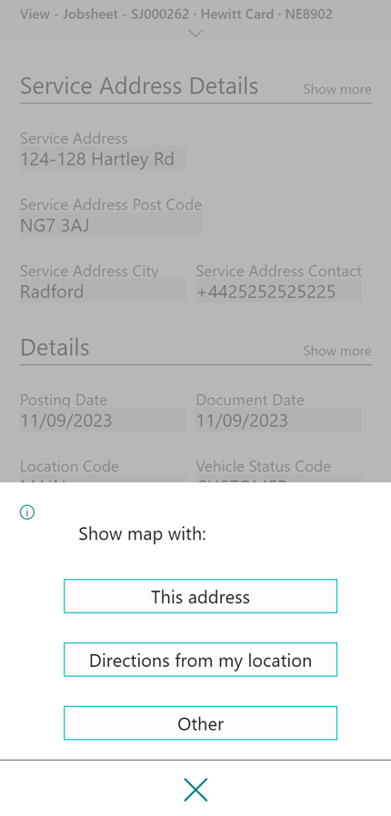
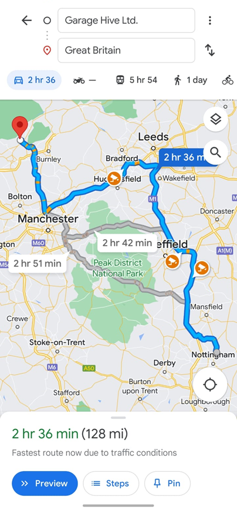

# We are still working on this article!
We are currently reviewing this article before it is published, check back later.

# How to Manage Mobile Service Work in Garage Hive
One useful feature available in our Garage Hive is the ability to manage mobile/on-site services. This means that users can create a Jobsheet and manage work that isn't being done at the garage, such as when a customer requires a tyre change from a location other than the garage. As a result, customers can receive more efficient and personalised service, and easily have it recorded in the system. To enable the Mobile Service work in the system:
1. In the top right corner, choose the  icon, enter **Service Mgt. Setup GH**, and select the related link.

   

2. Under the **General** FastTab, scroll down to the **Show Service Address** slider and enable it.

   

3. This activates the **Service Address Details** FastTab in the service documents.

   

4. Open the Jobsheet or create a new Jobsheet with the Mobile work, and enter the **Service Address** information, which is the place where the work is to be done.

   

5. The **Mobile Technician** can now use the **Service Address** to locate the route to use when going there, by opening the Jobsheet from the Mobile App and selecting the three dots on the bottom left corner.

   

6. Then select **Online Maps**, from the actions.

   

7. The technician has the option to select the location to start from, and show the directions on a map to the location of the job.

   

8. After selecting the location, the map is opened with the direction to the **Service Address**.

   

[Go back to top](#top)
