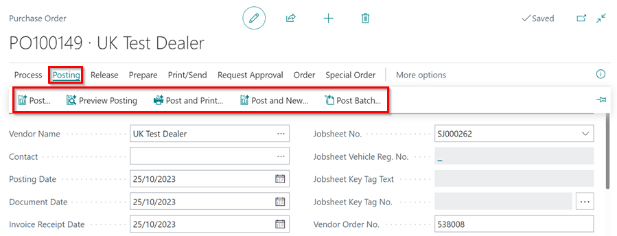
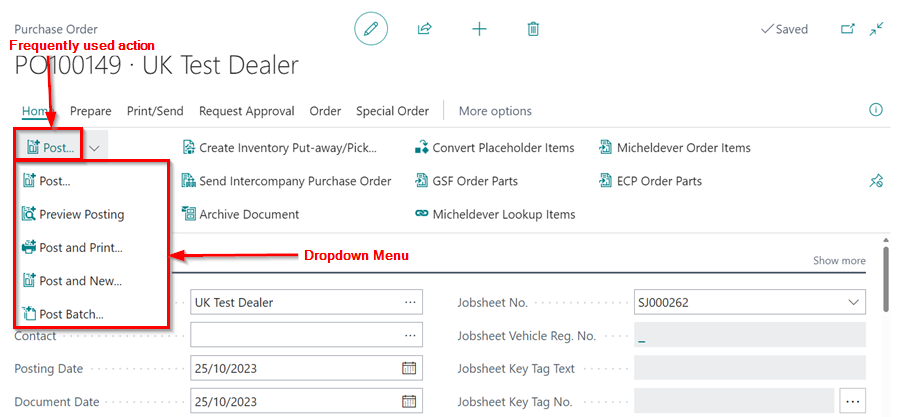
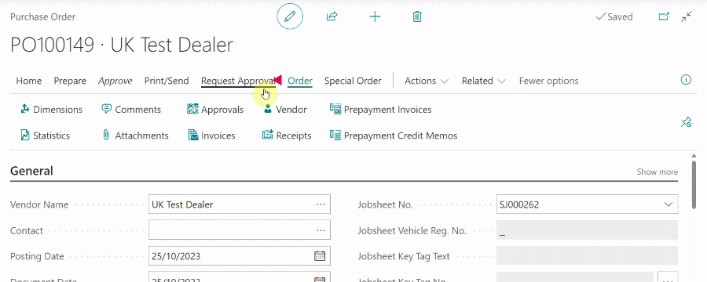
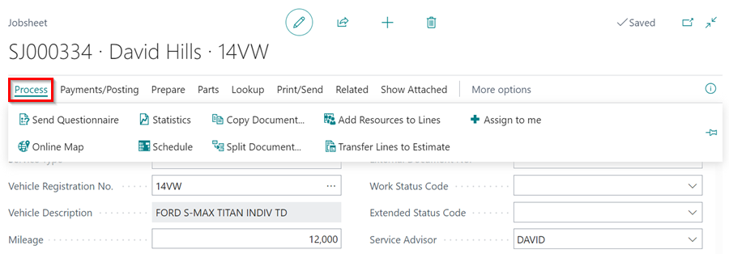
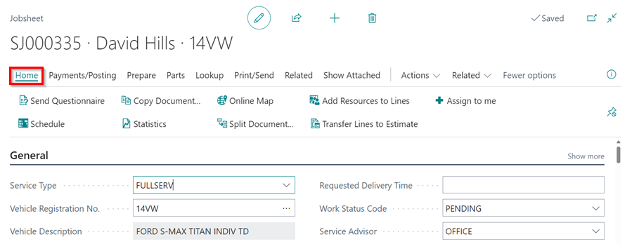
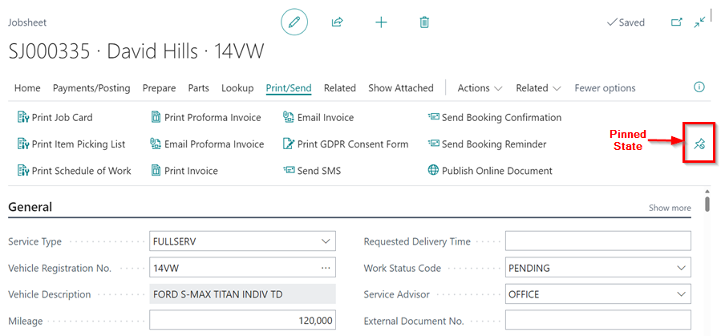
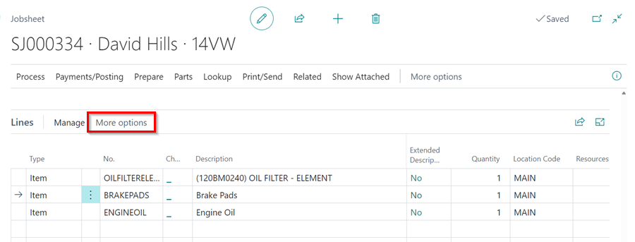
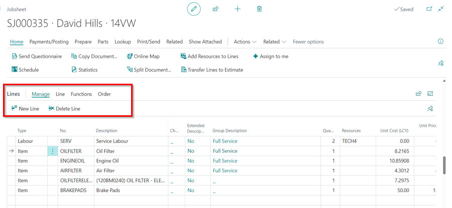

# Modern Action Bar Improvements in Garage Hive
The modern action bar was introduced as a preview in the previous versions of Business Central, but now it's being made available to all customer in the new releases, [read more](https://learn.microsoft.com/en-us/dynamics365-release-plan/2022wave2/smb/dynamics365-business-central/modern-action-bar){:target="_blank"}. It focuses on reducing clutter by consolidating related actions and eliminating redundancy. Key features include: 

### 1. Introduction of Split Buttons for Easier Access to Frequently Used Actions
The split button allows the users to quickly access the most commonly used action from the action bar while also providing a dropdown menu with additional, related actions that might be used less frequently. 

   - Previously in a Purchase Order:

      

   - Modern Action Bar:

      

### 2. Enhanced Customisation Options for Personalising Action Bars
Users now have more options to customise the action bar to better suit their workflows. Restrictions on moving actions have been relaxed, allowing for a more personalised and efficient setup.

   

### 3. Renaming the Process Tab to Home
Previously, the Process tab was designed to house actions related to processing data or executing operations relevant to the current page or context. 

   

In the Modern Action bar, the Process tab has been renamed to Home to suggest a central place for users to find the most commonly used actions and functions.

   

### 4. Presentation of Document Pages in a Pinned State by Default
The action bar at the top of pages contains actions related to the page you are viewing. This bar can be either expanded ("pinned") or collapsed. When the action bar is in a pinned state, all actions and menus are fully visible and accessible with a single click, without the need to expand the action bar. 

   

### 5. The Retirement of the Navigation Menu
The Navigate menu, previously found on some pages, has been merged into the entity menu, which is named after the entity displayed on the page, such as Customer. 

### 6. Actions in Lines Subpage now Visible Without Requiring to Click on More Options
Document pages that have a Lines subpage or any other page having a subpage, the subpage’s actions are now visible right away without requiring a click on “More options.” 

   - Previously

      

   - Modern Action Bar

      

[Go back to top](#top)