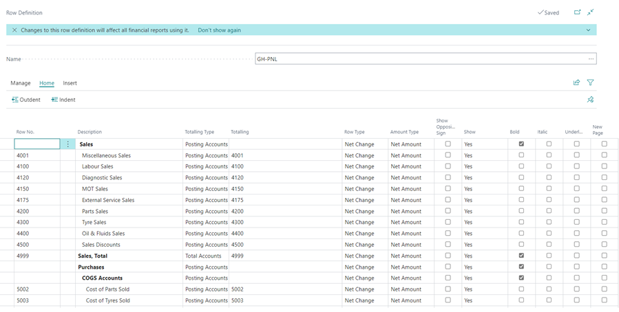
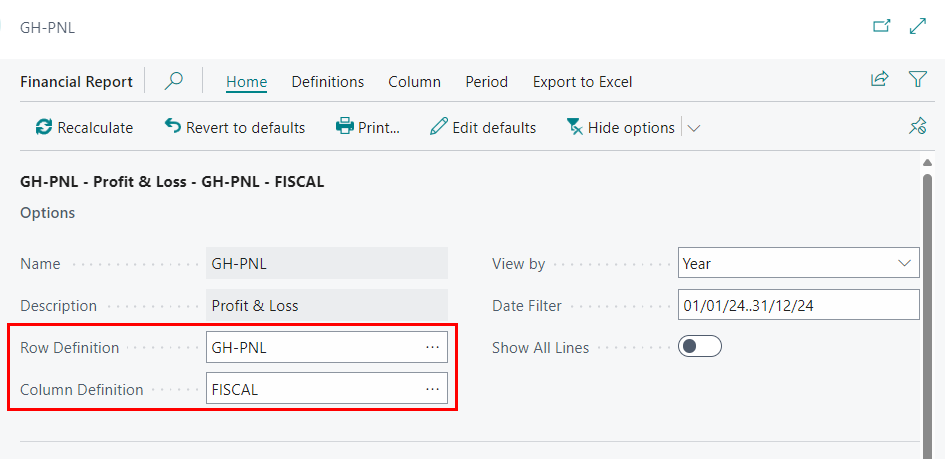

# Guide on Modifying Financial Reports in Garage Hive
**Accounts Schedules** are now called **Financial Reports** since the [2022 wave 2 release by Microsoft](garagehive-2022-business-central-release-wave-2.html). In this guide, we will explain the basics in **Financial Reports**, the types of reports available in Garage Hive, and how to modify them by adding or removing a G/L account.

## In this article
1. [Financial Reports Basics](#financial-reports-basics)
2. [Types of Financial Reports Available in Garage Hive](#types-of-financial-reports-available-in-garage-hive)
3. [Modifying the Financial Reports](#modifying-the-financial-reports)

### Financial Reports Basics
1. To open the financial reports, in the top right corner, choose the  icon, enter **Financial Reports**, and select the related link.

   

2. The **Financial Reports** uses the **Chart of Accounts** to create the reports. To view the accounts, choose the  icon in the top right corner, enter **Chart of Accounts**, and select the related link.

   

3. **Column Definition** in **Financial Reports** refers to the settings that determine the content and presentation of a column within the report. It defines what data is displayed in the column and how it is formatted. Here's an example of a **Column Definition** with the column header **Balance**.

   

4. **Column Definition** can be searched directly from the Role Centre. Choose the  icon in the top right corner, enter **Column Definition**, and select the related link.

   

5. On the other hand, **Row Definitions** which refers to the settings that determine the structure and content of rows within the report. It defines what data is displayed in each row and how it is organised. Here's an example of a **Row Definition** for a **Profit and Loss** report.

   

6. Similar to **Column Definition**, **Row Definitions** can as well be searched directly from the Role Centre. Choose the  icon in the top right corner, enter **Row Definitions**, and select the related link.

   

7. To open a report in excel for further analysis and charting, select the report you want to open in excel and click on the share icon in the top right corner, and select **Open in Excel**.

   

[Go back to top](#top)

### Types of Financial Reports Available in Garage Hive
The following are the **Financial Reports** that are available in Garage Hive. However, with the proper knowledge of how to do it, it is still possible to add more financial reports.

   

1. **Balance Sheet** - The Balance Sheet report shows the garage's assets, liabilities, and equity at a specific date. It provides an overview of the garage's financial health and its net worth.

2. **Profit & Loss** - Also known as the Income Statement, the Profit & Loss report shows the revenues, expenses and net income of the garage for a specific period.

3. **Trial Balance** - The Trial Balance report shows the balances of all general ledger accounts at a specific date.

4. **Cash Flow Statement** - The Cash Flow Statement shows the sources (inflows) and uses (outflows) for the garage at a specific period.

5. **Retained Earnings** - The Retained Earnings report shows the accumulated profits or losses of a business that have been retained and reinvested into the garage rather than distributed to shareholders as dividends.

[Go back to top](#top)

### Modifying the Financial Reports
1. To modify a financial report by adding or removing an account, choose the  icon in the top right corner, enter **Financial Reports**, and select the related link.

   

2. Select the report that you want to edit, click on the Ellipsis (...) from the menu bar, and choose **Edit Row Definition**.

   

3. From the **Row Definition** page select the where you want to add the line or the select the line you want to delete and click on the vertical three dots at the end of the **Row No.** field. Select **New Line** to add a new line or **Delete Line** to delete the line.

   

4. There is also the option to edit the **Financial Report** by changing the **Row Definition** or the **Column Definition** in a report. From the **Financial Reports** list, select the report that you want to edit and click on the **Edit Financial Report** from the menu bar.

   

5. Under the **Options** section, go to the **Row Definition** or **Column Definition** to change the row and column definitions.

   

[Go back to top](#top)

### See Also 

[Getting Started with Financial Reporting](/docs/garagehive-financial-reporting.html){:target="_blank"}