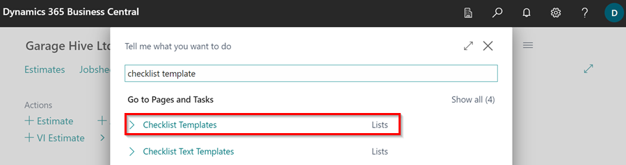
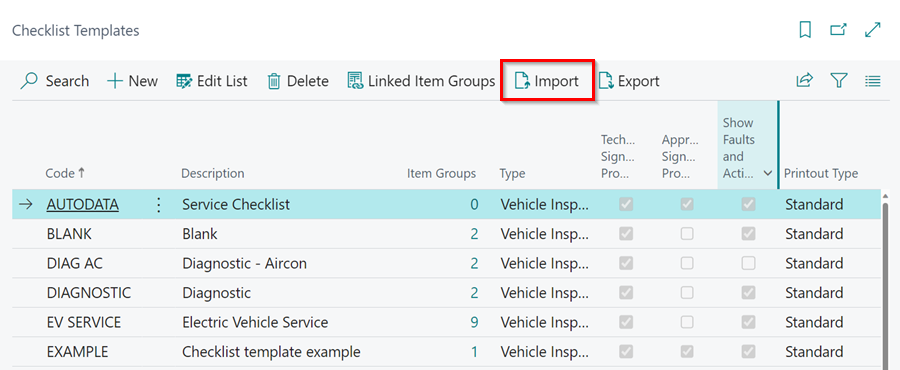
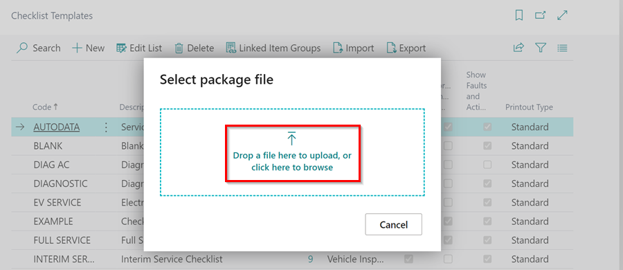
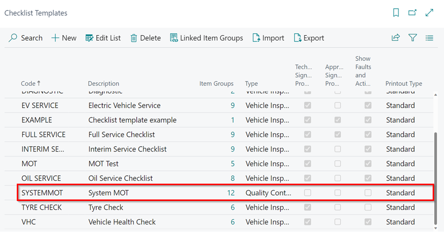
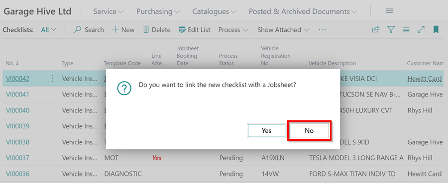
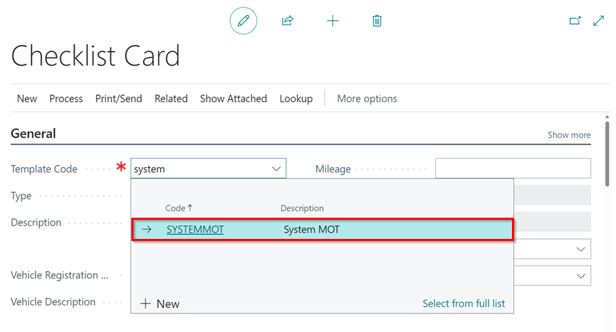

# We are still working on this article!
We are currently reviewing this article before it is published, check back later.

# How to Housekeep Your Garage Hive System
We have made a **Checklist Template** available to assist the garage in examining their system and making better use of it. It helps to go through the tiles and specify what needs to be done on each tile. This guarantees that your system is properly maintained and that its usage is optimised taking into account all of the processes carried out in the system, much like the MOT is performed on cars. To download the Checklist Template, use the link below.

[**Download Checklist Template**](https://docs.garagehive.co.uk/docs/checklist-template.cltx)

Once you have downloaded the **Checklist Template**, follow these steps to import and use it:
1. In the top right corner, choose the  icon, enter **Checklist Templates**, and select the related link.

   

2. Then, from the menu bar, select **Import** to import the **Checklist Template** you've downloaded to the system.

   

3. Select the file from where you have saved it in the computer.

   

4. The Checklist Template file will now be imported and ready to be used.

   

5. Create a new **Checklist**, without linking it to a Jobsheet. 

   

6. Select the **Template Code** as the Checklist Template you imported, **SYSTEMMOT**.

   

7. Check out the webinar below to learn how you can use the **Checklist Template** to housekeep your system.



[Go back to top](#top)