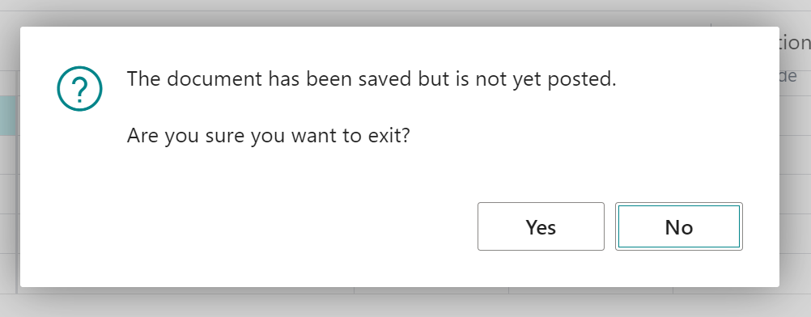
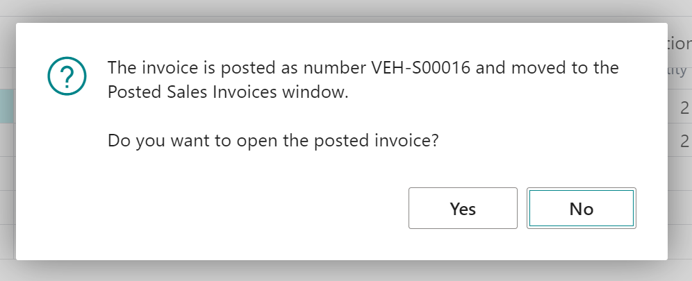
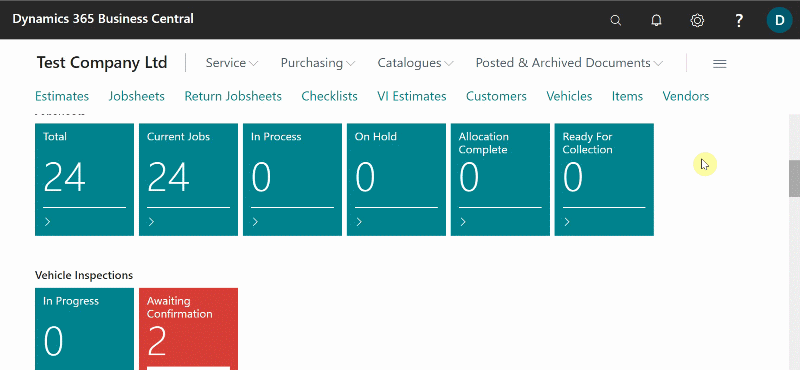
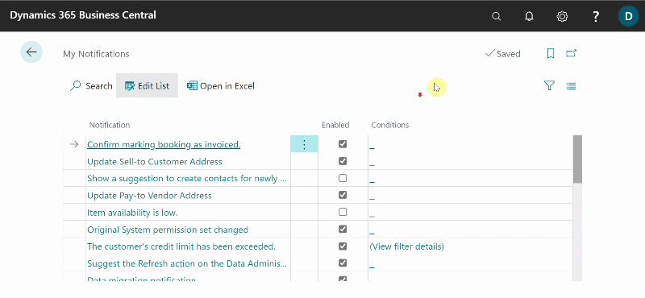
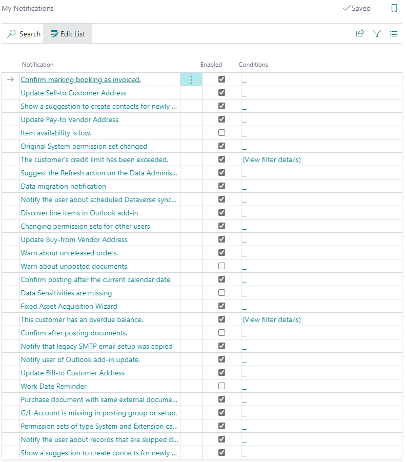

# How to Edit Your Notifications Within Garage Hive.
When using Garage Hive, you can manage your notifications to ensure that you have reminders for some of the actions you take. The following are some examples of notifications that you can manage:

* Show warning when you close a document that you have not posted.

   

* When you post a document, provide a warning about whether you can select to view the posted document.

   

To manage the notifications:
1. In the top-right corner, choose the  icon, enter **My Notifications**, and select the related link.
2. On the **My Notifications** page, all of the notifications that you can manage are listed, and the **Enabled** column shows the notifications that have been enabled.

   

3. To enable or disable a notification, select the checkbox in the **Enabled** column.

   

4. Here's an example of the recommended setup for the **My Notifications** page:

   

 

### **See Also**

[My Notifications in Microsoft Dynamics 365 Business Central Garage Hive](https://www.youtube.com/watch?v=1BxUESRf4dw){:target="_blank"}