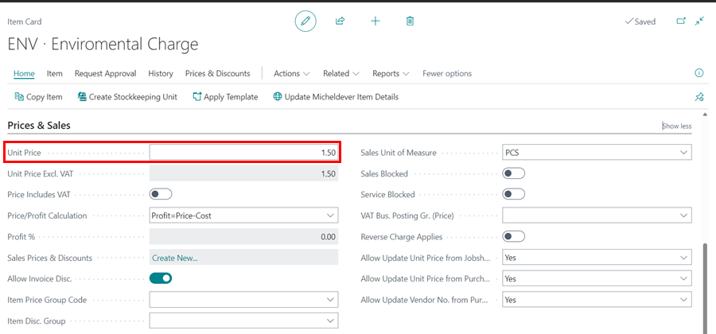
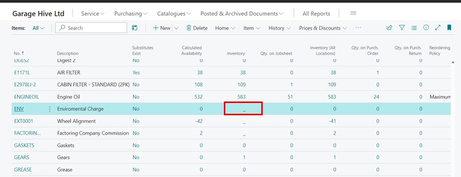

# How to Setup Non Inventory Items
Non-inventory items are those that you do not keep in stock or do not intend to keep in stock in the future. This allows you to add them to an invoice without having any interest in tracking the stock numbers. Here's how to set up the non-inventory items:
1. Open the **Items** list from the Role Centre.

   

2. Select **New** from the menu bar, then **Parts (Non-tracked stock)**. This is an **Item Template** that was previously created for **Non-inventory Items**; learn more about how to create an item template [here](create-item-templates.html). Click **OK**.

   

3. Under the **Item** FastTab, enter the item **No** and **Description**. Make sure the **Type** is set to **Non-Inventory**.

   

4. Enter the **Unit Price** for selling the non-inventory item in the **Prices & Sales** FastTab. Click on the back arrow (←), to close the item card.

   

5. When you scroll through the item list, the non-inventory item displays a dash (—) in the inventory column, indicating that the stock is not being tracked.

   

6. You can click on the dash (—) to view the **Item Ledger Entries** for the non-inventory item. 

