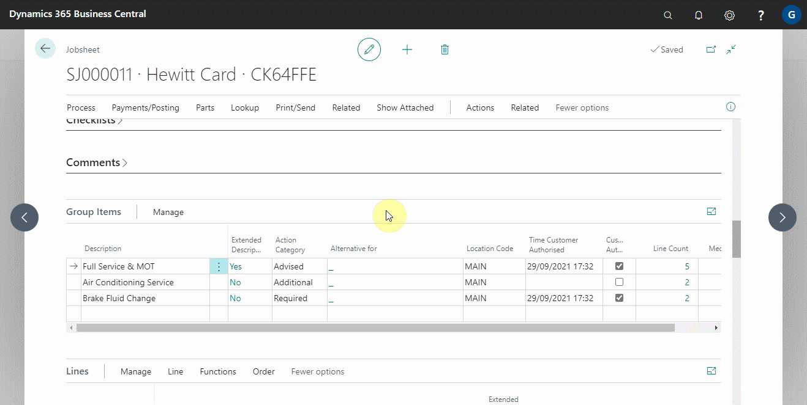
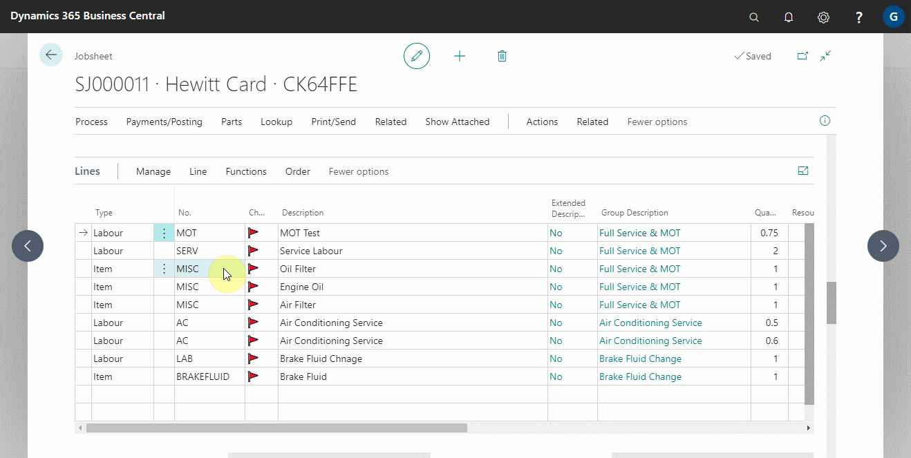
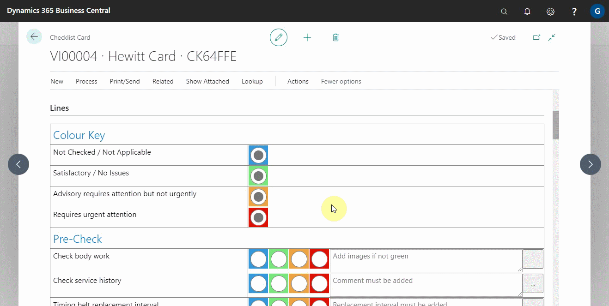
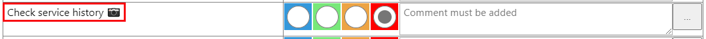
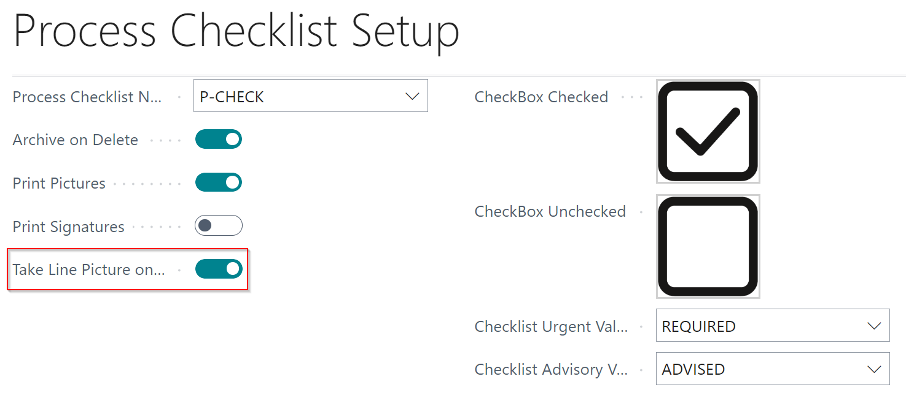
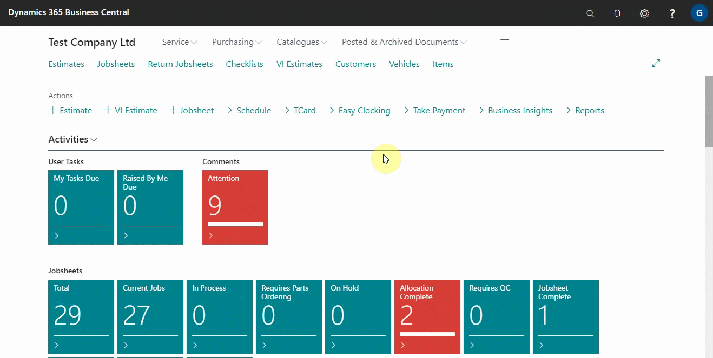

# Managing Media List in Garage Hive

With the ability to add images to the system, it is now easier to manage all of the images that have been added so that there is a smooth way of linking images to documents, adding images to documents, and so on.

## In this article

1. [Adding Media to Group Lines](#adding-media-to-group-lines)
2. [Adding Media to Document Lines](#adding-media-to-document-lines)
3. [Adding Media to Checklist Lines](#adding-media-to-checklist-lines)
4. [Managing All Added Media](#managing-all-added-media)

### Adding media to group lines
To add media in group lines, follow these steps:
1. In the **Group Items** section, under the **Media Count** column, select the cell in the line to add the media.
2. On the **Linked Media** page, click **New** from the actions bar, and then choose the method for adding the media.
3. You can link existing media in the system, take a picture, or upload from your device. In this case, we'll click **Upload Picture**, and select the media to add.

   

4. The newly added media is now linked to the selected group item.
5. When the online document is published, the customer will be able to see the media that has been added to that group.

   

### Adding media to document lines
Follow these steps to add media into document lines:
1. Select the line to which you want to add media from the document lines.
2. From the actions bar, select **Line** and then **Line Media**.
3. In the new window that appears, select **New** and then select the method for adding the media. In our case we'll choose **Upload Picture**.

   

4. Similar to adding media to group lines, the picture added to the document line will be displayed on the online document when it is published.

### Adding media to checklist lines
When creating a checklist, use the steps below to add media to the checklist lines:
1. From the checklist lines, select the three dots at the end of the checklist line to add the media.
2. From the pop-up menu, select the method for adding a picture to the line, in this case we'll use **Upload Line Picture**.

   

3. The checklist line will now display an available media with a photo icon on the line. When the checklist is printed, emailed, or published to an online document, the media will be displayed as well. 

   

4. To automatically start the take picture option when an attention option is selected, search for **Process Checklist Setup**, and on the **Process Checklist Setup** page, select the slider on **Take Line Picture On Attention** field.

   

### Managing all added media
A list of all added media to the system can be viewed and managed. To do so, follow these steps:
1. In the top-right corner, choose the  icon, enter **Media List** and select the related link.

   

2. The following actions are available to help you manage the media:

   

  * **Search** - Used when looking for a specific media file based on description, date, or other criteria.
  * **+New** - Used to add new media to the system.
  * **Take** - Used to add new media to the system by capturing it with the device's camera.
  * **Download Picture** - Used to save a picture from the system to your device.
  * **Open Online** - Used to open the media using a browser link, making it appear large.
  * **References** - Used to open a list of all the links that the media has in the system, which could be a jobsheet, a checklist, or something else.

 

### **See Also**

[Introduction to Online Documents](garagehive-online-documents-introduction.html) \
[Grouping document lines](garagehive-group-items-grouping-document-lines.html) \
[Working with group items actions](garagehive-group-items-working-with-group-items-actions.html) \
[Setting up online documents](garagehive-online-documents-setting-up-online-documents.html) \
[Previewing and publishing online documents](garagehive-online-documents-previewing-and-publishing-online-documents.html) \
[Using online documents in estimates, checklists and vehicle inspection estimates](garagehive-online-documents-using-online-documents-in-estimates-checklists-and-vehicle-inspection-estimates.html) \
[What Happens When a Customer Acts on a Sent Online Document?](garagehive-online-documents-what-happens-for-customers-actions.html)
