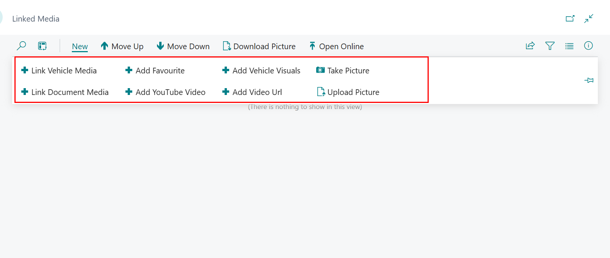
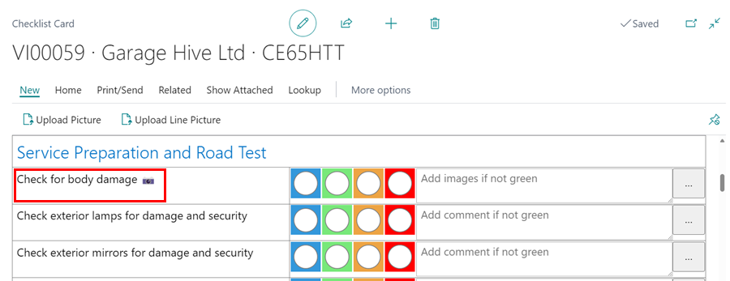
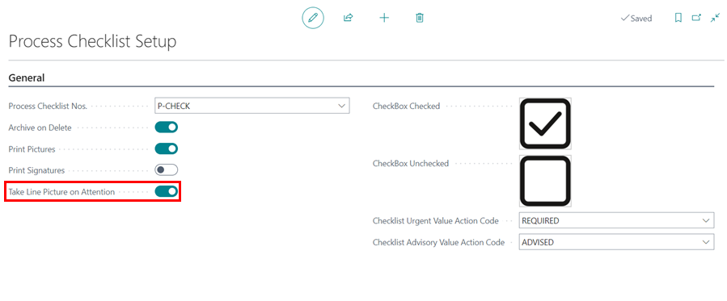

# Managing Media List in Garage Hive (Including YouTube and Vehicle Visuals)
In this article, we look at the feature of adding media (referring to both images and videos) into the Garage Hive system. We will explore how you can add media, including adding media to grouped lines and document lines, linking media with various documents, and seamlessly integrating media into documents.

## In this article
1. [Adding Media to Group Lines and Document Lines](#adding-media-to-group-lines-and-document-lines)
2. [Adding Media to Checklist Lines](#adding-media-to-checklist-lines)
3. [Adding Media to Service Packages](#adding-media-to-service-packages)
4. [Managing All Added Media](#managing-all-added-media)

   

### Adding Media to Group Lines and Document Lines
To add media in group lines for Jobsheets, Estimates or VIEs, or in document lines for Jobsheets follow these steps:
1. In the **Group Items** section, under the **Media Count** column, click on the cell in the line to add the media.

   

2. For adding media to document lines in Jobsheets, first select the desired line from the document lines. Then, go to the **Lines** menu bar, choose **Line** and then **Line Media**.
  
   

3. On the **Linked Media** page, click **New** from the menu bar, and then choose the method for adding the media. You can choose either of the following:

      

   - **Link Vehicle Media** - This option lets you link existing vehicle media in the system to your current document.
   - **Link Document Media** - This option lets you link the media attached to this document to another part of the document like group items or lines.
   - **Add Vehicle Visuals** - This option lets you access and link videos from the Vehicle Visuals library (available with a paid plan) to your current document. To do this, select **Add Vehicle Visuals**, choose your desired video, and click **OK**.
      
      

   - **Add YouTube Video** - This option enables you to link a YouTube video to your current document. Select **Add YouTube Video**, then copy and paste the video's link into the **YouTube Video URL** field. Press the tab key, and the **YouTube Video ID** will fill in automatically. You can then add a **Description** and click **OK** to complete the process.

      

4. After adding media, click **Open Online** to view the desired video or picture.

   

5. The newly added media will now be linked to the selected group item or document line.
6. When the online document is published, the customer will be able to see the media that has been added. [Click here](garagehive-online-documents-previewing-and-publishing-online-documents.html), to read more on how to publish an online document.

   

[Go back to top](#top)

### Adding Media to Checklist Lines
When creating a Checklist, use the steps below to add media to the checklist lines:
1. From the checklist lines, select the ellipsis (...) at the end of the checklist line to add the media.

   

2. From the pop-up menu, select the method for adding a picture to the line, in this case we'll use **Upload Line Picture**.

   

3. The checklist line will now display an available media with a photo icon on the line. When the checklist is printed, emailed, or published to an online document, the media will be displayed as well. 

   

4. To automatically start the take picture option when a 'requires attention colour' is selected, click on the  icon and search for **Process Checklist Setup**.

   

5. On the **Process Checklist Setup** page, select the slider on **Take Line Picture On Attention** field.

   

[Go back to top](#top)

### Adding Media to Service Packages
When creating a Service Package, use the steps below to add media to the checklist lines:
1. In the **Service Package** Card, go to the **Versions** sub-page, scroll to the **Media Count** column and click on the cell of the line to add media.

   

2. On the **Linked Media** page, click **New** from the menu bar, and then choose the method for adding the media.

   

3. The newly added media will now be linked to the selected Service Package.

[Go back to top](#top)

### Managing All Added Media
A list of all added media to the system can be viewed and managed. To do so, follow these steps:
1. In the top-right corner, choose the  icon, enter **Media List** and select the related link.

   

2. The following actions are available to help you manage the media:

   

   * **Search** - Use this to find a specific media file, filtering by description, date, or other parameters.
   * * **+New** - This allows you to create a new media card.
   * * **Take** - Select this to capture an image directly using your device's camera.
   * * **Download Picture** - Use this option to save an image from the system onto your device.
   * * **Open Online** - This opens the media in a browser link.
   * * **References** - Used to open a list of all the links related to the media in the system, which could be a Jobsheet, a Checklist, etc.

[Go back to top](#top)

 

### **See Also**

[Introduction to Online Documents](garagehive-online-documents-introduction.html){:target="_blank"} \
[Grouping document lines](garagehive-group-items-grouping-document-lines.html){:target="_blank"} \
[Working with group items actions](garagehive-group-items-working-with-group-items-actions.html){:target="_blank"} \
[Setting up online documents](garagehive-online-documents-setting-up-online-documents.html){:target="_blank"} \
[Previewing and publishing online documents](garagehive-online-documents-previewing-and-publishing-online-documents.html){:target="_blank"} \
[Using online documents in estimates, checklists and vehicle inspection estimates](garagehive-online-documents-using-online-documents-in-estimates-checklists-and-vehicle-inspection-estimates.html){:target="_blank"} \
[What Happens When a Customer Acts on a Sent Online Document?](garagehive-online-documents-what-happens-for-customers-actions.html){:target="_blank"}
