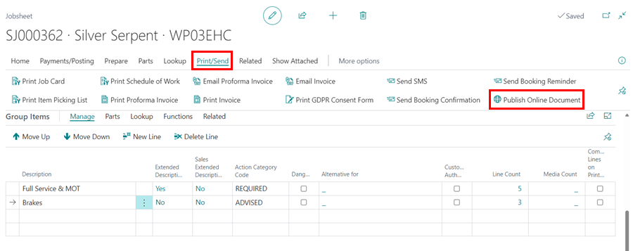
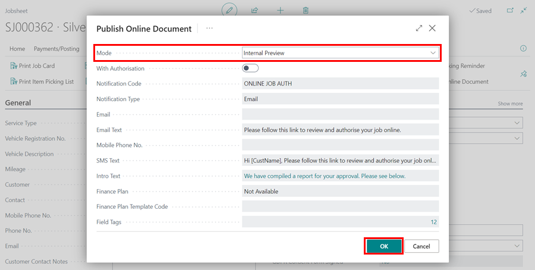
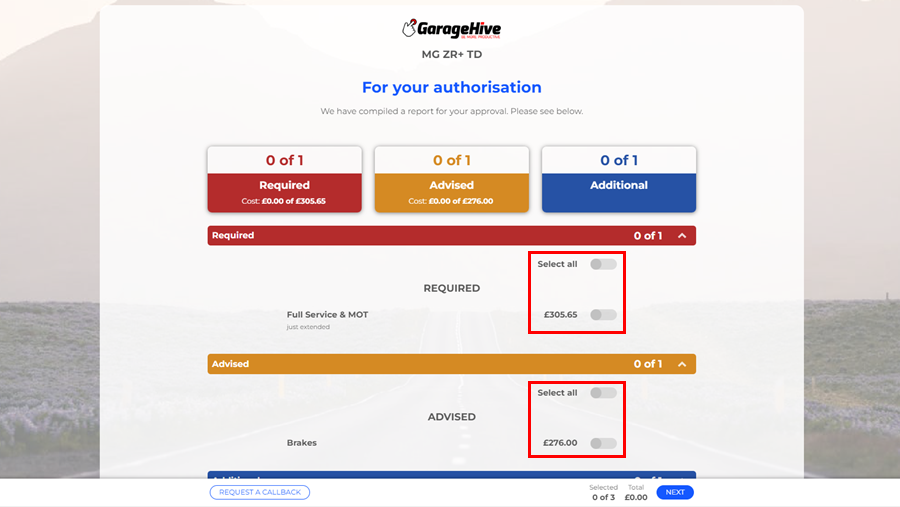
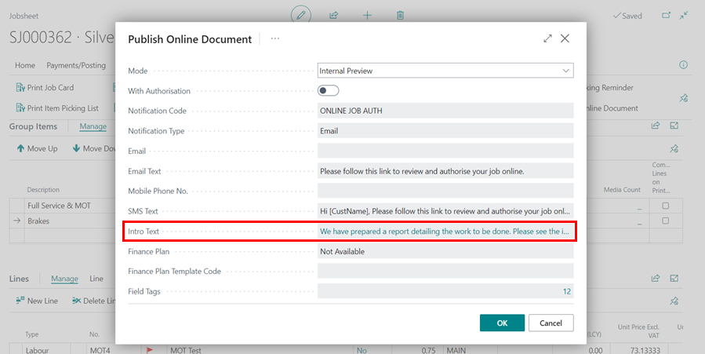

# Previewing and Publishing Online Documents 

Previewing an online document is done when the document to be previewed has been edited and you want to confirm how it will look when sent to the customer, whereas publishing is done when the document is finished and ready to send to the customer.

## In this article

1. [How to Preview an Online Document](#how-to-preview-an-online-document)
2. [How to Publish an Online Document](#how-to-publish-an-online-document)
3. [Set the Default Online Document to Require Authorisation](#set-the-default-online-document-to-require-authorisation)

### How to Preview an Online Document
To preview an online document from a jobsheet:
1. Scroll down to the **Group Items** section (where you have already created the groups, read [Grouping document lines](garagehive-group-items-grouping-document-lines.html){:target="_blank"}).
2. Depending on the level of urgency and the nature of the job, add an **Action Category** to each group. You have the option of customising the action categories or using the pre-defined action categories.

   

   

3. To preview the online document, select **Print/Send** from the document menu bar, then **Publish Online Document**. 

   

4. Select **Internal Preview** as the **Mode**. You can click **OK** because **Internal Preview** is always the default mode.

   

5. The document will be previewed without the option for the customer to authorise the work to be done online.

   

6. To preview the document with the option for the customer to authorise online, select the **With Authorisation** slider on the **Publish Online Document** page. Click **OK**.

   

7. The document will be previewed with the option for the customer to authorise the work to be done online.

   

8. On the current document, you can edit the intro to be specific to the customer, but the intro text will revert to the default text when the document is published. Click on the **Intro Text** field from the **Publish Online Document** page to edit the intro text.

   

[Go back to top](#top)

### How to Publish an Online Document
After you have finished preparing the document and are ready to send it to the customer, you can now publish it. To make the document available to the customer, follow these steps:
1. From the document menu bar, select **Print/Send**, and then **Publish Online Document**.

   

2. Select the **Mode** to be **Publish to Customer** and specify the method for sending the online document. It could be via SMS, email, or both.

   

3. You can also personalise the text used for the SMS, Email, or online document introduction, or use previously saved text messages. Click **OK** to send the online document to the customer without giving the customer the option to authorise the work to be done online.

   

4. The document will be published and sent to the customer for viewing, with the option to call back with any questions.

   

5. To publish the document with the option to for the customer to authorise the work to be done online, select the **With Authorisation** slider on the **Publish Online Document** page. Click **OK**.

   

6. Scroll down to the **Online Document** FastTab to see what actions the customer takes from the sent online document. Here you can see how many edit versions of the document are available, when the published online document was opened, when it will expire, and so on.

   

7. When a customer takes action, the **Online Document** FastTab is updated after a while. The following is an example of when the customer approves the document.

   



[Go back to top](#top)

### Set the Default Online Document to Require Authorisation
To always publish the document that require the customer authorisation for the work to be done:
1. In the top right corner, choose the  icon, enter **Online Document Setup**, and select the related link.

   

2. Under the **General** FastTab, select the **With Authorisation** slider.

   

 

### **See Also**

[Introduction to Online Documents](garagehive-online-documents-introduction.html){:target="_blank"} \
[Grouping document lines](garagehive-group-items-grouping-document-lines.html){:target="_blank"} \
[Working with group items actions](garagehive-group-items-working-with-group-items-actions.html){:target="_blank"} \
[Setting up online documents](garagehive-online-documents-setting-up-online-documents.html){:target="_blank"} \
[Adding and Managing Media in Garage Hive](garagehive-online-documents-adding-and-managing-media.html){:target="_blank"} \
[Using online documents in estimates, checklists and vehicle inspection estimates](garagehive-online-documents-using-online-documents-in-estimates-checklists-and-vehicle-inspection-estimates.html){:target="_blank"} \
[What Happens When a Customer Acts on a Sent Online Document?](garagehive-online-documents-what-happens-for-customers-actions.html){:target="_blank"}
