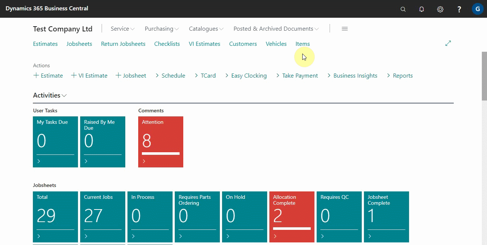
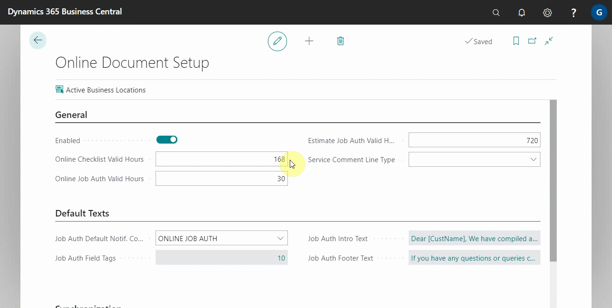
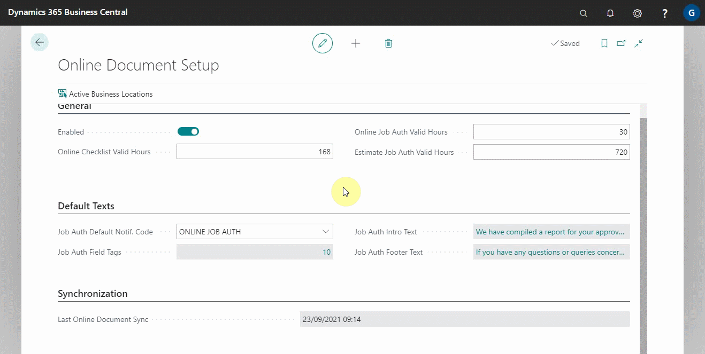
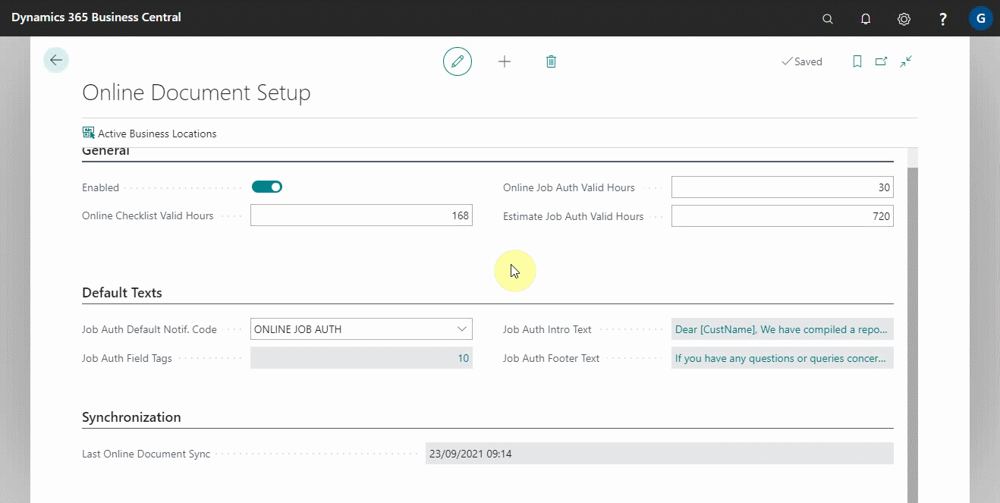
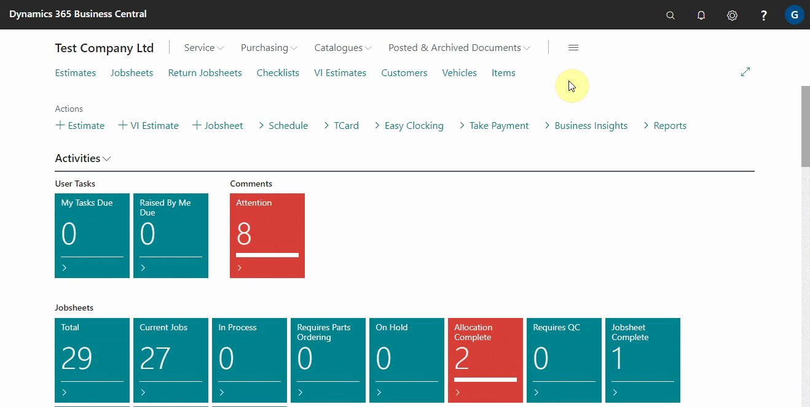
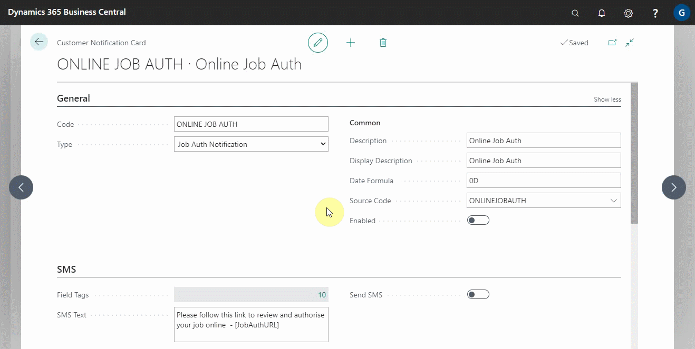
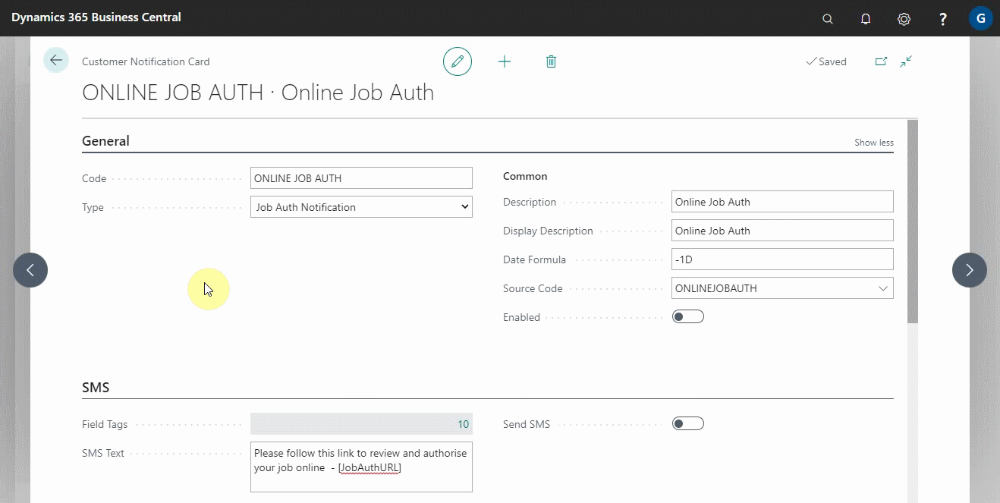
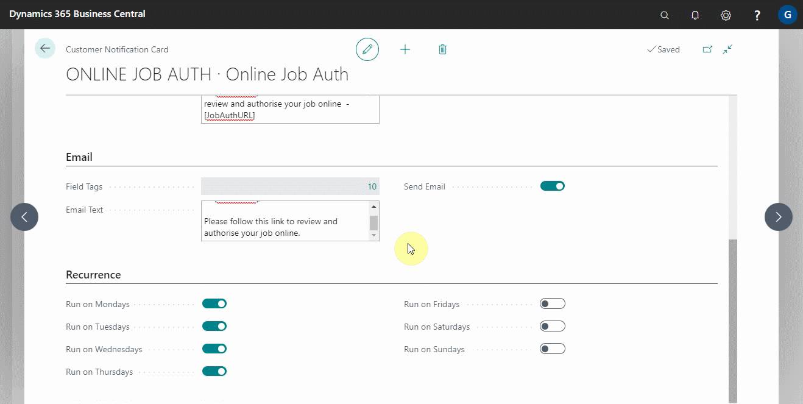

# Setting Up Online Documents 
To enable the online documents in your system, you must first contact the Garage Hive Support team so that the service can be enabled. In this article, we'll go over the steps to take after the service has been activated in your system.

## In this article

1. [Online documents set up](#online-documents-set-up)
2. [Customer notification set up](#customer-notification-set-up)

### Online documents set up
If your system already has the service activated, the following steps will help you to fully configure the online documents:

1. Search **Online Documents Setup** on the search icon in the top-right corner and select it from the search results.

   

2. Make sure the **Enabled** slider is turned on.
3. Set the **Valid Hours** for online documents, which is the number of hours the previewed or published online document lasts before expiring. 

   

4. Add an introduction text in the field **Job Auth Intro Text** from the section titled **Default Texts**. This is the text that appears at the top of the online document that has been previewed or published. You can use the **Field Tags** to automatically insert a particular field in the text.

   

5. Add the footer text in the next field, **Job Auth Footer Text**. This is the text that appears after the report in the online document.

   

 

### Customer notification set up
The customer notification setup allows you to specify how the customer will receive the online documents link, when and after how long, and the message body. The following are the steps to take for the setup:

1. From the search icon at the top-right corner, search for **Customer Notifications** and select it from the search results.
2. From the window that opens, choose **Online Job Auth**.

   

3. Under the **General** section, you can set the **Date Formula** to **-1D** (-1 Day) to ensure that the system sends the link to the customer immediately.

   

4. Add the message body to both the **SMS** and the **Email** sections, using the provided field tags to add a specific field in the message body.

   

5. Select the slider next to the Send SMS and Send Email fields to enable sending **SMS** and **Email**. A pop-up window will appear, allowing you to select a default document to preview the messages.

   

6. Under the **Recurrence** section, select the days on which you want the system to send the notification, and enable the customer notification under the **General** section.

   

After you have completed this setup, you are now ready to use the online document feature.

 

### **See Also**

[Introduction to Online Documents](garagehive-online-documents-introduction.html) \
[Grouping document lines](garagehive-group-items-grouping-document-lines.html) \
[Previewing and publishing online documents](garagehive-online-documents-previewing-and-publishing-online-documents.html) \
[Adding and Managing Media in Garage Hive](garagehive-online-documents-adding-and-managing-media.html) \
[Using online documents in estimates, checklists and vehicle inspection estimates](garagehive-online-documents-using-online-documents-in-estimates-checklists-and-vehicle-inspection-estimates.html)