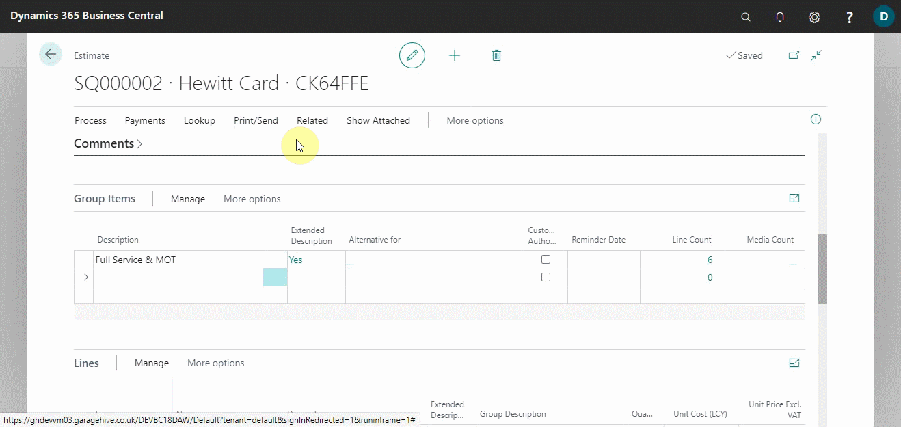
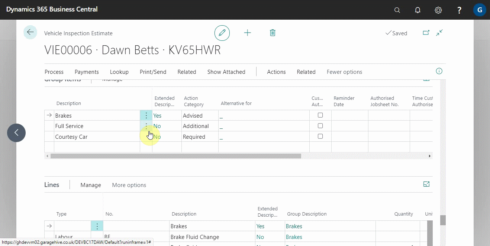

# Using Online Documents in Estimates, Checklists and Vehicle Inspections

In this article, we'll take a look at how online documents are displayed when they're used in estimates, checklists, or vehicle inspection estimates. This will assist you in determining which document is the best for you at a given point in time to send out the online document to the customer.

## In this article

1. [Using online documents in estimates](#using-online-documents-in-estimates)
2. [Using online documents in checklists](#using-online-documents-in-checklists)
3. [Using online documents in vehicle inspection estimates](#using-online-documents-in-vehicle-inspection-estimates)

### Using online documents in estimates
Because the estimate is a document created for the customer prior to bringing the vehicle, there are no action categories in the online document; instead, all groups created are listed under the Estimate header.

So, once the group has been authorised by the customer, you can copy the authorised lines to a jobsheet.

### Using online documents in checklists
The checklist entails having the vehicle on site and physically inspecting the vehicle; as a result, a report is prepared and can be sent to the customer via an online document link as a download for them to go through.

After reviewing the checklist, the customer can request a call back if they have any questions or give the go-ahead to prepare a vehicle inspection estimate.

### Using online documents in vehicle inspection estimates
When a customer requests for an estimate based on a completed vehicle inspection, the vehicle inspection estimate is prepared and can be shared via an online document with various categories of the groups, such as advised, required, additional, and so on.

The customer can approve all of the items in a category or just some subitems.

 

### **See Also**

[Introduction to Online Documents](garagehive-online-documents-introduction.html) \
[Grouping document lines](garagehive-group-items-grouping-document-lines.html) \
[Setting up online documents](garagehive-online-documents-setting-up-online-documents.html) \
[Previewing and publishing online documents](garagehive-online-documents-previewing-and-publishing-online-documents.html) \
[Adding and Managing Media in Garage Hive](garagehive-online-documents-adding-and-managing-media.html)