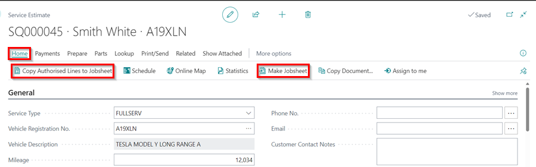

# Using Online Documents in Estimates, Checklists and Vehicle Inspections

In this article, we'll take a look at how online documents are used and displayed in estimates, checklists, vehicle inspection estimates and jobsheets. This will assist you in determining which document is the best for you to use the online documents feature.

## In this article
1. [Using online documents in estimates](#using-online-documents-in-estimates)
2. [Using online documents in checklists](#using-online-documents-in-checklists)
3. [Using online documents in vehicle inspection estimates](#using-online-documents-in-vehicle-inspection-estimates)
4. [Using online documents in jobsheets](#using-online-documents-in-jobsheets)

### Using online documents in estimates
Let's say a customer phones the garage before bringing the vehicle in for repair, and the customer wants to know how much it will cost to do an **MOT** and a **Full Service**. The **Estimate** is the relevant document to use. There are no action categories in the online document for the Estimate; instead, all created group items are listed under the **Estimate** header, as shown below.

If a customer has authorised the work, you can use the **Make Jobsheet** action to create a new jobsheet for this work and schedule it in, or you can add authorised work to the existing jobsheet using the **Copy Authorised Lines to Jobsheet** action.

### Using online documents in checklists
When the customer brings the vehicle to the garage for pre-booked work, the garage can have a policy doing overall vehicle health check. In such a scenario, the **Checklist** should be created, which involves physically checking the vehicle, taking pictures of the faults, and adding technicians' comments. As a result of the inspection, a report is created and can be sent to the customer as a download via an online document.

After reviewing the checklist, the customer can **Request a Callback** if they have any questions or give the go-ahead to prepare a vehicle inspection estimate.

### Using online documents in vehicle inspection estimates
When a **Checklist** is carried out and there are some previously unknown faults found, to prepare an Estimate for the work needed to fix them 
the **Vehicle Inspection Estimate** is created.

There are several features that help in the quick and efficient pricing of previously found issues. The perfect scenario would be for the checklist lines to be set up to flag as attention if a technician marks them as amber or red, see [How to create a checklist](garagehive-checklist-how-to-create.html){:target="_blank"}. When a line is marked as attention, the technician is prompted to take a picture of the fault to show it to the customer later. Also, the technician adds text explaining the fault, which can be taken from templates. The text template is linked to a service package that contains a description of why this needs to be done as well as the work items.

When a vehicle inspection estimate is created, group items are generated using the **Add Attention Lines** action. This transfers all the checklist faults to VIE **Group Items**, links checklist pictures to these groups, and applies checklist text template packages with descriptions and lines. The lines can then be priced and **Group Items** descriptions edited to the specific case.

When the vehicle inspection estimate is priced up it can be shared via an online document with various categories of the groups, such as advised, required, additional, and so on.

The customer can approve all of the items in a category or just some subitems. To copy the approved items in the online document to the jobsheet, use the **Copy Authorised Lines to Jobsheet** action under **Process** in the VIE menu bar.

### Using online documents in jobsheets
The customer has approved work, and you create a jobsheet for those items. While working on the car additional work can be found that needs to be done and for this you can just add that work to the same jobsheet and publish an online job authorization. This allows the customer to keep track of all approved items as well as any additional items that come up.

 

### **See Also**

[Introduction to Online Documents](garagehive-online-documents-introduction.html){:target="_blank"} \
[Grouping document lines](garagehive-group-items-grouping-document-lines.html){:target="_blank"} \
[Working with group items actions](garagehive-group-items-working-with-group-items-actions.html){:target="_blank"} \
[Setting up online documents](garagehive-online-documents-setting-up-online-documents.html){:target="_blank"} \
[Previewing and publishing online documents](garagehive-online-documents-previewing-and-publishing-online-documents.html){:target="_blank"} \
[Adding and Managing Media in Garage Hive](garagehive-online-documents-adding-and-managing-media.html){:target="_blank"} \
[What Happens When a Customer Acts on a Sent Online Document?](garagehive-online-documents-what-happens-for-customers-actions.html){:target="_blank"}