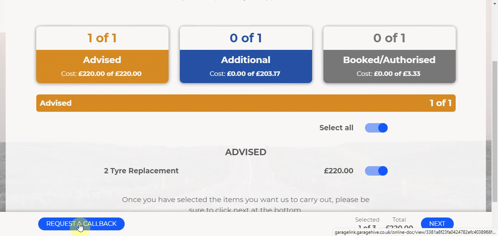

# What Happens When a Customer Acts on a Sent Online Document?

The goal of sending the online document is to communicate with the customer about the work that needs to be done on the vehicle, so that at the end of it, the customer will take action and the garage owner will receive notification about the customer's action. Let's take a look at how the customer's actions are interpreted by the system.

## In this article

1. [Customer approves the job to be done](#customer-approves-the-job-to-be-done)
2. [Customer requests for a call back](#customer-requests-for-a-call-back)

### Customer approves the job to be done
When the customer receives and opens the online document, it displays a list of items organised by the action category. The customer can now approve the jobs to be done by using the slider on each item and selecting **Next** at the bottom to view the summary of the items selected, as shown below, and approve the items when satisfied:

The approval notification appears as a comment marked attention for the service advisor take action. To view the approval:
1. From the **Role Centre** (home page), navigate to the **Attention** tile and click on it.
2. Choose the document from which the online document was sent, and then click the document **No.**.

   

3. Scroll down to the **Group Items** section to see the items approved in the column **Customer Authorised**.
4. After you've confirmed approved items, scroll up to the comments section and remove the attention mark in the **Online Doc** comment so it no longer appears as requiring attention.

   

### Customer requests for a call back
Sometimes, the customer might opt to request for a call back from the online document sent, as shown below:

When that happens, the **Request a Callback** button, also creates a comment marked attention and can be seen from the role centre **Attention** tile.

 

### **See Also**

[Introduction to Online Documents](garagehive-online-documents-introduction.html) \
[Grouping document lines](garagehive-group-items-grouping-document-lines.html) \
[Working with group items actions](garagehive-group-items-working-with-group-items-actions.html) \
[Setting up online documents](garagehive-online-documents-setting-up-online-documents.html) \
[Previewing and publishing online documents](garagehive-online-documents-previewing-and-publishing-online-documents.html) \
[Using online documents in estimates, checklists and vehicle inspection estimates](garagehive-online-documents-using-online-documents-in-estimates-checklists-and-vehicle-inspection-estimates.html) \
[Adding and Managing Media in Garage Hive](garagehive-online-documents-adding-and-managing-media.html)
