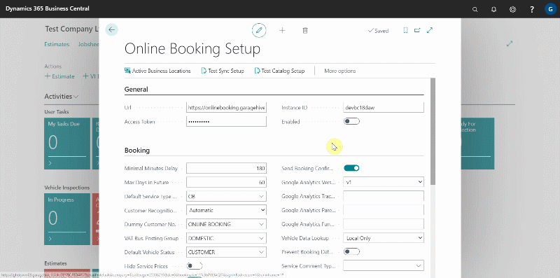
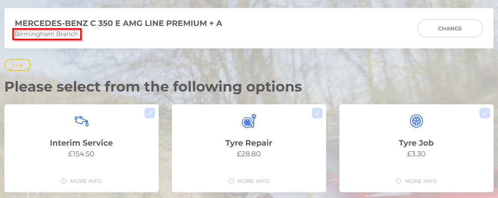
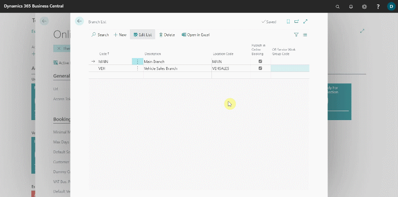
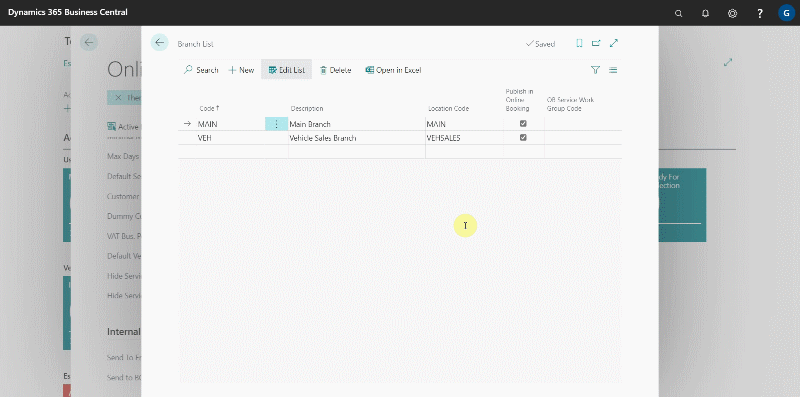

## Branches 
In the **Online Booking Setup** page:
1. From the actions bar, choose **More Options**, then **Related**, and finally **Branches**. If More Options was previously selected, select **Related** right away; otherwise, **Fewer Options** will be available.
2. You should rename the branch descriptions here because they will appear in the online booking widget, and then enable the **Publish Online Booking** checkbox.

   

   Appearance in the online booking page:

   

3. Add the **Online Booking (OB) Service Work Group Code** field for each branch.

   

4. Then, click the down arrow to the right of the **Location Code** and then click **select from full list**.
5. Select the three dots at the top, then **Manage**, followed by **Edit**.
6. In the page that appears, ensure that the **Business Location** is enabled and enter the **Address**, **Phone Number**, and **Email Address** of that location. Repeat the process for each location you've added.

   

 
[Next step](/docs/garagehive-onlinebooking-holidays.html)