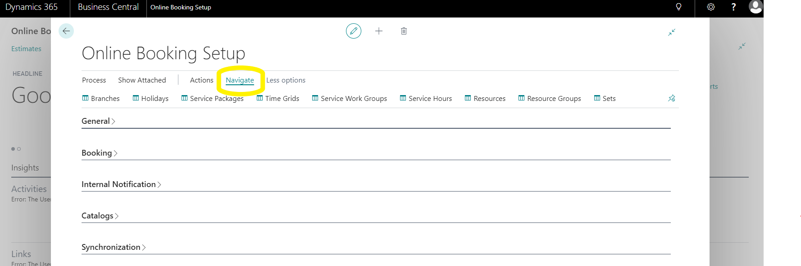
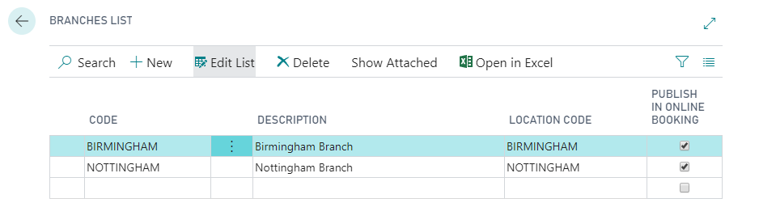
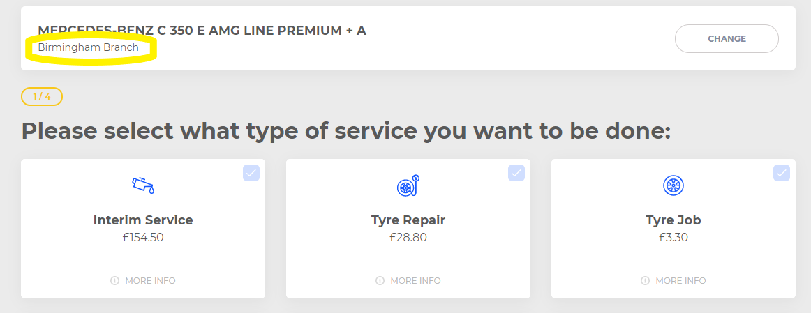
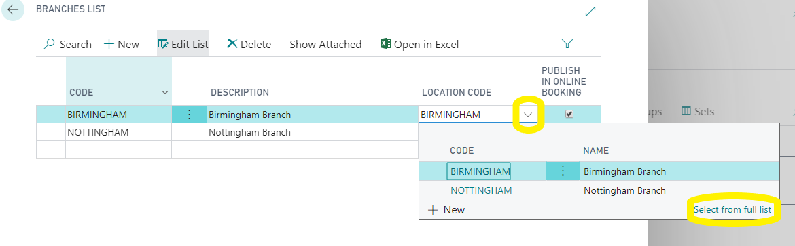
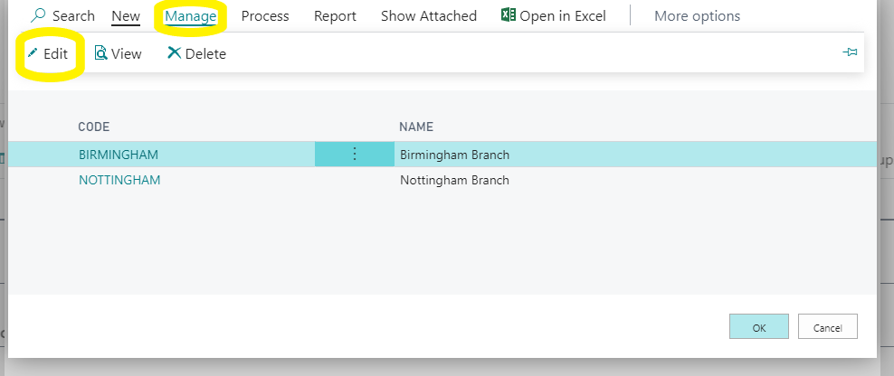
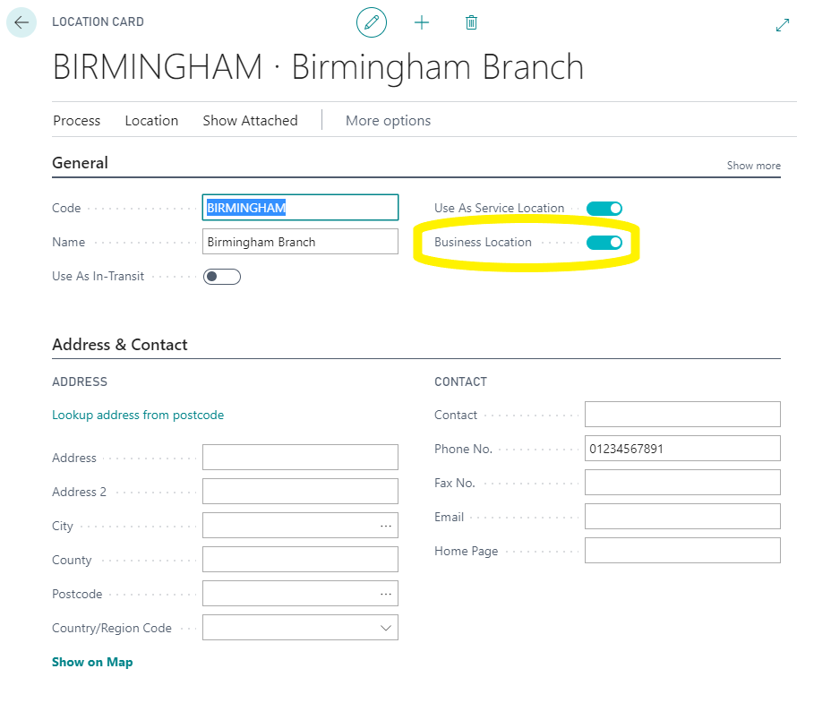

# Branches 
BACK IN THE ONLINE BOOKING SETUP PAGE.

Click on “navigate” so that you can see the list of set up tables.

Branches – Here you should rename the branch descriptions as this will display in the online booking widget.

Next, click on the arrow to the right of the location code and select from full list.

Then manage and edit.

Here you need to make sure the business location is turned on and fill in that locations,
* Address
* Phone number
* Email address

 
# [NEXT STEP](https://docs.garagehive.co.uk/docs/garagehive-onlinebooking-holidays.html)