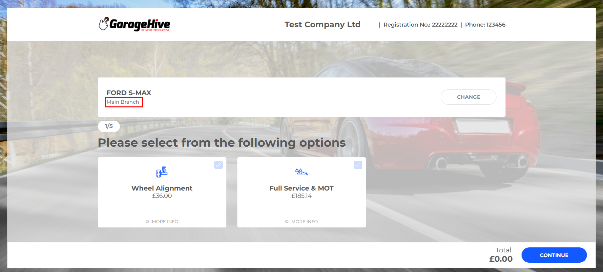

## Branches 
Branches are the locations where customers can book their vehicles online. The customer will have to select which branch they are booking into, before they can proceed to book. Here is how to setup the branches:

In the **Online Booking Setup** page:
1. From the menu bar, choose **More Options**, then **Related**, and finally **Branches**. If More Options was previously selected, select **Related** right away; otherwise, **Fewer Options** will be available.

   

2. Rename the branch descriptions here the way you want them to appear in the online booking widget, and then enable the **Publish Online Booking** checkbox.

   

   Appearance in the online booking page:

   

3. Add the **Online Booking (OB) Service Work Group Code** field for each branch.
4. Add the **Online Booking (OB) Available Hours Resource Group Code** field. This setting ensures that online bookings adhere to the service schedule available hours. When the available hours for a given day at a branch are used up, no further bookings will be allowed for that day.

   

5. Then, click the down arrow to the right of the **Location Code** and click **select from full list**.

   

6. Click the ellipsis (...) in the menu bar, then select **Manage**, followed by **Edit**.

   

7. In the page that appears, ensure that the **Address**, **Phone Number**, and **Email Address** of that location is added. Repeat the process for each location you've added.

   

 
[Previous](/docs/garagehive-onlinebooking-setup.html) | [Next Step](/docs/garagehive-onlinebooking-holidays.html)