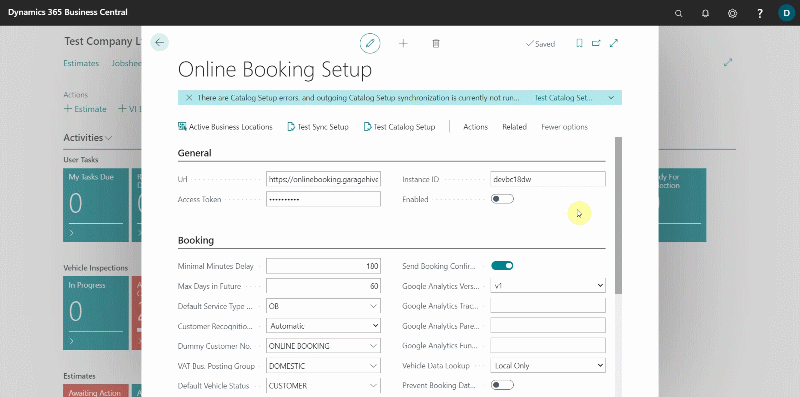

## Holidays
Holidays can be set up in online booking to ensure that those days are blocked out, and no bookings can be made online during those dates. Here's how to setup the holidays.

In the **Online Booking Setup** page:

1. From the menu bar, choose **Related**, followed by **Holidays**.
2. In the page that opens, add all of the **Bank Holidays** in the calendar year that you want to prevent customers from making online bookings.

  

 
[Previous](/docs/garagehive-onlinebooking-branches.html) | [Next step](/docs/garagehive-onlinebooking-service-packages.html)