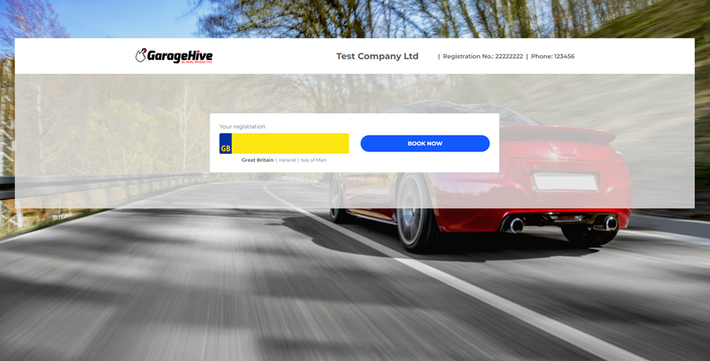

# Intro 
If you haven't already set up your service packages, it is recommended that you do so before starting the **Online Booking Setup**. Here is the documentation for the service package - [Set Up Service Packages.](/docs/garagehive-service-packages.html){:target="_blank"}

Why not have a play with our demo system here, [online booking demo page.](https://onlinebooking.garagehive.co.uk/cronusmotorsbc.html){:target="_blank"}

 

The following are the steps to help you set up online booking:

|             |                                                                                                                                             |
| :---------- | :------------------------------------------------------------------------------------------------------------------------------------------ |
| **STEP 1**  | [Initial Setup](garagehive-onlinebooking-setup.html){:target="_blank"}                                                                      |
| **STEP 2**  | [Setting up the Branches](garagehive-onlinebooking-branches.html){:target="_blank"}                                                         |
| **STEP 3**  | [Setting up the Holidays](garagehive-onlinebooking-holidays.html){:target="_blank"}                                                         |
| **STEP 4**  | [Setting up Service Packages for Online Booking and Enquiries](garagehive-onlinebooking-service-packages.html){:target="_blank"}            |
| **STEP 5**  | [Setting up the Time Grids](garagehive-onlinebooking-time-grids.html){:target="_blank"}                                                     |
| **STEP 6**  | [Setting up the Service Workgroups and Service Hours](garagehive-onlinebooking-service-workgroups-and-service-hours.html){:target="_blank"} |
| **STEP 7**  | [Setting up the Resource Groups](garagehive-onlinebooking-resources.html){:target="_blank"}                                                 |
| **STEP 8**  | [Setting up the Sets](garagehive-onlinebooking-sets.html){:target="_blank"}                                                                 |
| **STEP 9**  | [Testing the Set Up](garagehive-onlinebooking-testing.html){:target="_blank"}                                                               |
| **STEP 10** | [Common Errors for Online Booking](garagehive-common-errors-for-online-booking.html){:target="_blank"}                                      |

[Go to First Step](/docs/garagehive-onlinebooking-setup.html)