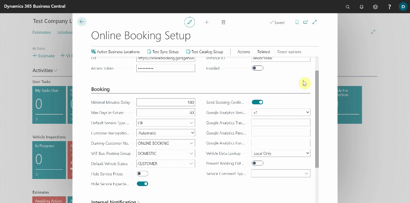

# Resource Groups
Back in the **Online Booking Setup** page:
1. From the actions bar, choose **Related**, followed by **Resource Groups**.
2. **Resource Groups** were previously created when we added them to service packages, but this provides quick access to that table if you need to make changes.
[Click here to see that document](garagehive-onlinebooking-service-packages.html).
 

# [NEXT STEP](/docs/garagehive-onlinebooking-sets.html)