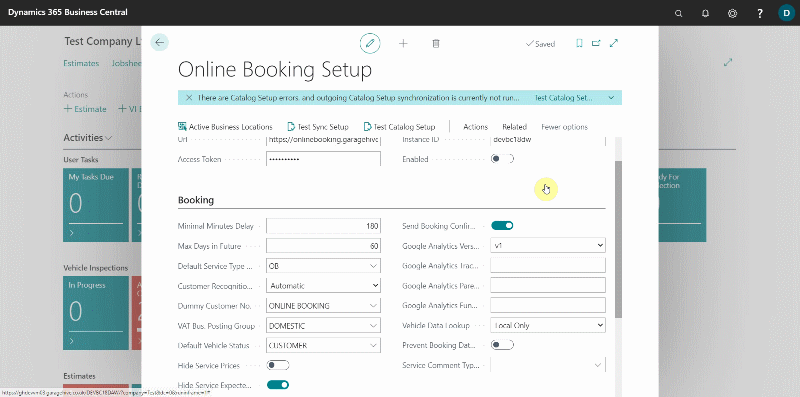
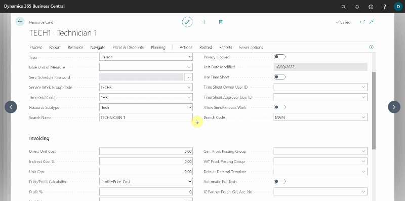
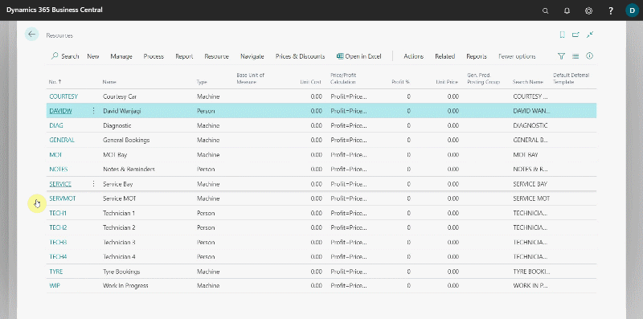

# Setting Up Online Booking - Resources
In the **Online Booking Setup** page:
1. From the actions bar, choose **Related**, followed by **Resources**.
2. Open each **Resource** that is part of the **Resource Groups** you created previously (MOT, all techs, etc).

    

3. Choose **Related** from the **Resource Card's** actions bar, then **Resource** and **Time Grids**. In this section, enter the time slots for which you want that resource to be available for booking. For example, the MOT resource would normally be set to 45 minutes or one hour because the labour in the service package for MOTs is 0.75 or 1.0 depending on your setup.

    

4. If a resource only has a 1-hour time grid and someone tries to book an MOT at **0.75** and a service at **1.5** hours, the total amount of time required exceeds the time grid. As a result, all of the time grids for **Service**, **General Resources**, and so on are typically assigned **1, 2, 3, 4, and 8 hours.** 

    
 

[Next step](/docs/garagehive-onlinebooking-resource-groups.html)