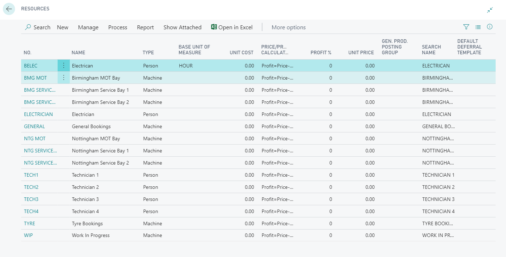
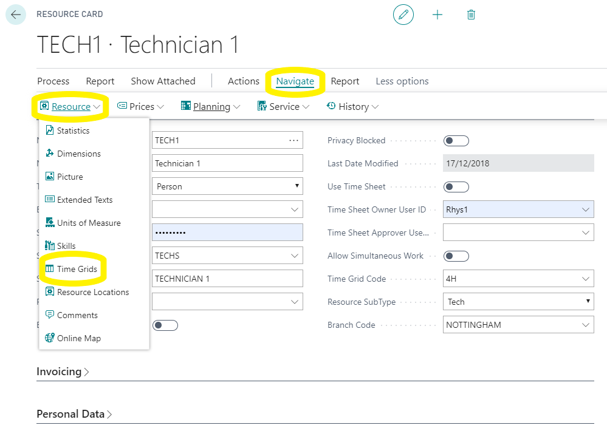
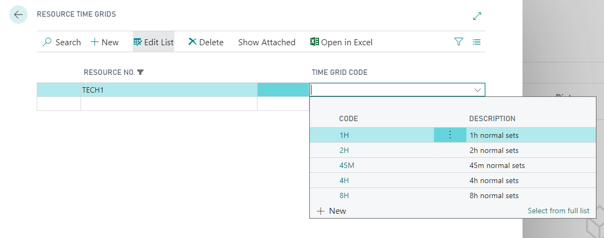

# Resources
BACK IN THE ONLINE BOOKING SETUP PAGE.

Click on “navigate” so that you can see the list of set up tables.

Select "Resources" next.

 

Open each resource that’s included in the groups that you made previously ( MOT, All techs, ETC) and open time grids,

 

Here add the time slots that you want that resource to be able to be booked for. e.g. MOT resource would normally be set to 45min or 1 hour because the labour in the service package for MOT’s is 0.75 or 1.0 depending on your setup. 

If a resource only has the 1-hour time grid in it and someone tries to book an MOT at .75 and a service at 1.5 hours that resource would not be available to book as the total amount of time needed exceeds the time grid. As such its typical for Service, General resources etc to have all the time grids allocated 1,2,3,4 & 8 hours. 

  

# [NEXT STEP](/docs/garagehive-onlinebooking-resource-groups.html)