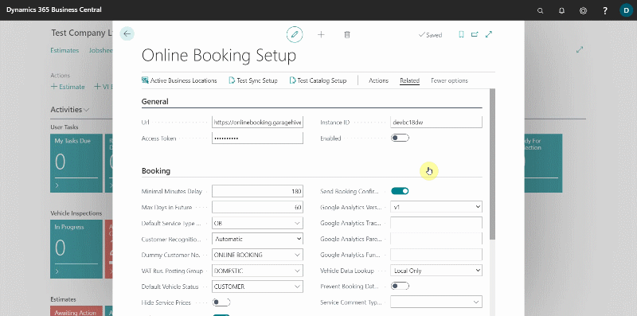
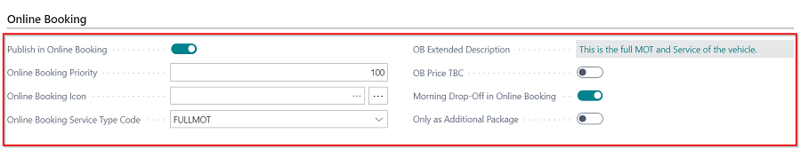
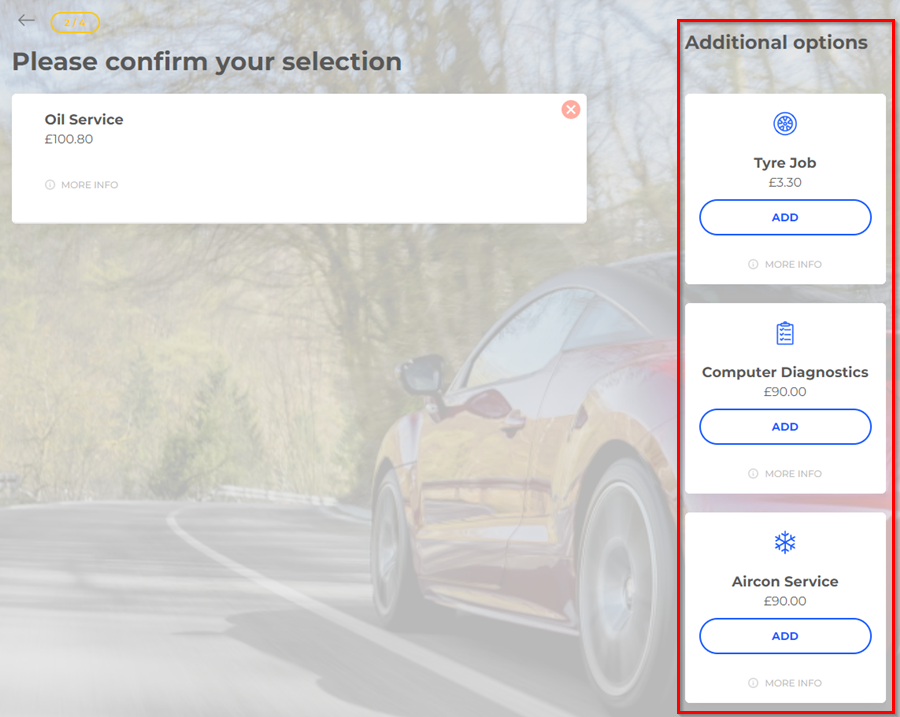
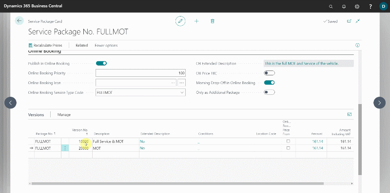
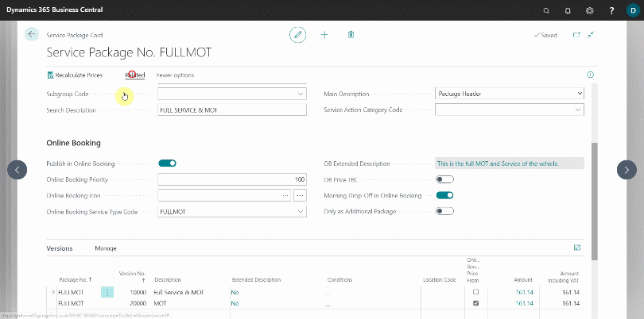
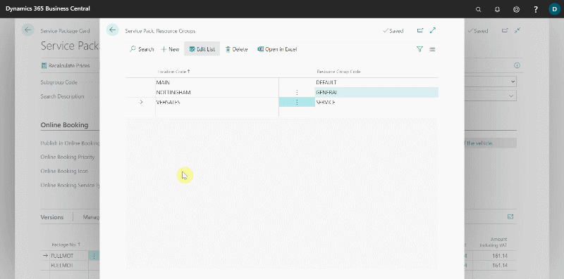
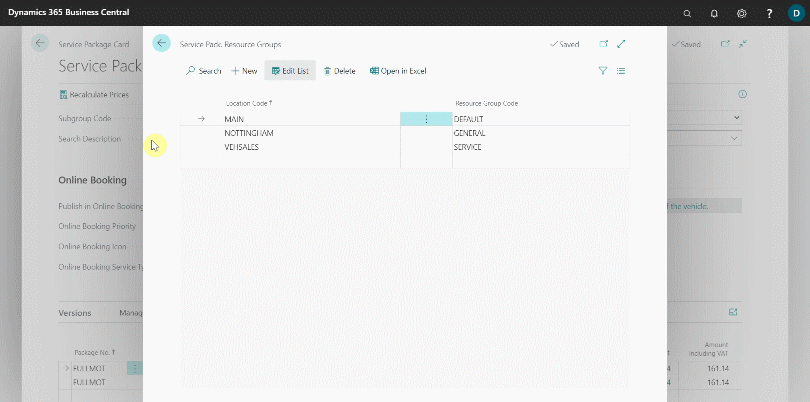

# Setting Up online booking Service Packages
Back in the **Online Booking Setup** page:
1. From the actions bar, choose **Related**, followed by **Service Packages**.
2. Open the **Service Package** you want to show in the **Online Booking(OB)** widget. Please see [here](garagehive-service-packages.html) for more information on creating service packages.

   

3. On the **Service Package** card, under the **Online Booking(OB)** FastTab, make the following settings:
      * Slide the **Publish In Online Booking** slider to the **ON** position.
      * **Online Booking Priority** - This is the order in which the service packages appear online; the lower the number, the higher it will appear in the order. It is recommended to start with 100's between each package so that there is room to add more packages later, for example, **MOT Service Packages** are usually 100's, **Interim Services** 200's, **Full Service** 300's, and so on.
      * **Online Booking Icon** - In this field, choose the icon you want to display for the service package in the online widget.
      * **Online Booking Service Type Code** - These are the **Service Types** that you see at the top of the jobsheets; this should indicate what type of service type this package relates to.
      * **OB Extended Description** - You can add a description to the service package here if you want it to be different from the **Service Package** header description. You may enter as much text as you like in this field.
      * **OB Price TBC** - When the slider is turned on, it indicates that the price of the service package will be confirmed after booking, in which case it is not displayed when booking.
      * **Morning Drop-Off in Online Booking** - When the slider is turned on, it indicates that the vehicle will need to be dropped off in the morning so that the work in the service package can be scheduled during the day.

        
        

      * **Only as Additional Package** - When the slider is enabled, this package is hidden from the first page of the online booking but can be added as an additional item to other packages. This is ideal for things like discounted MOTs or fuel treatments.

        

4. Under the **Versions** FastTab, select the **Online Booking Prices From** checkbox for the version that does not have a fixed price, so that you can have the price defined as **Price From** without specific figure.

    

5. Now, from the actions bar, select **Related**, then **Package**, and finally **Resource Groups**. Select a new line to add a **Location Code** from the list of available locations. If you only have one location, you can leave the location blank.

    
    
6. The next step is to specify where the system will look for availability in your schedule to book the service package. Click on the down arrow in the **Resource Group Code**, then select **See from full list**.
7. Select a **Resource Group** for the location, and then click the three dots at the top, followed by **Specifications**. In this list opens, add the resources that you want resource group to be able to make allocations against. This could be just the MOT bay, all techs, or just the tech who does diagnosis work, depending on what this group will be used for. (In the future, you may not need to create new groups; instead, you can simply add existing groups to each service package.)

    

8. Return to the **Service Package** Card and select **Related**, then **Package**, and finally **Additional Services**. Here, you can add the service packages that you want to show as an additional service for the service packages. 
9. Add the **Type** as **Online Booking** and select the additional services from the **Additional Service Pack**. No. ** column You can add as many additional services as you need.

    

10. The selected **Additional Services** will appear as follows in the online booking widget.

    

[Next step](/docs/garagehive-onlinebooking-time-grids.html)