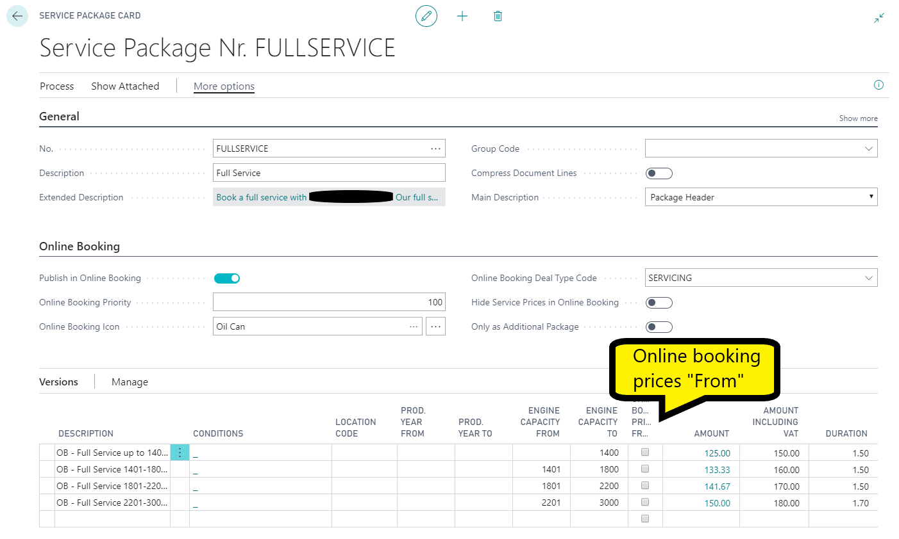
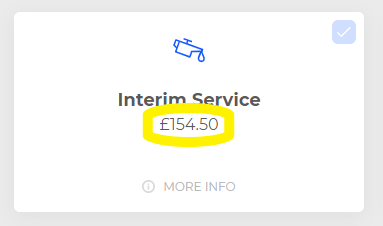
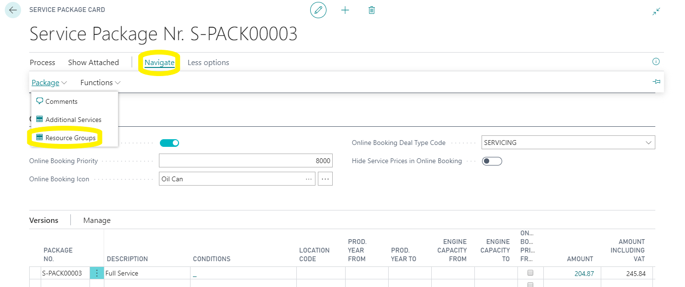
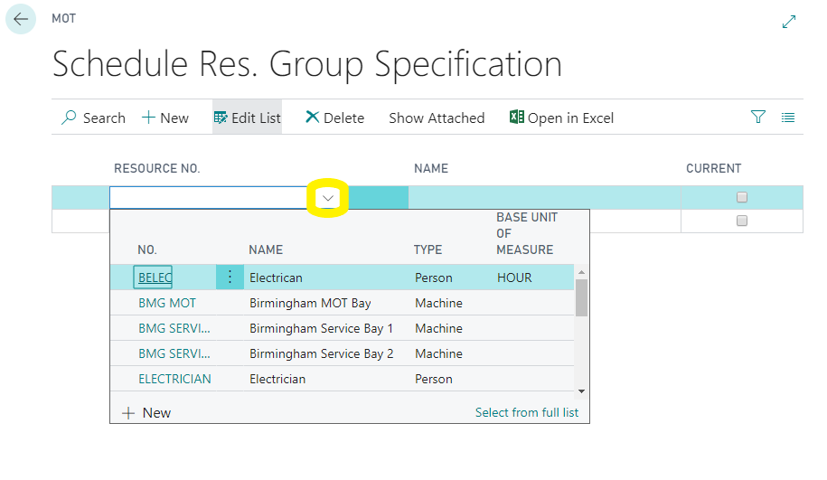
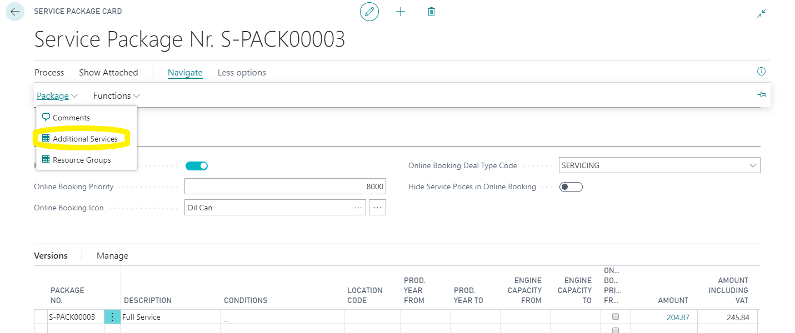
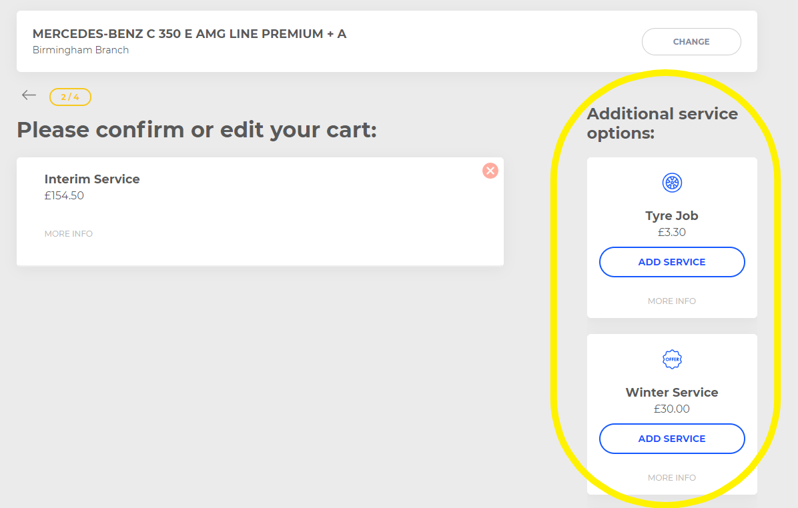

# Service Packages
BACK IN THE ONLINE BOOKING SETUP PAGE.

Click on “navigate” so that you can see the list of set up tables.

Select "Service Packages", Open this table and open one of the packages that you want to display in the online booking widget. 
[for information on creating service packages please see here](https://docs.garagehive.co.uk/docs/garagehive-service-packages.html)

# Online Booking tab

* Publish in online booking – Slide this on. 

* Online Booking Priority – It's best practice to start with 100’s between so there’s room to slide more packages in later e.g. MOT service packages are usually 100 then interim services 200 full service 300 and so on, this number denotes what order they appear online, the lower the number the higher it will appear in the list.

* Online booking icon – Here you can select the icon that you want to display on for this package in the widget.

* Online Booking Deal Type Code – These are the “service types” that you see at the top of job sheets, this should denote what kind of service type this service package relates to. 

* Hide Service Prices in Online Booking - This will hide the sales price of this service package.

* Only as Additional Package – This slider hides this package from the 1st page on the online booking but allows the package to be added to other packages as an additional item, this ideal for things like fuel treatments or discounted MOT’s.

* Online Booking Prices From – If your package contains a version that is not a fixed price you can define this as a “price from” version by ticking this box.

Next, click on navigate and resource groups. 

Then click on new and add a code and description, if you are a single location you can leave the location blank.

Now click on process and specification. 

This is where the system is going to look for availability in your schedule to make the booking,
In this list add the resources that you want that group to be able to make allocations against this could be just the MOT bay or it could be all techs or just the tech that does diagnosis work etc dependent on what this group will be used for. (going forward you may not need to create new groups you can simply add existing groups to each service package) 

Now back to navigate, package and additional services,

here you can add the service packages that you want to display as additional services for that package.

# [NEXT STEP](/docs/garagehive-onlinebooking-time-grids.html)