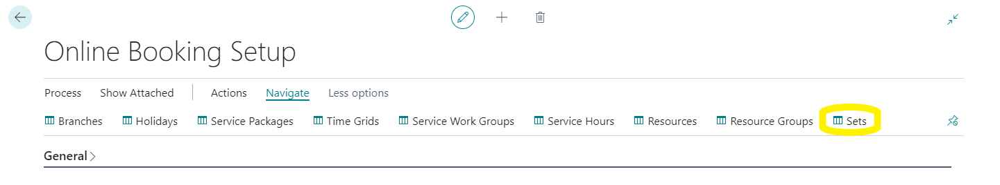
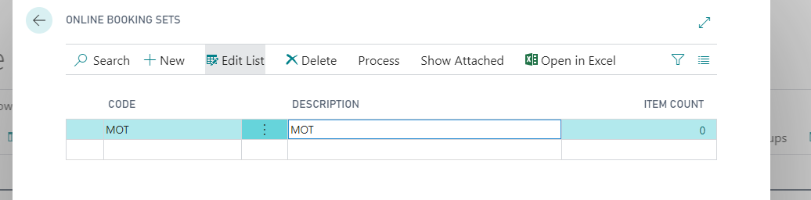
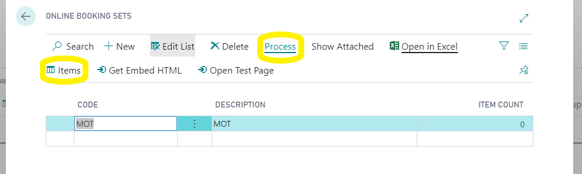
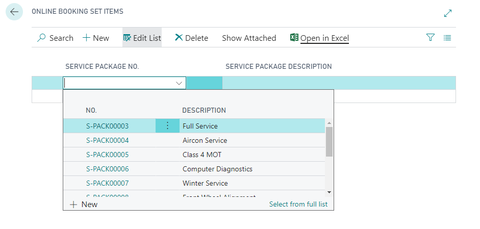
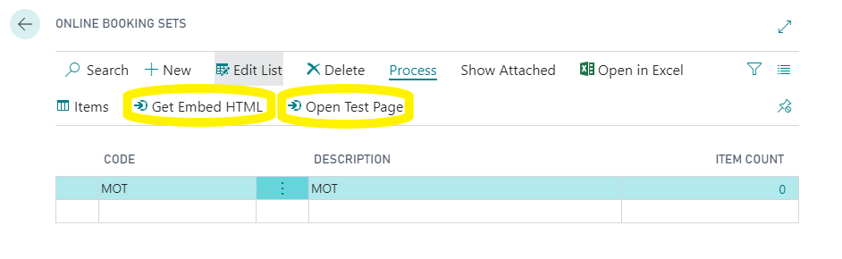

# Sets
BACK IN THE ONLINE BOOKING SETUP PAGE.

Click on “navigate” so that you can see the list of set up tables.

Select "Sets"

 

Sets allow you to make widgets for specific sets of service packages, for instance, MOT only for use on your MOT landing page and have the full set of packages available on your home page. 

Give your set a code and description,

Then go to process and items 

 

Then add the service packages you want to be included in that set. 

From the Sets table, you can get the specific sets embed script and or test the setup via the test page. 

# [NEXT STEP](/docs/garagehive-onlinebooking-testing.html)