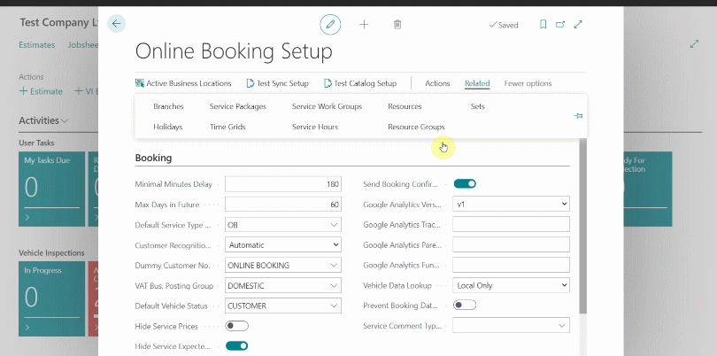
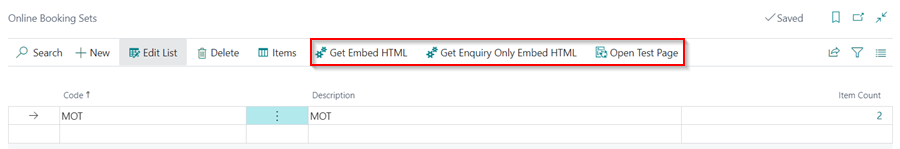

# Setting Up Online Booking Sets
In the **Online Booking Setup** page:
1. From the actions bar, choose **Related**, followed by **Sets**.
2. **Sets** allow you to create widgets for specific groups of **Service Packages**. For example, **MOT** only for use on your **MOT** landing page, and have the full set of packages available on your page. Give your set a **Code** and a **Description**.
3. Select **Items** from the actions bar, and add the **Service Packages** you want to be included in that set.

     

4. From the **Sets** table, you can get the specific sets **Embed** and or test the setup via the **Open Test Page**.

    

[Next step](/docs/garagehive-onlinebooking-testing.html)