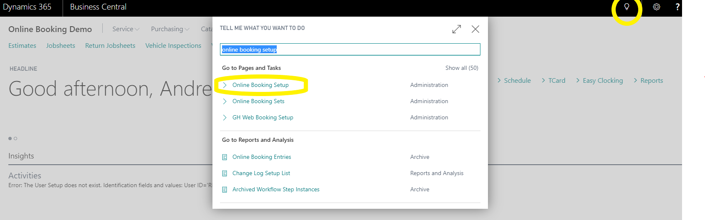
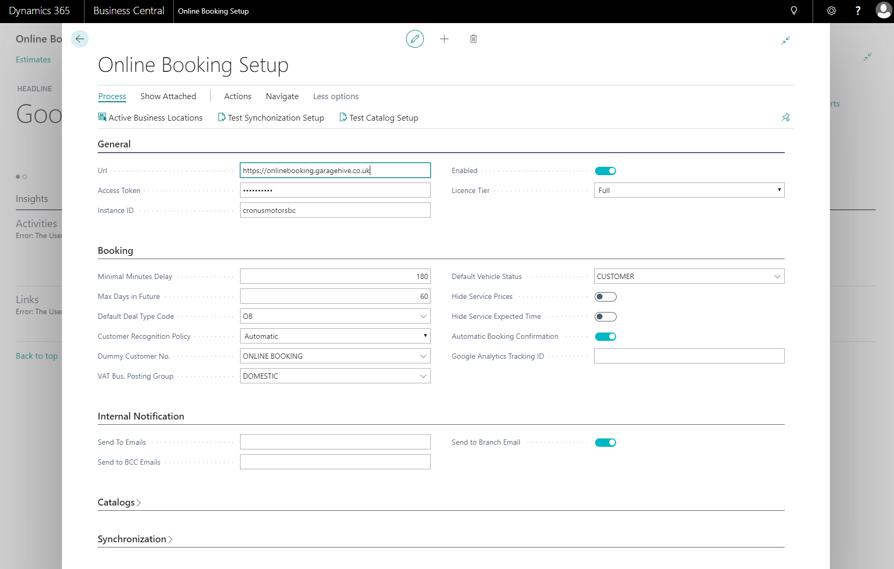
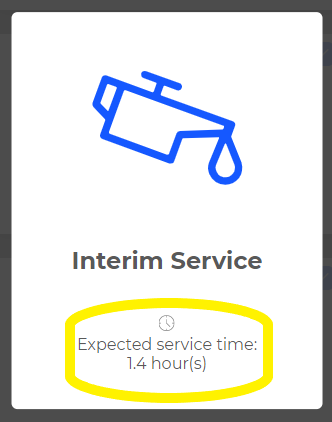

# Online Booking Setup 
Search for “online booking setup” 

Under the General tab, you will see your license type “full” or “solo” and whether or not your online booking is enabled.

Under the booking tab, you can make some set up changes as follows,

* Minimum minutes delay - This is the delay in time from now until the first available booking i.e. 180 minutes gives a 3-hour delay meaning at 8 am a customer can make bookings from 11 am that same day.

* Max days in future - This is the maximum days in the future you will allow bookings to be made. 

* Default Deal Type Code - Its best practice to set this to “OB” for more information on this feature please talk to a member of the team. 

* Customer Recognition Policy - its best practice to set this to “automatic” for more information on this feature please talk to a member of the team. 

* Dummy Customer No. – Should be set to “ONLINE BOOKING”

* VAT Bus. Posting Group – should be set to “DOMESTIC”

* Default Vehicle Status – Should be set to “CUSTOMER”

* Hide Service Prices – This will hide the sales price of all service packages.

* Hide Service Expected Time – This hides the expected service times from service packages. (displayed when more info Is clicked along with any extended descriptions set up in the packages)

* Automatic Booking Confirmation – If enabled will send an email and/or an SMS to the customer confirming there booking.

* Under the Internal notification tab,
Send To Emails – This is usually left blank but this can be used for additional email recipients, this is for a confirmation email that’s sent to the branch.

* Send To BCC Emails – These can be used if you need to BCC the confirmation anywhere else multiple addresses can be entered by using ; as in service@thegarage.com;managment@thegarage.com.

* Send To Branch Email - Its best practice to tick this, this will send the confirmation message to the email in the branch set up that we will do later on in the setup. 

# [NEXT STEP](/docs/garagehive-onlinebooking-branches.html)