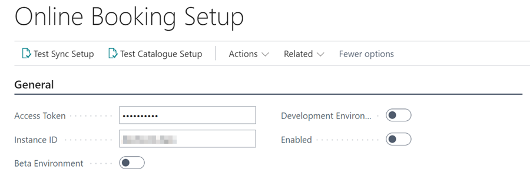
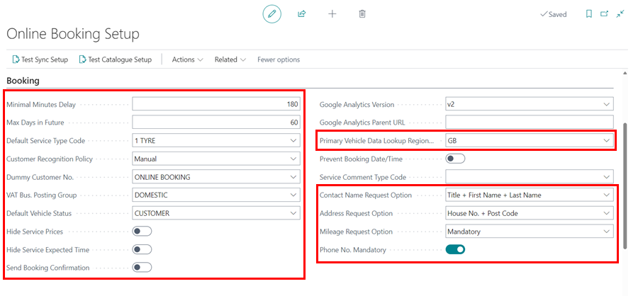

# Online Booking Setup 
To setup online booking:
1. In the top-right corner, choose the search icon, enter **Online Booking Setup**, and choose the related link.

   

2. Under the **General** FastTab, you will see the **URL** for online booking, **Access Token**, **Instance ID**, and whether the setup is enabled.

   

3. You can make the following changes under the **Booking** FastTab:
      - **Minimum Minutes Delay** - This is the time difference between now and the first available booking, i.e., 180 minutes equals a 3-hour delay, implying that at 8 a.m., a customer can make a booking for 11 a.m. that same day.
      - **Max Days in Future** - This is the maximum number of days in the future that bookings can be made.
      - **Default Deal Type Code** - It is recommended that this be set to **OB**. For more information on this feature, please contact a member of the team. 
      - **Customer Recognition Policy** - It is best to set this to **Automatic**. Please contact a member of the team for more information on this feature.
      - **Dummy Customer No.** – Should be set to **Online Booking**.
      - **VAT Bus. Posting Group** – should be set to **Domestic**.
      - **Default Vehicle Status** – Should be set to **Customer**.
      - **Hide Service Prices** – This will hide the sales price of all service packages.
      - **Automatic Booking Confirmation** – If enabled, will send an email and/or SMS confirmation to the customer.

        

      - **Hide Service Expected Time** – This hides the expected service times from service packages. (displayed when **More Info** is clicked, along with any extended descriptions set up in the packages).

        

4. Under the **Internal Notification FastTab, you can set the following:
      - **Send To Emails** – This is usually left blank, but it can be used for additional email recipients; this is for a confirmation email that's sent to the branch.
      - **Send To BCC Emails** – You can use these if you need to BCC the confirmation somewhere else. Multiple addresses can be entered using the ";" character, as in service@thegarage.com;management@thegarage.com.
      - **Send To Branch Email** - It is best practise to check this box, as this will send the confirmation message to the email address specified in the branch setup, which we will do later in the setup.

        

[Next step](/docs/garagehive-onlinebooking-branches.html)