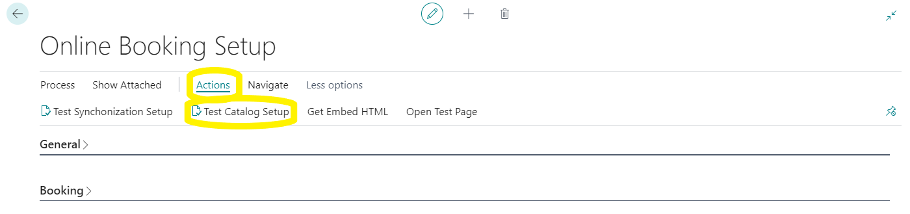

# Testing. 

We are almost there I promise, back in online booking set up you should select "actions" and 
"test catalogue setup" 
 
If all has gone well there will be errors if there are errors,
 
Clicking on the description will open the relevant table.
* warnings will not prevent the system working but errors will its best practice to have no errors or warnings.

Once all the errors are gone you can get the embed script and or use the test page to verify your setup please allow 5 minutes after the errors are clear before testing to allow the system time to validate the setup. 

 