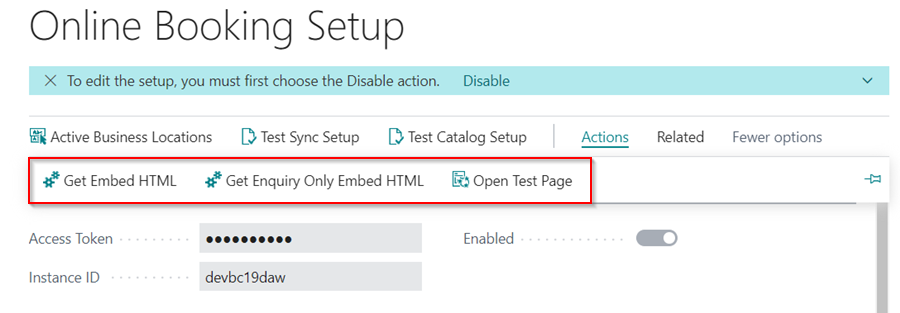

# Testing

We're almost there, I promise. In the **Online Booking Setup** page:
1. From the menu bar, select **Test Catalog Setup**. 

    

2. This validates all of your **Online Booking Setup**, and if everything went well, no errors will be displayed; if not, the errors will be displayed as follows.
3. Clicking on the **Source** will open the relevant table.

    

    

4. Once all errors have been resolved, select **Actions** from the menu bar to obtain the **Embed Script** (you can also get an embed script specific for online enquiry) and/or use the **Open Test Page** to verify your setup. Please wait 5 minutes after the errors have been cleared before testing to give the system time to validate the setup. 

    

[Next step](/docs/garagehive-reviewing-online-bookings-and-enquiries.html)

