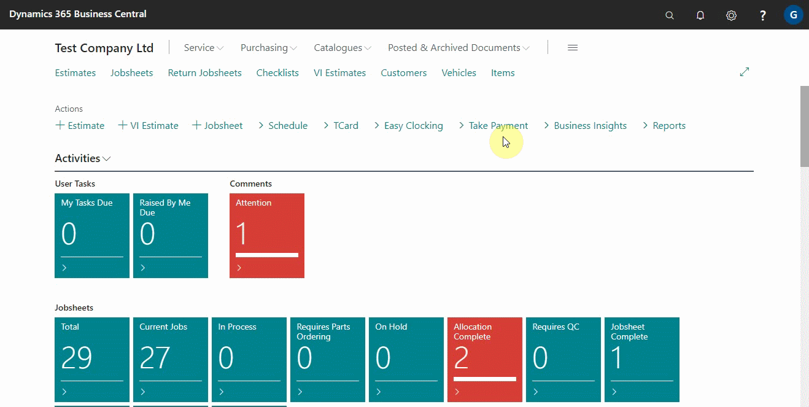
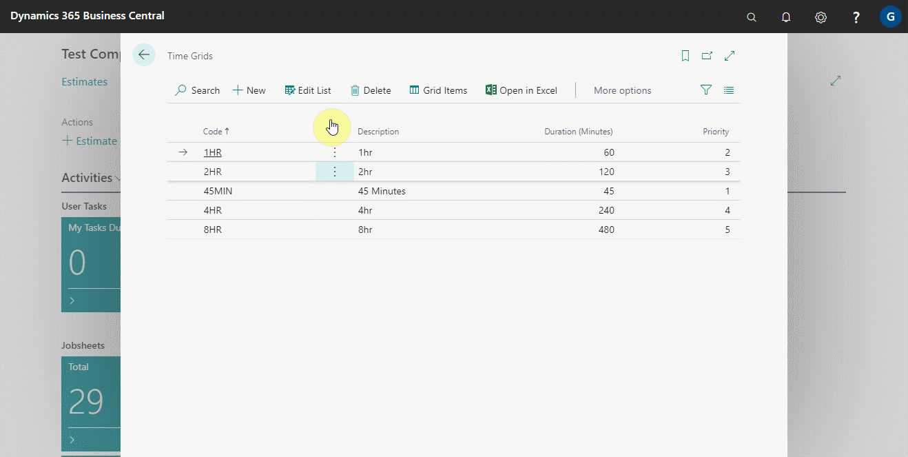
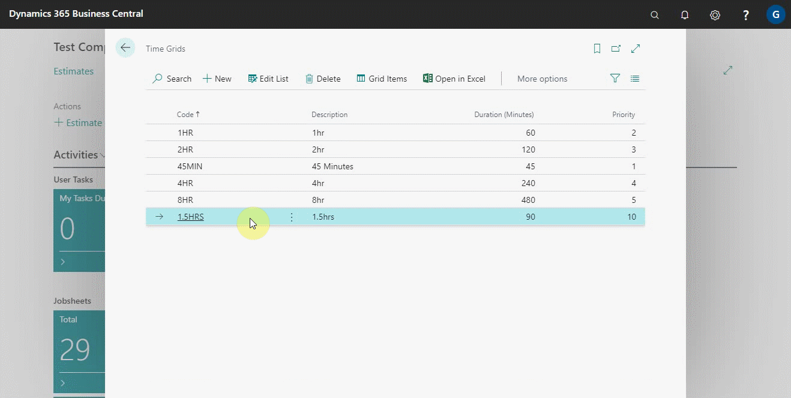
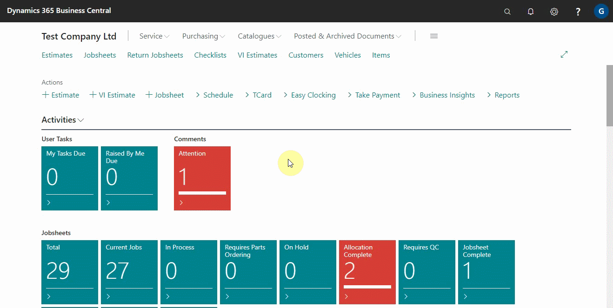
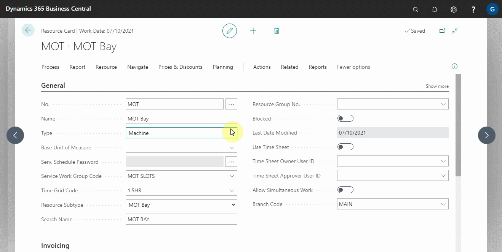

# Time Grids

Time grids are system time allocations that help manage time slot availability for online bookings. When a customer makes a booking online, they first select a service package. After that, they need to choose a time slot for the booking. This is where time grids come in, allowing the system to display available time slots. These grids are configured to calculate the labour hours required for the selected service package and suggest suitable time slots for the resource performing the work. Let’s explore how to set up and use time grids effectively.

   

## In this article
1. [Setting Up Time Grids in the System](#setting-up-time-grids-in-the-system)
2. [Adding Time Grids for a Resource](#adding-time-grids-for-a-resource)
3. [Adding Greyed Lines in the Schedule Using Time Grids](adding-greyed-lines-in-the-schedule)

### Setting Up Time Grids in the System
1. In the top right corner, choose the  icon, enter **Time Grids**, and select the related link.
1. The list that appears is for the time grids that have already been set.

   

1. To make it easier for you to understand, we'll make a new time grid. Click **Edit List** and then, under the **Code** column, enter a code to identify the time grid in the system, in our case, **1.5HRS**.
1. After that, you can add a **Description** or leave it blank.
1. In the column **Duration (Minutes),** enter the number of minutes that will represent this time grid's time slot. In this case, we'll do **90 minutes** because 1.5 hours equals 90 minutes.
1. In the Priority column, enter any number to define the slot's priority. The higher the priority, the lower the number, and vice versa. We'll do **10** in this case.

     

1. The next step is to define the various time slots in which a booking can be made. They all have to be 90 minutes duration as specified in the previous window. Choose the 1.5Hrs row and then click **Grid Items**.
1. In the window that appears, begin adding the **Time Start** for when you want the **90-minute time slots** to begin, and then press the down arrow.
1. The **Time End** field is automatically filled by adding 90 minutes to the start time you specified.
1. You have the option of adding multiple time slots to the list.

  

> **Example:**
> 
> The customer logs in to your online booking platform and selects the **Full Service** package with a labour hour of **0.45hr**. Now, in order to provide the best time slot suggestions to the customer, the system first examines the grid priority settings. So, if the **30 minutes** duration has priority one, and the labour (45 minutes) is longer than 30 minutes, the system will bypass the 30 minutes and go to the next priority, which could be **60 minutes**, and now, because the 45 minutes fall within 60 minutes, the time slots set up under the **60 minutes** duration are suggested as the available times for booking.

### Adding Time Grids for a Resource
Time grids are added to the resource to specify the duration of time that the resource can work and the time slots that the resource can be booked. For example, if we add **1Hr** to the time grid for the resource, it means that the resource can be booked for the full 60-minute duration. Here's how to add time grids for resources:
1. In the top-right corner, choose the  icon, enter **Resources** and select the related link.
2. The window that appears lists all of the resources that have been added to the system; select the resource to which you want to add the time grids. In this instance, we'll go with **MOT**.

  

3. From the resource page, select **Related** from the menu bar, then select **Resources** from the submenu, and finally click on **Time Grids**.
4. From the window that appears, you can add a single time grid to the resource or several.

  

5. As a result of the above added time grids, the resource can be assigned to a service package and booked within the specified time slots for the added time grids.

### Adding greyed lines in the schedule using time grids
Sometimes you would want to add greyed lines in the schedule, to help in organizing the schedule; for example in lunch breaks. It is possible to add the greyed lines for a specific resource. To do this:
1. From the MOT **Resource** page, scroll down to **Time Grid Code** in the general FastTab, and choose a previously set up time grid.

  

The time slots set up in the selected time grid are greyed out along the MOT timeline as a result of this. As explained above, you can modify the settings for the time slots.

  

[Previous](/docs/garagehive-onlinebooking-service-packages.html) | [Next Step](/docs/garagehive-onlinebooking-service-workgroups-and-service-hours.html)