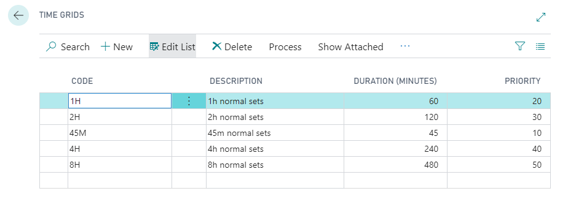

# Time Grids
BACK IN THE ONLINE BOOKING SETUP PAGE.

Click on “navigate” so that you can see the list of set up tables.

Select "Time Grids" 

 You should have these by default and they cover most events its recommended that you use these and consult with the team if you have specific requirements that may require these being altered.

# [NEXT STEP](https://docs.garagehive.co.uk/docs/garagehive-onlinebooking-Service-workgroups-and-Service-hours.html)