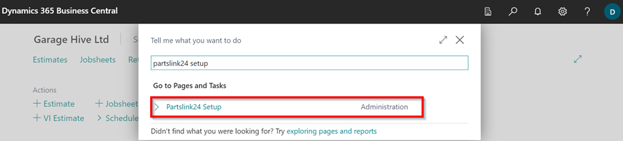
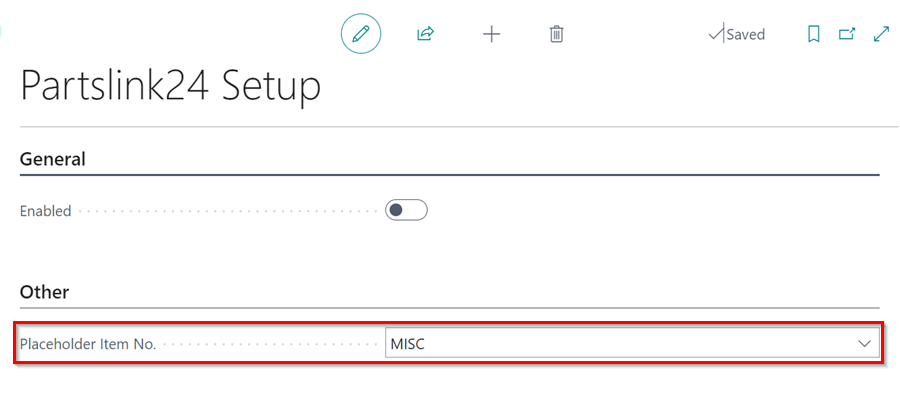
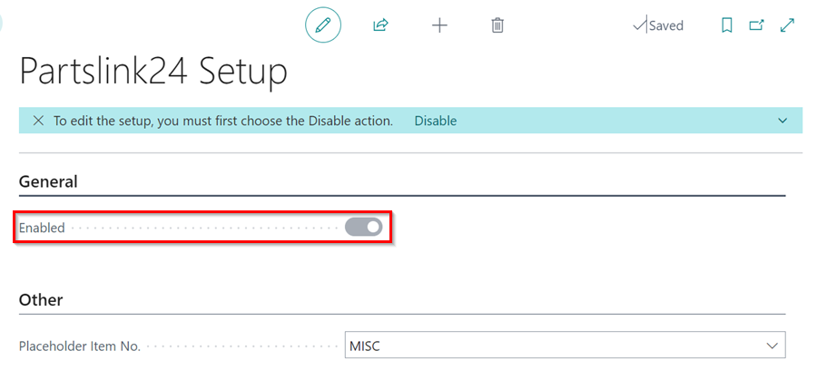
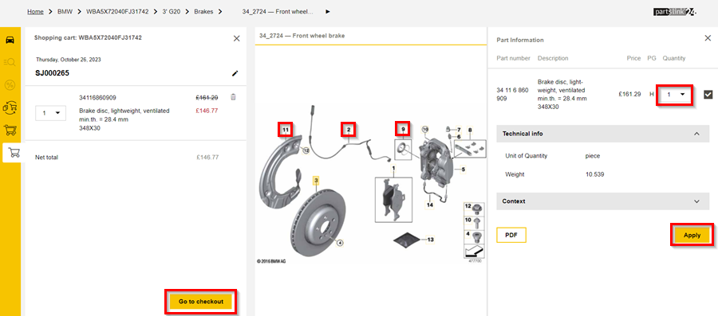
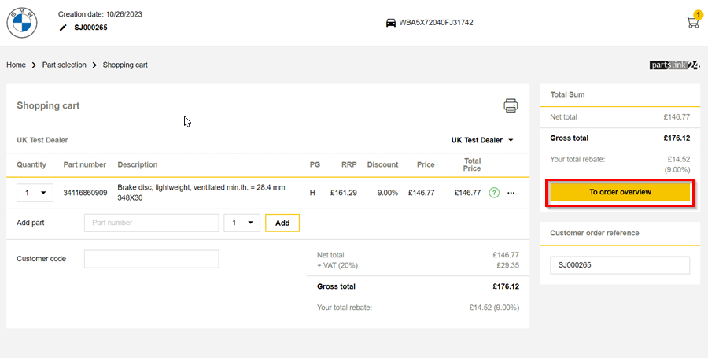
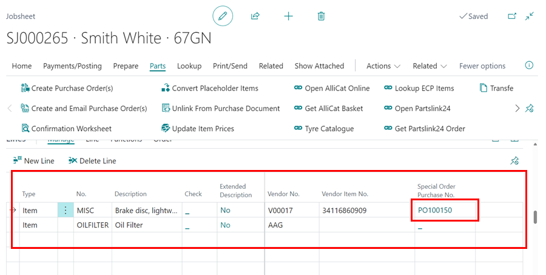

# How to Use PartsLink24 Integration in Garage Hive
Garage Hive integration with Partslink24 allows users of PartsLink24 to easily transfer orders to Garage Hive through the Partslink24 Portal. This feature is available for use in Garage Hive if you are registered with Partslink24. To learn more about how to register, please visit their official website using this [link](https://www.partslink24.com/pl24-html/index.htm?se=oh&au=ig&la=en#:~:text=The%20partslink24%20Portal%20enables%20you,processing%20is%20rapid%20and%20convenient){:target="_blank"}.

New Partslink24 users can get a free demo on the Partslink24 portal. Contact [Garage Hive support](https://docs.garagehive.co.uk/support.html) for referral.

## In this article
1. [Partslink24 Setup](#partslink24-setup)
2. [Opening Partslink24 from Garage Hive and Placing an Order](#opening-partslink24-from-garage-hive-and-placing-an-order)
3. [How to Transfer Partslink24 Order to Garage Hive](#how-to-transfer-partslink24-order-to-garage-hive)

### Partslink24 Setup
1. In the top-right corner, choose the  icon, enter **Partslink24 Setup**, and select the related link.

   

2. Choose the **Placeholder Item No.** that will be used for the parts ordered in the **Partslink24 Portal**, after the order is moved to the document lines.

   

3. Then select the **Enabled** slider to enable the Partslink24 setup in your system.

   

[Go back to top](#top)

### Opening Partslink24 from Garage Hive and Placing an Order

   

1. Partslink24 is available for use in the Jobsheet, Estimate and VI Estimate.
1. Open the document that you want to open the **Partslink24** portal from, and in the menu bar select **Parts** followed by **Open Partslink24**.

   

1. You will be directed to the **Partslink24** portal where you can place your order with authorised dealers. The Partslink24 portal uses the VIN to help you create your order.
1. Click **Continue** to start adding items in your shopping cart.  In the **Main Group** column, select the category from which to add items.

   

1. You can copy the VIN from Garage Hive and paste it to the Partslink Portal if it is not picked up automatically. Once **Open Partslink24** is selected, the page below opens immediately.

   

1. For easier reference, copy the Jobsheet number and add it as the customer reference in the shopping cart. Then, click on the sub-category description to open the parts list.

   

1. In the parts list column, click on the information icon for the part that you want to order.

   

1.  The **Part Information** page opens, where you can click any number on the displayed picture to add items that go with the selected item, or pick more quantity in the **Quantity** field.
1. Click on **Apply** to add the item(s) in the shopping cart. 
1. Repeat the process for other items you want to order, and when done select **Go To Checkout**.

   

1. On the shopping cart, click on **To Order Overview**, to view the summary of the order.

   

1. Check the **Transmit purchase prices** option and select **Order Now** to place the order in Partslink24.

   

[Go back to top](#top)

### How to Transfer Partslink24 Order to Garage Hive
1. Once you have placed an order on the **Partslink24** portal, return to Garage Hive and open the document where you clicked the **Open Partslink24** action. Select **Parts** from the menu bar, followed by **Get Partslink Order**.

   

2. The **Lines** subpage will be updated with the item(s) that you ordered from Partslink24, and a **Purchase Order** will be generated for the item(s). 
3. To view the Purchase Order, click the Purchase Order number in the column **Special Order Purchase No.**.

   

4. The **Vendor Order No.** from **Partslink24** will be added to the Purchase Order for easier tracking. 
5. Once the items are received, you can post the Purchase Order, and the order will be completed.

   

[Go back to top](#top)