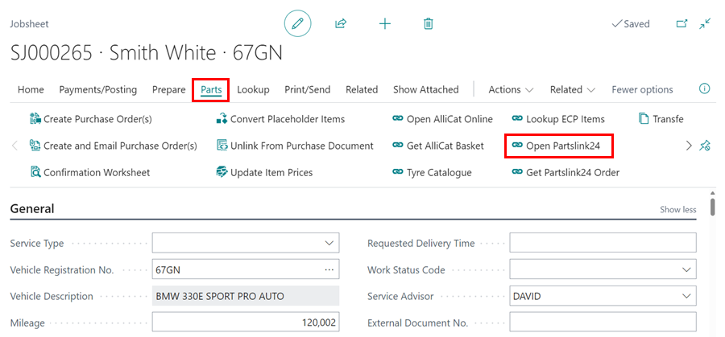
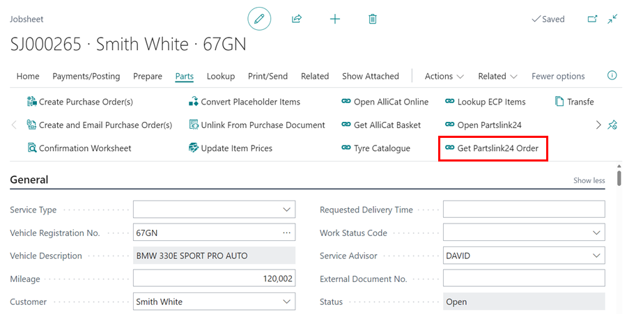
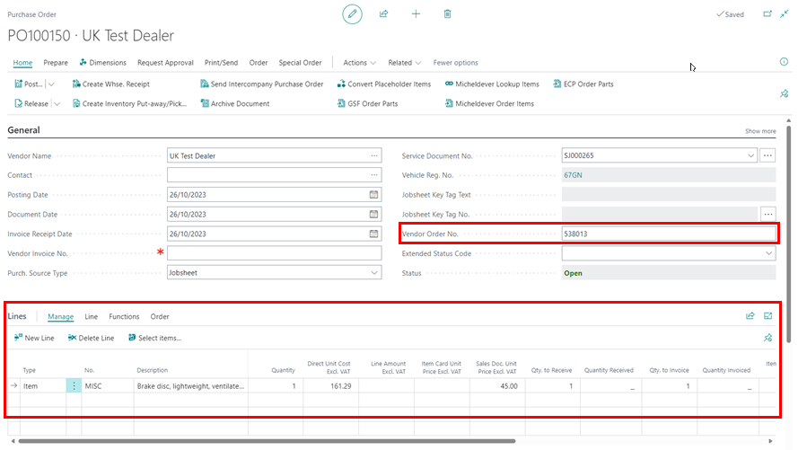

# We are still working on this article!
We are currently reviewing this article before it is published, check back later.

# How to Use Parts Link Integration
Garage Hive integration with Partslink24 allows users of PartsLink24 to easily transfer orders to Garage Hive through the Partslink24 Portal. This feature is available for use in Garage Hive if you are registered with Partslink24. To learn more about how to register, please visit their official website using this [link](https://www.partslink24.com/pl24-html/index.htm?se=oh&au=ig&la=en#:~:text=The%20partslink24%20Portal%20enables%20you,processing%20is%20rapid%20and%20convenient){:target="_blank"}.

## In this article
1. [Opening Partslink24 from Garage Hive and Placing an Order](#opening-partslink24-from-garage-hive-and-placing-an-order)
2. [How to Transfer Partslink24 Order to Garage Hive](#how-to-transfer-partslink24-order-to-garage-hive)

### Opening Partslink24 from Garage Hive and Placing an Order
1. Partslink24 is available for use in the Jobsheet, Estimate and VI Estimate.
2. Open the document that you want to open the **Partslink24** portal from, and in the menu bar select **Parts** followed by **Open Partslink24**.

   

3. You will be directed to the **Partslink24** portal where you can place your order with authorised dealers. The Partslink24 portal uses the VIN to help you create your order. 
4. Click **Continue** to start adding items in your shopping cart.  In the **Main Group** column, select the category from which to add items.

   

5. For easier reference, copy the Jobsheet number and add it as the customer reference in the shopping cart. Then, click on the sub-category description to open the parts list.

   

6. In the parts list column, click on the information icon for the part that you want to order.

   

7. The **Part Information** page opens, where you now click on **Apply** to add the item in the shopping cart. Repeat the process for all the items you want to order, and when done select **Go To Checkout**.

   

8. On the shopping cart, click on **To Order Overview**, to view the summary of the order.

   

9. To place the order in Partslink24, click on **Order Now**.

   

[Go back to top](#top)

### How to Transfer Partslink24 Order to Garage Hive
1. After placing an order in **Partslink24** portal, go back to Garage Hive and open the document in which you clicked the action **Open Partslink24**. Select **Parts** from the menu bar, followed by **Get Partslink Order**.

   

2. The items you ordered in Partslink24, will be added in the **Lines** subpage and a **Purchase Order** will be created for the items. Click on the Purchase Order number in the column **Special Order Purchase No.** to open the Purchase Order.

   

3. In the Purchase Order, the **Vendor Order No.** from **Partslink24** will be added for easier tracking. When you receive the items, you can post the PO and the order will be completed.

   

[Go back to top](#top)