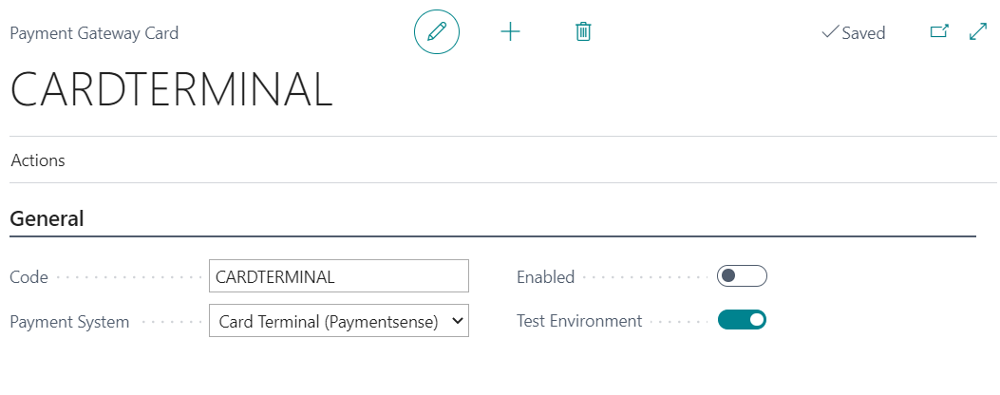

## The Payment Gateways in Garage Hive
Payment gateway is a service that automates the payment transactions between the business and the customer from the Garage Hive system. Garage Hive has two payment gateways available:

### Payment by Garage Link
Garage Link (GLink) is a payment method in which the payment is processed online via a link generated for each transaction. The customer can open it and use it to pay online from wherever they are by clicking on this link.

   

To learn more about how to set up payment by **Garage Link** for Dojo follow [this link](garagehive-setting-up-payment-by-glink-dojo.html){:target="_blank"} or for Pay360 follow [this link](garagehive-setting-up-payment-by-glink-pay360.html){:target="_blank"}.

### Payment by Card Terminal
A Card Terminal, also known as a point of sale (POS) terminal, is an electronic device that allows a business to accept credit card payments from customers. The card terminal is linked to the Garage Hive system, and the customer must physically present the credit card for payment.

   

To learn more about how to set up **Card Terminal** follow [this link](garagehive-setting-up-payment-by-card-terminal.html){:target="_blank"}.

