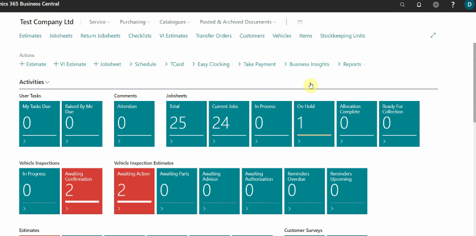

# Generating Paymentsense Card Machine End Of Day, X and Z Report
Garage Hive provides the following reports from the payments received for via the **Paymentsense Card Machine:**
 * **X Balance** - An X Balance report returns the current local session totals on the **Paymentsense Card Machine** without resetting them.
 * **Z Balance** - A Z Balance report returns the current local session totals on the **Paymentsense Card Machine** and resets them. Other than the reset of totals, a Z Balance report is the same as X Balance report.
 * **Banking** - A Banking report fetches the current banking totals from the bank and returns these totals. The banking totals are reset in line with banking times.
 * **End of Day** - An End of Day report performs a Z Balance report followed by a Banking report. 

### How to generate the reports:
1. From the **Service Advisor** role centre, select **Reports** from the actions bar, followed by **End of Day**, and then **Card Machine Report**.

   

2. Under the **GroupName** FastTab, select the card machine in the **Card Machine**, followed by the **Report Type**; in this case **X Balance** report and then click **OK**. The report will be generated.

   

3. To generate the **Z Balance** report, select **Z Balance** in the **Report Type** field, and click **OK**. The report will be generated.

   

4. To generate the **Banking** report, select **Banking** in the **Report Type** field, and click **OK**. The report will be generated.

   

5. To generate the **End of Day** report, select **End of Day** in the **Report Type** field, and click **OK**. The report will be generated.

