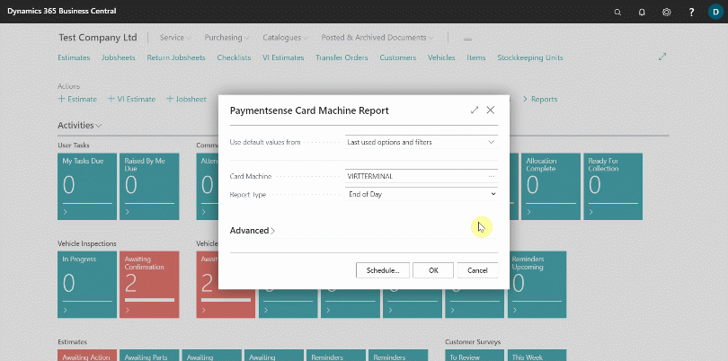

# Generating Paymentsense Card Machine End Of Day, X and Z Report
If you have an integrated **Paymentsense Card Machine** you can print the following directly from Garage Hive:
 * **X Balance** - An X Balance report returns the current local session totals on the **Paymentsense Card Machine** without resetting them.
 * **Z Balance** - A Z Balance report returns the current local session totals on the **Paymentsense Card Machine** and resets them. Other than the reset of totals, a Z Balance report is the same as X Balance report.
 * **Banking** - A Banking report fetches the current banking totals from the bank and returns these totals. The banking totals are reset in line with banking times.
 * **End of Day** - An End of Day report performs a Z Balance report followed by a Banking report. 

### How to generate the reports:
1. From the **Service Advisor** role centre, select **Reports** from the menu bar, followed by **End of Day**, and then **Card Machine Report**.

   

2. Select the payment machine to take the report from in the **Card Machine** field, followed by the **Report Type**; you can select **X Balance**, **Z Balance**, **Banking** or **End of Day** report and then click **OK**. 
   
   

 

### **See Also**

[How to perform a Customer/Vendor Balancing Payment](garagehive-contra-payment.html){:target="_blank"} \
[Working with Payment Reconciliation Journals](garagehive-payment-reconciliation-journals.html){:target="_blank"} \
[How to create Bank Accounts](garagehive-create-new-bank-account.html){:target="_blank"}