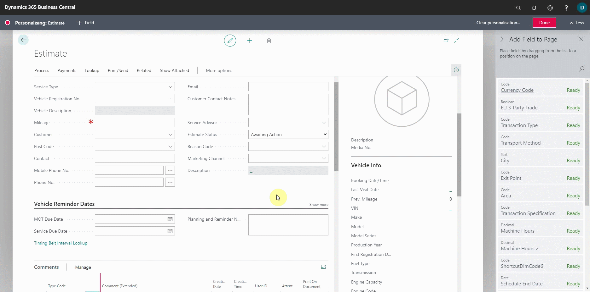
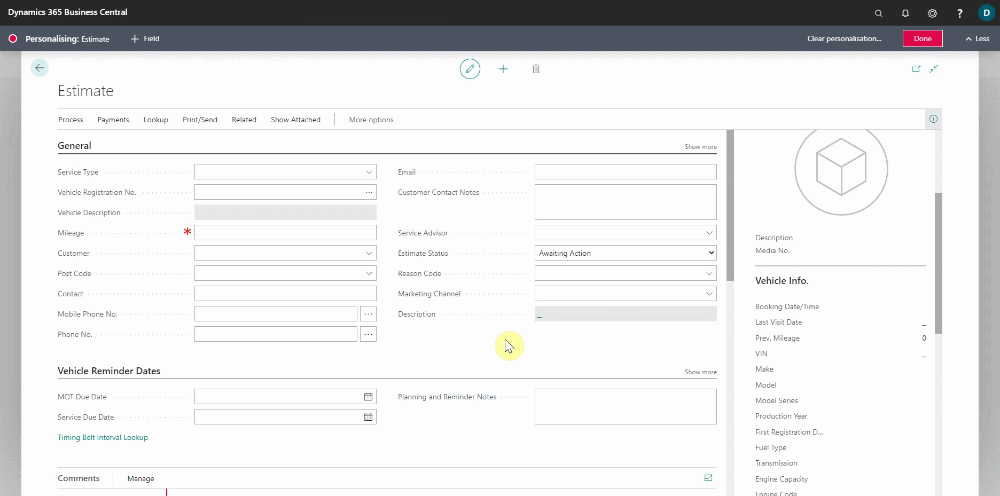
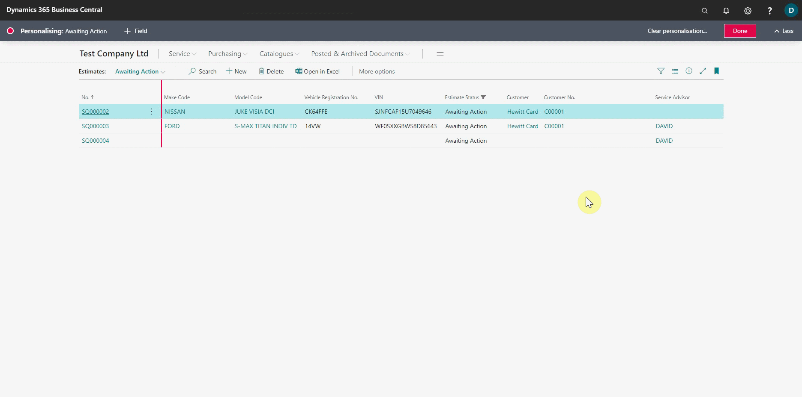
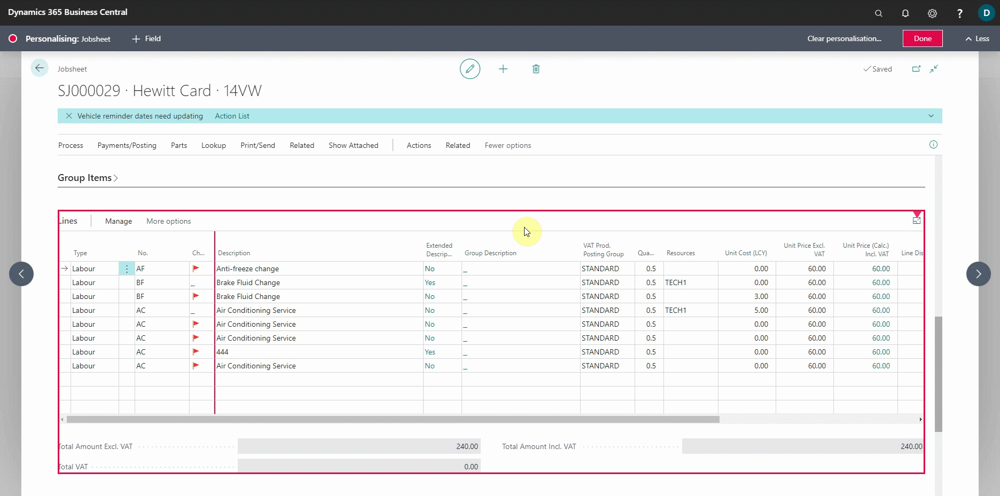
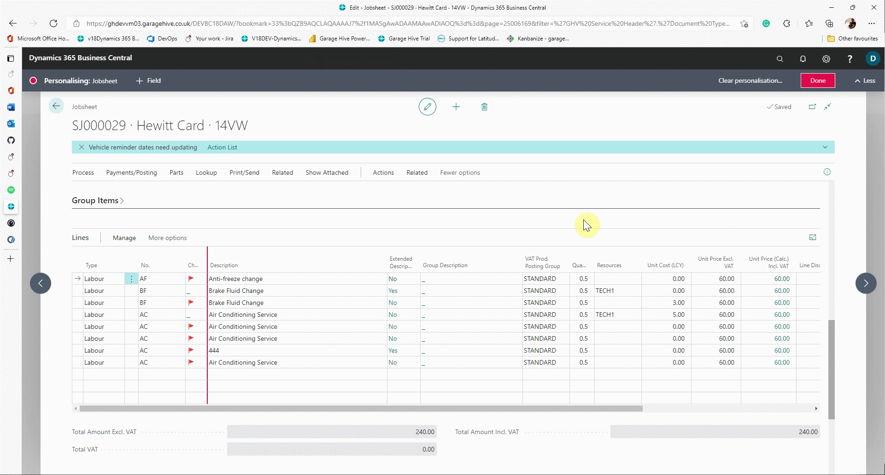
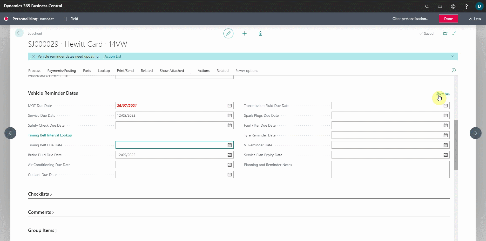
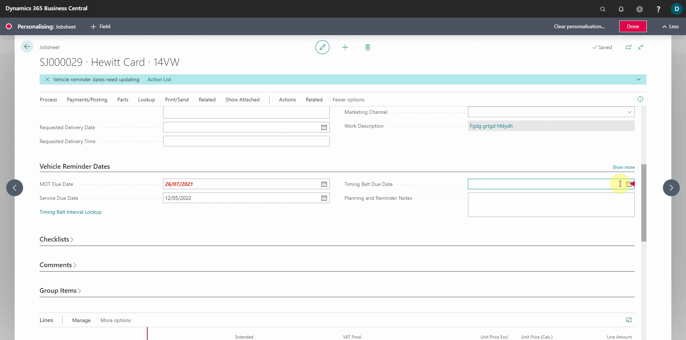
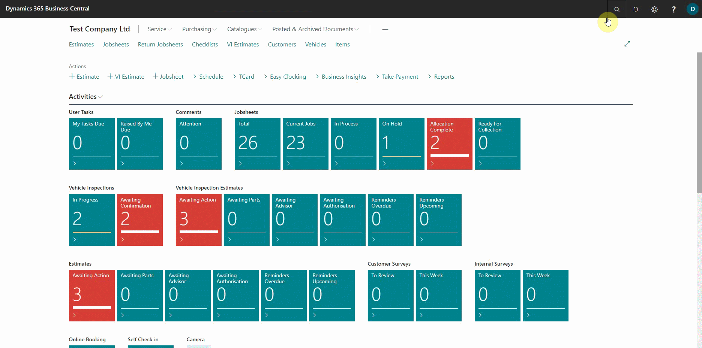
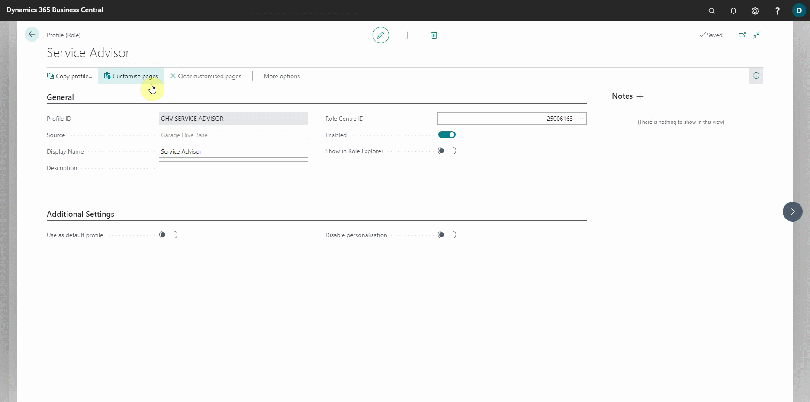

# Personalisation of Garage Hive
Personalizing Garage Hive is quick and easy, such as adding fields to pages and hiding columns. Let's take a look at some of the ways you can maximize on the personalization feature.

## In this article
1. [Adding fields to pages](#adding-fields-to-pages)
2. [Hiding or moving columns](#hiding-or-moving-columns)
3. [Freezing and resizing the columns](#freezing-and-resizing-the-columns)
4. [Adding or removing fields from a collapsed fasttab](#adding-or-removing-fields-from-a-collapsed-fasttab)
5. [Customising Garage Hive for each user](#customizing-garage-hive-for-each-user)

### Adding fields to pages
To add a field into a page:
1. Select the **Settings** icon in the top-right corner, then **Personalise**. At the top, the **Personalising** bar appears.
   
   

2. Select the page to add a new field; some pages will be highlighted with a red box to indicate that it has been selected.
3. Click on the **Field** option from the **Personalising** bar at the top, which now adds options to the right side of the screen to select from. 
4. Choose the field to be added, then click and hold it while dragging it to the desired position.
5. When you're finished, click **Done** in the top-right corner of the **Personalising** bar.

   
     

### Hiding or moving columns
To hide or move a column:
1. Select the **Settings** icon in the top-right corner, then **personalise**.At the top, the **Personalising** bar appears.

   

2. Place your cursor over the **Field** you want to hide or move, and then click on the small red arrow that appears on the right side of the field. To hide the field, click **Hide**.

   

3. To move the field, click and hold the small arrow that appears when you place your cursor over it, then drag it to the desired position.
4. When you're finished, click **Done** in the top-right corner of the **Personalising** bar.

   

### Freezing and resizing the columns
To freeze or resize the columns:
1. Select the **Settings** icon in the top-right corner, then **personalise**. At the top, the **Personalising** bar appears.

   

2. Place your cursor over the column you want to freeze, then click the small red arrow to the right of the column header. To freeze the column, select **Set Freeze Pane**. When scrolling across the table, all columns to the left of the frozen column will not be hidden.
3. To remove the freeze pane, select the column with the freeze pane enabled, click the small red arrow, and then select **Clear Freeze Pane**.

   

4. To resize a column, move your cursor over the column's right side line until the double-headed arrow with parallel lines cursor appears, then hold and drag to the left to reduce the size of the column or to the right to increase the size of the column.
5. When you're finished, click **Done** in the top-right corner of the **Personalising** bar.

   

### Adding or removing fields from a collapsed fasttab
To add or remove a field in a fastab when collapsed:
1. Select the **Settings** icon in the top-right corner, then **personalise**. At the top, the **Personalising** bar appears.

   

2. Place your cursor over the **Field** you want to add, then click the small red arrow to the right of the field. Select **Show Always**  or **Show When Collapsed** to add the field so that it appears when the FastTab is collapsed.

   

3. To hide a field when the FastTab is collapsed, place your cursor over the **Field** you want to hide, then click the small red arrow to the right of the field. Select **Show Under "Show More"** to hide the field when the FastTab is collapsed.
4. When you're finished, click **Done** in the top-right corner of the **Personalising** bar.

   

### Customising Garage Hive for each user
When working with Garage Hive, you may want to customise Garage Hive differently for different users so that you can limit what a user can see when they are on the system. Here's how to personalise it for each user:
1. Select the search icon in the top-right corner, enter **Profiles**, and select the related link.
2. Search for the user whose system you want to customise, and then click on the user's **Profile ID** to open the user's profile.

   

3. Select **Customise Pages** from the actions bar. The **Customising** page opens in a new browser tab.
4. You can now customise the user's system from this **Customising** page. To open a page, click on the page link you want to open and then select **Open (Ctrl+Click)**. You can also use the shortcut **Ctrl** + **Left-Click** on the page.

   

5. You can now personalise the opened page using any of the methods described above.