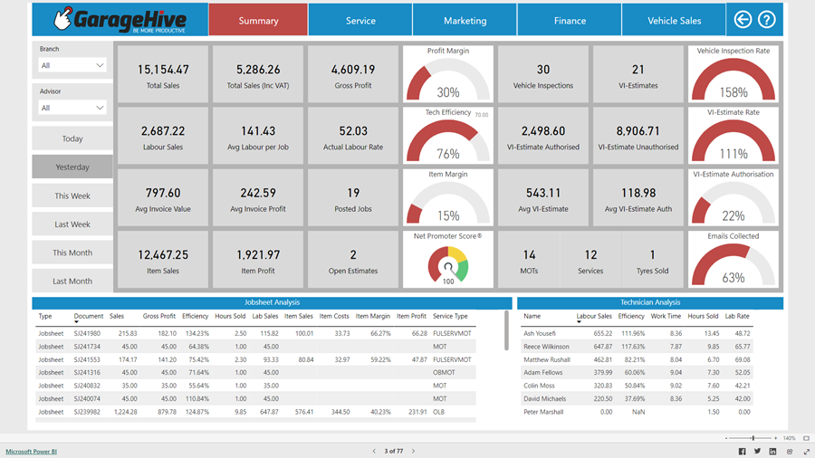
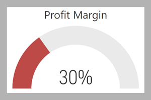
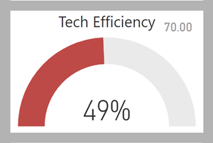
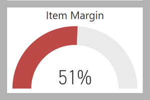
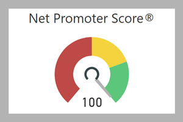

# We are still working on this article!
We are currently reviewing this article before it is published, check back later.

# Summary Reports Overview
The Summary Reports provide a brief overview of your business data based on certain key performance indicators. You can view these data for specific timeframes such as today, yesterday, this week, last week, this month, and last month. The summary reports are optimised to be viewed on your mobile device. It is highly recommended to review these reports on a daily basis.

   

## Jobsheet Key Performance Indicators (KPIs)
The table below lists some important KPIs from the **Summary Reports** that are used to evaluate a business's financial stability, operational efficiency, and profitability.  By monitoring and analysing these KPIs, you can help the business in making well-informed decisions and identify areas that need improvement. 

| Key Performance Indicators              | Data Source                                                                                                                                                                               | Report Insights                                                                                                                                                                                                                                                                                                                                                                                                                                                                                                                                                                                                |
| :-------------------------------------- | :---------------------------------------------------------------------------------------------------------------------------------------------------------------------------------------- | :------------------------------------------------------------------------------------------------------------------------------------------------------------------------------------------------------------------------------------------------------------------------------------------------------------------------------------------------------------------------------------------------------------------------------------------------------------------------------------------------------------------------------------------------------------------------------------------------------------- |
| **Total Sales/ Total Sales (Inc. VAT)** | The total amount of sales from the created Jobsheets in the specified timeframe.                                                                                                          | - Total sales directly reflect the growth the growth or decline in the business’s overall income.     - Total sales can indicate shifts in market demand. A rise in total sales may suggest increased demand and vice versa.     - Total sales impact cash flow, and understanding sales patterns helps in managing cash flow effectively.     - Total sales data is essential for creating accurate financial forecasts.                                                                                                                                                                    |
| **Gross Profit**                        | The difference between the total selling price and total cost of items and labour listed in the Jobsheets within a specific timeframe.                                                    | - Gross profit helps assess the profitability of the core business activities.     - Gross profit helps assess how efficiently the business manages costs associated with the acquisition of services and parts.     - Gross profit helps in examining the proportion of revenue retained after covering direct costs, indicating profitability.     - Gross profit highlights changes in the direct cost, such as variations in buying parts from the suppliers.     - Analysing gross profit trends helps in forecasting future financial performance and guides strategic planning. |
| **Labour Sales**                        | The total amount from labour sales from the created Jobsheets in the specified timeframe.                                                                                                 | - Changes in labour sales indicate fluctuations in demand for the services offered by the business.     - Labour sales help identify the contribution of service-related activities to the business's overall revenue.     - Labor sales, when compared to the number of staff hours or employees, can be used to assess staff productivity.      - Analysing labour sales assists in evaluating the effectiveness of the pricing strategy for services.                                                                                                                                     |
| **Average Labour Per Job**              | The number of hours from the created Jobsheets in the specified timeframe.                                                                                                                | - Average labour per job helps assess how efficiently labour resources are utilised in completing specific jobs and tasks.     - A decreasing average labour per job trend may indicate improved operational productivity and streamlined processes.      - Efficient completion of jobs may contribute to higher customer satisfaction.                                                                                                                                                                                                                                                           |
| **Average Invoice Value**               | The total amount of the invoices issued from the created Jobsheets in the specified timeframe.                                                                                            | - Average invoice value provides a clear understanding of the typical monetary size of individual transactions.     - A higher average invoice value may indicate successful upselling of items and labour.     - The analysis of average invoice values assists in evaluating the effectiveness of pricing strategies.     - Consistently high average invoice values may indicate satisfied customers willing to spend more.                                                                                                                                                               |
| **Average Invoice Profit**              | The difference between the Total Selling Price for Items and labour and the Total Cost for Items and Labour of the invoices issued from the created Jobsheets in the specified timeframe. | - Average invoice profit helps assess the overall profitability of business sales, taking into account both revenue and associated costs.         -	Average invoice profit helps evaluate the effectiveness of pricing strategies.        - Analysing average invoice profit assists in evaluating the efficiency of cost management.                                                                                                                                                                                                                                                              |
| **Item Sales**                          | The total amount from item sales from the created Jobsheets in the specified timeframe.                                                                                                   | - Understanding the performance item sales helps in assessing their contribution to overall revenue.      - Analysing item sales assists in evaluating the effectiveness of the pricing strategy for the items.              - Monitoring item sales helps in effective inventory management.                                                                                                                                                                                                                                                                                                      |
| **Item Profit**                         | The total amount from item sales from the created Jobsheets in the specified timeframe.                                                                                                   | - Item profit provides insights into the profitability of items.      - Analysing item profit helps businesses strategically focus on high-profit items.     - Businesses can identify items with lower profit margins and explore ways to improve cost efficiency or consider adjustments in pricing and marketing strategies.                                                                                                                                                                                                                                                                    |

[Go back to top](#top)

## Report Visuals
The following visuals represent a quick and intuitive way to understand the performance or status of the corresponding KPI:

1. **Profit Margin**
   
      
   
   This visual shows the percentage of profit margin. A higher profit margin is indicative of efficient cost management, a better competitive advantage, and effectiveness in generating profit from business operations. A lower profit margin may suggest that the business needs to reassess its pricing strategies, control costs, and explore new revenue streams.

2. **Tech Efficiency**
   
      
   
   This visual illustrates the percentage of technicians' efficiency. High technicians' efficiency implies streamlined processes and optimised use of the resources in the business. A low technicians' efficiency may suggest that the processes and resources in place are not performing efficiently and can lead to operational issues.

3. **Item Margin**
   
      
   
   This visual represents the percentage of item margin. A higher margin on items contributes positively to the overall profitability of the business, while a lower margin on items impacts the overall profitability of the business.

4. **Net Promoter Score (NPS)** 
   
      
   
   This visual displays the NPS groups for customers. Green indicates the promoters, suggesting strong customer satisfaction and loyalty. Yellow represents passive customers, indicating some customer satisfaction but room for improvement. Red represents detractors, indicating high likelihood of customer dissatisfaction and potential issues.

[Go back to top](#top)