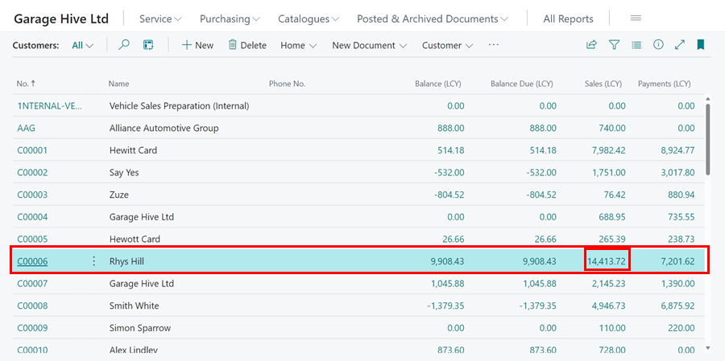
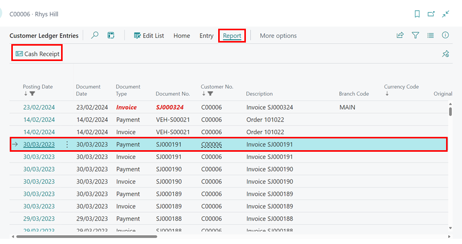
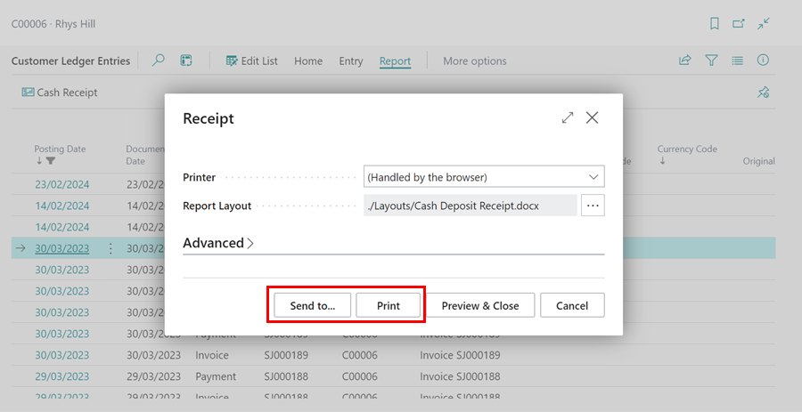

# How to Print or Email Customer Payment Receipt
You can print or email a customer payment receipt from **Take Payment** function or from the **Customer Ledger Entries**:

### From Take Payment Function
To print or email a payment receipt when taking a payment with the **Take Payment** function:
1. In the Role Centre, select the **Take Payment** function, enter the **Customer Name** and the **Payment Method**, and then click the **Next** button.
2. Select the **Amount** field, choose the document to which the payment will be applied, and enter the amount; click the **Next** button.

   

3. Select **Print** or **Email** under the **Receipt** field in the **Review Before Posting** window. You can also do both when you select **Email** and click on the attachment to download, which you can then print.

   

[Go back to top](#top)

### From Customer Ledger Entries
1. Select the **Customers** list from the Role Centre, and then select the customer for whom you want to print or email the payment receipt.
2. In the **Sales** column, click on the **Amount** for the customer. 

   

3. On the **Customer Ledger Entries** list, select the payment ledger entries for which you want to print a payment receipt, then click **Report** from the menu bar, followed by **Cash Receipt**.

   

4. You can now **Print** or **Email** the payment receipt by clicking **Print** or **Send To**, respectively.

   

[Go back to top](#top)

 

### **See Also**

[Video: How to print or email payment receipts](https://www.youtube.com/watch?v=L0XsAnP2UAI&t=6s){:target="_blank"}