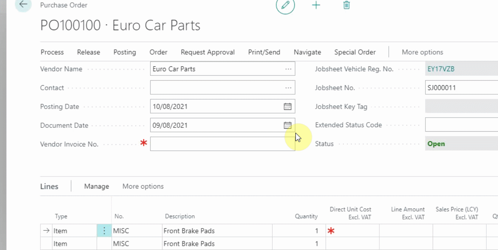
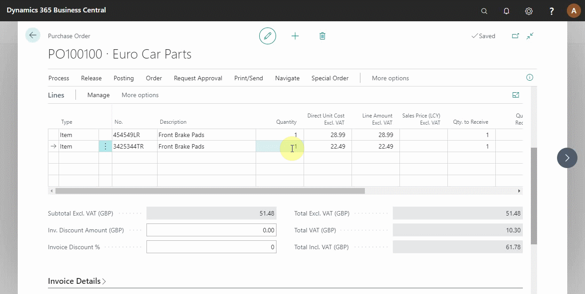

# Processing a Purchase Order   

To process a purchase order means receiving the items ordered from the supplier and updating the respective ledger accounts for the items and vendor. To do this, you must have the supplier invoice with you. 

## In this article

1. [Match the supplier invoice with the purchase order](#match-the-supplier-invoice-with-the-purchase-order)
2. [Receive and post the purchase order](#receive-and-post-the-purchase-order)

### Match the supplier invoice with the purchase order
To post a purchase order in the system, all the details from the supplier invoice must match with the purchase order; this includes the date, document number, part numbers, and the total amount. Open the purchase order with the items to receive, update the **Document No.** to match the supplier document number, and the posting date must be the date today. For the items with **Misc**, update to match the correct item **No.** and the **Unit Cost** (see below).

> **Note:** 
>
> All the information in the supplier invoice must match the purchase order, even if the invoice has incorrect information.

### Receive and post the purchase order
After ensuring that all the information in the purchase order is correct, the purchase order needs to be posted. From the action bar, click on **Posting** and select **Post** from the submenus. Since we are now receiving the items and invoicing the customer, select **Receive and Invoice** from the pop-up menu. The document is now posted and updated (see below).

 

### **See Also**

[Video: How to process a purchase order/invoice](https://www.youtube.com/watch?v=eKXEvrj1QQQ).