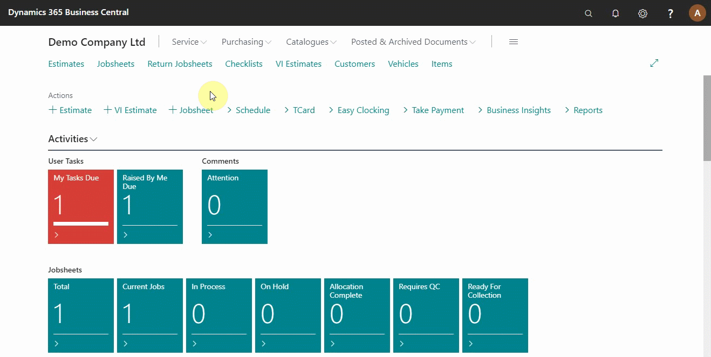
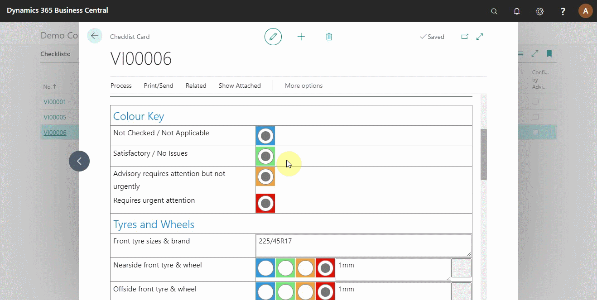
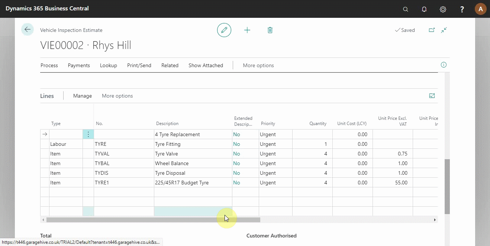

# How to Process Vehicle Inspection Estimates (VIEs) 

VIE in Garage Hive offer the ability to manage and monitor your up-sell, additional authorisation and estimates across all of your service staff. VIE are created by confirming a checklist such as, [Vehicle Inspection](/docs/garagehive-technicians-vehicle-inspections.html "How to perform a Vehicle Inspection") or **Quality Control**.

## In this article
1. [Create a VIE from a checklist template](#create-a-vie-from-a-checklist-template)
2. [Carry out the vehicle checks from the checklist template](#carry-out-the-vehicle-checks-from-the-checklist-template)
3. [Confirm the checklist to create a vehicle inspection estimate](#confirm-the-checklist-to-create-a-vehicle-inspection-estimate)
4. [Add items and labour to the VIE and change status](#add-items-and-labour-to-the-VIE-and-change-status)
5. [Add customer authorisation and copy the authorised lines to jobsheet](#add-customer-authorisation-and-copy-the-authorised-lines-to-jobsheet)

### Create a VIE from a checklist template
To create a vehicle inspection estimate from a checklist template, click on **Checklists** from the navigation menu, and select **+New**. From the **Template Code** field, select the type of checklist you want to do (see below).

### Carry out the vehicle checks from the checklist template
The checklist template created has fields to be filled according to the actual checks on the vehicle. For each field, there is colour codes indicate the level of priority required (refer to the colour key). Besides every colour codes, you can add a comment (see below).

### Confirm the checklist to create a vehicle inspection estimate
After completing the vehicle checks, the checklist is now ready for the next stage. Click on **Process** from the top navigation bar and select **Confirm**, you will get a query if you want to create a vehicle inspection estimate, say yes (see below).

> **Note**
>
> After confirming the checklist, change the **Process Status** on the checklist to **Completed**, so as archive the checklist card.

### Add items and labour to the VIE and change status
From the role centre, you can check the status tiles of the vehicle inspection estimate.

After creating a VIE from the checklist, the status is **Awaiting Action**, to give the service advisor an alert to take action. Click on the **Awaiting Action** tile to open the VIE list, and select the VIE to work on. Add items and labour to the VIE according to the checks done, change the **VIE Status** to **Awaiting Authorisation** from the customer, which moves it from the **Awaiting Action** to **Awaiting Authorisation** tile (see below).

### Add customer authorisation and copy the authorised lines to jobsheet
At this stage, you have already communicated with the customer and advised on which work should be done. The next step is to authorise the document lines; scroll to the right on the document lines up to the **Customer Authorised** column, tick on all the lines that the customer has approved. Click on **Process** from the action bar, and select **Copy Authorised Lines to Jobsheet**. You are given an option to create a new jobsheet or merge it to an existing one; you could do either, depending on your preference. The VIE is now complete (see below).

> **Note**
>
> The VIE is marked complete and archived after all the lines are approved, or you could change the VIE status to complete for it archiving the unapproved lines.
> 
