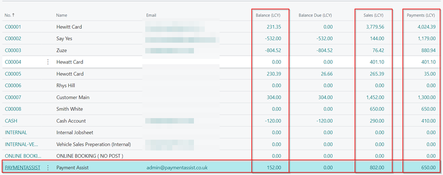
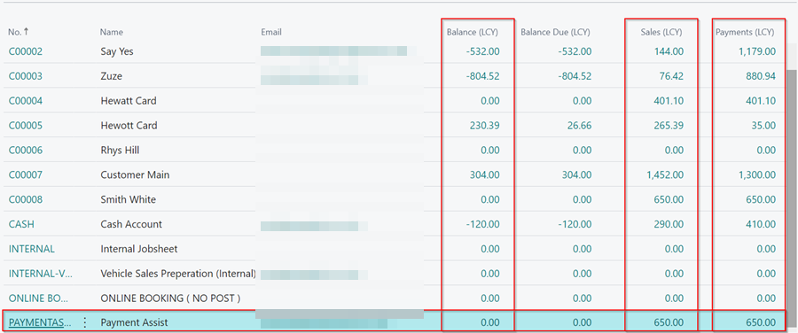

# How to Process Factored Debt in Garage Hive

> **Important:**
>
> Because this is an accounting issue, please consider sending this documentation to your accountant for approval and/or comments.

**Debt Factoring** is an external, short-term source of finance for a business. With **Debt Factoring**, the business raises cash by selling their outstanding sales invoices (receivables) to a third party (a factoring company) at a discount. Here is how to process a factored debt in Garage Hive:
1. Suppose you have a customer who owes the company £802, and then you transfer the money to a factoring company, in this case **Payment Assist**. So, now **Payment Assist** now owes you £802 and the customer owes them.
2. In the agreement, **Payment Assist** pays the company £650, leaving a balance of £152 as its commission; You may now process the balance as the commission.

   

3. To begin, use the **Payment Assist Commission** item card available in the items list, or [create an **Item** card](garagehive-create-an-item-card.html) with this setup; make it a **Non-Inventory**, and add an **Item Category Code** (**PAYMENTASSIST**) to distinguish it from other item category codes. If you have more than one factoring company, create a separate item card for each.
4. The **Posting Details** should be the same as the rest of the item cards.

   

5. After you've created the item card, search for **Sales Credit Memo** in the top-right corner and select the related link.
6. To create a new sales credit memo, click **New** from the actions bar.

   

7. In the **General** FastTab **Customer Name** field, enter the name of the factoring company, **Payment Assist**, as the balance is now under the company.
8. In the **Lines** sub-page, enter the **Item** you created as the **Payment Assist Commission**, **Quantity** to be one, and the **Unit Price** as the balance, in this case **£152**.

   

9. To post the amount, select **Posting** from the actions bar, followed by **Post**. Before posting ensure that you have added the **Payment Terms Code** field, under the **Credit Memo Details** FastTab.

   
   
   

10. The balance from **Payment assist** will now be £0, and the sales/payment to **Payment Assist** will be £650.

   

11. To apply the amount in the customer account, select the **Customer**, and click on the amount in the **Balance** column.
12. Select **Process** from the actions bar, followed by **Apply Entries**.

   

12. In the lines that are yet to be applied, add the **Applies-to ID** by selecting **Process** from the actions bar, followed by **Set Applies-to ID**.
13. When done adding the **Applies-to ID**, select **Process** and then **Post Application**. Click **OK** in the pop-up window.
14. The entries are now applied for **Payment Assist**, and are no longer open.

   

 

### See also

[Video: How to review your customer surveys in Garage Hive](https://www.youtube.com/watch?v=UWpPgs-rJJg&t=136s)

