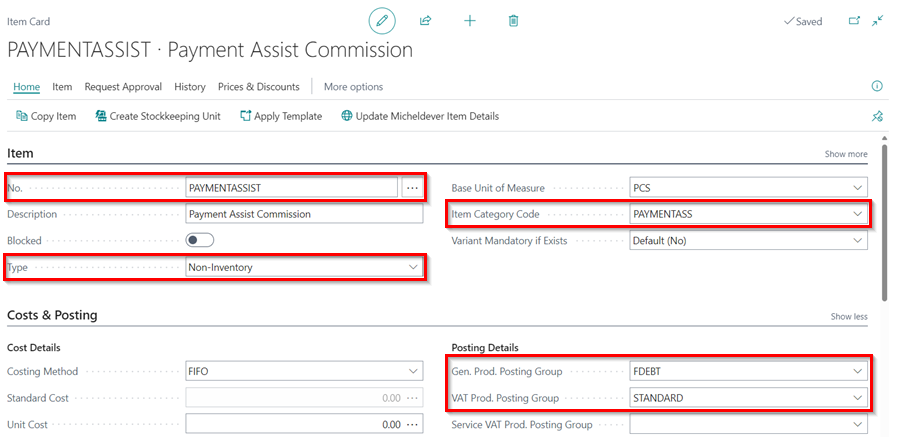

# How to Process Factored Debt in Garage Hive

   

**Debt Factoring** is an external, short-term source of finance for a business. With **Debt Factoring**, the business raises cash by selling their outstanding sales invoices (receivables) to a third party (a factoring company) at a discount. Here is how to process a factored debt in Garage Hive:
1. Suppose you have a customer who owes the company £802, and then you transfer the money to a factoring company, in this case **Payment Assist**. So, now **Payment Assist** now owes you £802 and the customer owes them.
1. In the agreement, **Payment Assist** pays the company £650, leaving a balance of £152 as its commission; You may now process the balance as the commission.

   

1. To begin, use the **Payment Assist Commission** item card available in the items list, or [create an **Item** card](garagehive-create-an-item-card.html){:target="_blank"} with this setup; make it a **Non-Inventory**, and add an **Item Category Code** (**PAYMENTASSIST**) to distinguish it from other item category codes. If you have more than one factoring company, create a separate item card for each.
1. The **Posting Details** should be: **Gen. Prod. Posting Group** - **FDEBT** and **VAT Prod. Posting Group** - **STANDARD**. If this is not set up in your system, please contact the support team for assistance.

   

1. After you've created the item card, choose the  icon in the top-right corner, enter **Sales Credit Memo** and select the related link.
1. To create a new sales credit memo, click **New** from the menu bar.

   

1. In the **General** FastTab **Customer Name** field, enter the name of the factoring company, **Payment Assist**, as the balance is now under the company.
1. In the **Lines** sub-page, enter the **Item** you created as the **Payment Assist Commission**, **Quantity** to be one, and the **Unit Price** as the balance, in this case **£152**.

   

1. To apply the amount in the customer account, select **Prepare** and then **Apply Entries** in the Sales Credit Memo menu bar.
1. Select **Process** and then **Set Applies-to ID** from the pop-up window. Click **OK**.

   

1. To post the amount and apply the entries to **Payment Assist**, select **Posting** from the menu bar, followed by **Post**.
   
   

1. The balance from **Payment assist** will now be £0, and the sales/payment to **Payment Assist** will be £650.

   

1. The entries are now applied for **Payment Assist**, and are no longer open.

[Go back to top](#top)

