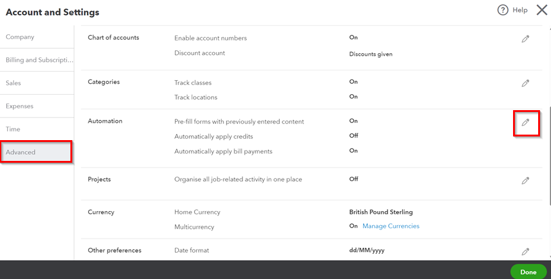
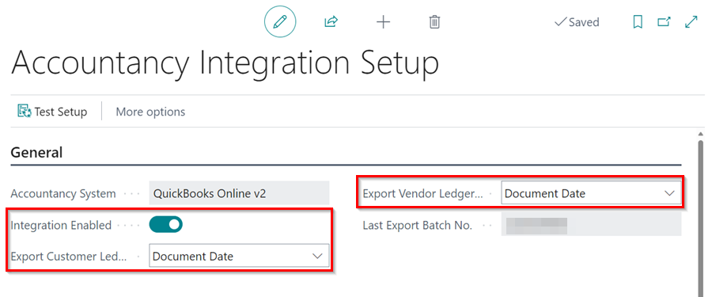
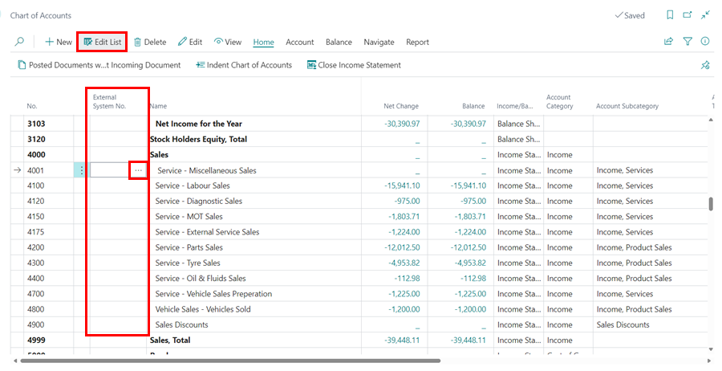

# How to Integrate Garage Hive With QuickBooks Online
Garage Hive has made it possible to integrate QuickBooks online accounting system in order to streamline your accounting processes and make them more efficient and accurate.

## In this article
1. [Initial Setup](#initial-setup)
2. [Integrate Chart of Accounts](#integrate-chart-of-accounts)
3. [Integrate Payment Methods](#integrate-payment-methods)

### Initial Setup
To integrate **QuickBooks Online** with Garage Hive, follow these steps.

#### Quickbooks Mandatory Setup
To be able to integrate QuickBooks Online with Garage Hive, the following mandatory setup must be done on your QuickBooks Online system:
1. Click on the settings  icon in the top right corner of screen, and choose **Accounts and Settings** from the dropdown menu..

   

2. Select **Advanced** tab  located on the left side. Then, click on the edit icon along the **Automation** section.

   

3. Disable the **Automatically Apply Credits** option, and click on **Save**.

   

#### Garage Hive Initial Setup
1. In the top-right corner, choose the  icon, enter **Accountancy Integration Setup**, and select the related link.

   

2. In the **General** FastTab, select **QuickBooks Online v2** as your accounting system in the **Accountancy System** field.

   

3. Select **Document Date** in both the **Export Customer Ledger by** and **Export Vendor Ledger by** fields, and turn on the **Integration Enabled** slider.

   

[Go back to top](#top)

### Integrate Chart of Accounts
To integrate the **Chart of Accounts** to **QuickBooks** accounting system: 
1. In the top-right corner, choose the  icon, enter **Chart of Accounts** and select the related link.

   

2. In the **Chart of Accounts** page, select **Edit List** from the menu bar.
3. In the **External System No.** column, enter the account number for the accounts you want to integrate with the external system. In this case, we'll integrate all of the **4000s** accounts.

   

   

[Go back to top](#top)

### Integrate Payment Methods
To add the **External System No.** to the **Payments Methods**: 
1. In the top-right corner, choose the  icon, enter **Payment Methods** and select the related link.

   

2. In the **External System No.** column, enter the corresponding code for the **Payment Methods** that you use in your external system.

   

[Go back to top](#top)

 

### **See Also**

[How to Export to Your External Accountancy System](garagehive-finance-accountancy-export.html){:target="_blank"} \
[How Import Exported Data to QuickBooks Online](garagehive-import-exported-data-to-quickbooks-online.html){:target="_blank"} \
[Accountancy System Integrations](garagehive-external-accountancy-integration.html){:target="_blank"}

