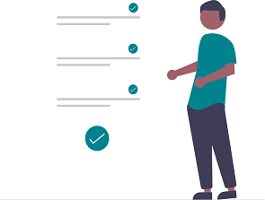

# Garage Hive's Recommended Customer Workflow 
Starting with the customer's inquiry, Garage Hive gives the business a complete workflow to follow until the customer's job is completed. Here's a quick overview of how to use Garage Hive from the customer's inquiry: 

## Customers calls your garage

   

When a customer calls your company, they might be calling to: 
1. **Request for a quote** - Create a quote for the customer using [**Estimates**](garagehive-create-an-estimate.html) and send it to them via email or [**Customer Online Authorisation**](garagehive-online-documents-using-online-documents-in-estimates-checklists-and-vehicle-inspection-estimates.html). 

    or 

2. **To book in for routine maintenance like an MOT and/ or service** - The customer will call and request that the vehicle be scheduled for a specific date; [**book-in the Vehicle**](garagehive-create-a-booking.html) and [**customise the vehicle date reminders**](garagehive-customising-vehicle-reminder-dates.html) so that you can send reminders to the customer about routine maintenance in the future.

    or

3. **Enquire about their vehicle having an issue** for example, squeaking brakes - At this point, request that the customer bring the vehicle in so that you may perform a [**Vehicle Inspection**](garagehive-technicians-vehicle-inspections.html) to provide a quote and possibly uncover additional issues with the vehicle that may be of assistance to the customer. After deciding on a time for the vehicle to be delivered with the customer, [**book-in the Vehicle**](garagehive-create-a-booking.html).

## The vehicle arrives at your garage

   

The following are the crucial steps to do when a customer brings their vehicle into the garage: 
1. Open the vehicle job (as earlier booked) from the [**Role Centre Tiles or the Schedule**](garagehive-trial-processing-a-vehicle-arriving.html). 
2. Mark the vehicle as being on-site. 
3. [**Assign a Key/Bin Number**](garagehive-managing-key-numbers-in-the-system.html) to the vehicle's key. 
4. Check that the customer's information is correct, including phone number, name, and address. 
5. A technician should be allocated the vehicle.

## Vehicle is handed over to the technician

   

When the technician receives the vehicle, he or she needs to: 
1. Check on [**My Tasks**](garagehive-easy-clocking.html) from their phone or tablet using the Microsoft Dynamics app. 
2. Clock in for the work that has been allocated to them. 
3. Do the [**Vehicle Inspection**](garagehive-technicians-vehicle-inspections.html) using the checklist templates, adding notes and images to the vehicle inspection template. 
4. When they are finished, they clock out of the job after confirming that everything has been captured as planned. 

## Vehicle Inspection Estimate and Authorisation

   

The service advisor can now create a [**Vehicle Inspection Estimate**](garagehive-VHC.html) and communicate it with the customer via the [**Customer Online Authorisation**](garagehive-online-documents-using-online-documents-in-estimates-checklists-and-vehicle-inspection-estimates.html) for approval on the job.

When the work is [**Approved**](garagehive-online-documents-what-happens-for-customers-actions.html), a new allocation is created by [**Copying the Authorized**](garagehive-jobsheet-create.html) groups from the VIE (Vehicle Inspection Estimate), a jobsheet is created, and the technician can begin working on the allocation.

## Job is completed

   

When the job is finished:
1. Double-check that there are no [**red flags on the item lines, that no resources are missing**](garagehive-jobsheet-taking-payment.html#adding-resources-to-labour-lines-in-a-jobsheet), and that the pricing is correct. 
2. Call, email, or SMS the customer to let them know the job is finished and they may come pick up their vehicle. 
3. Change the jobsheet's status from finished to ready for collection. 

## Customer comes to pick up the vehicle

   

When the customer arrives to pick up the vehicle:
1. Choose the ready for collection tile to see the jobsheets in a list view. 
2. In the list, you should be able to see: **Jobsheet No**. **Vehicle Reg**, **Make** and **Model**, **Customer Name**, and **Jobsheet Value**; if not, [**Personalise**](garagehive-personalising-garage-hive.html) the list to these columns, so that you can tell the customer the details without even opening the jobsheet. 
3. Print the jobsheet/invoice to give to the customer (if necessary). 
4. [**Take payment and Post the Jobsheet**](garagehive-jobsheet-taking-payment.html).

## Customer survey after job is completed

   

When the work is completed, the customer is sent a [**follow-up survey**](garagehive-customer-surveys.html) to get feedback on the entire experience of being served at the garage; this helps in determining the NPS score, which is a measure of customer loyalty and satisfaction.