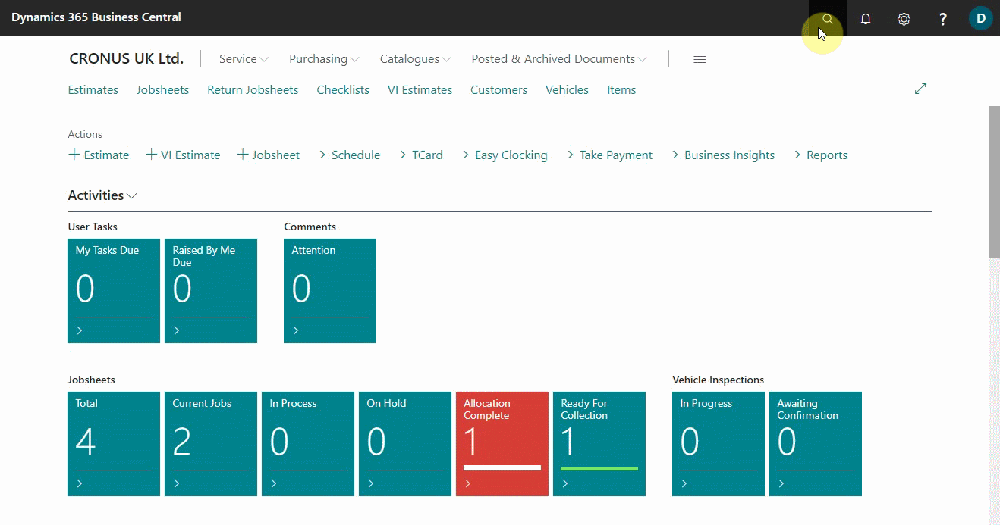
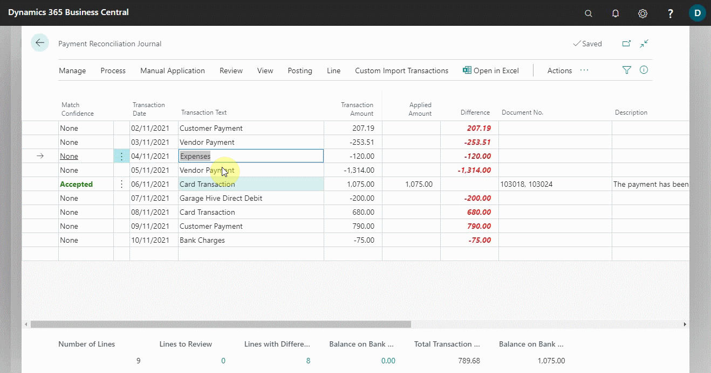
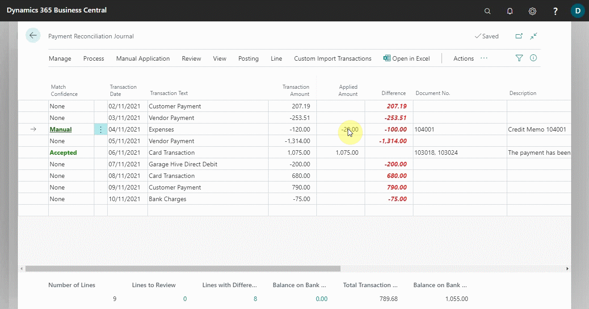

# Reconcile Payments that Cannot be Applied Automatically 
There may be no suggested application for journal lines; this could be due to a missing document or a customer overpaid, resulting in an excess amount after applying the payment to another journal line. In such cases, the **Transfer Difference to Account** action can be used to create and post the missing general ledger entry, such as a refund, that is required to apply the payment to. The following describes how to reconcile payments that cannot be applied automatically:
1. Choose the  icon, on the top-right corner, enter **Payment Reconciliation Journals**, and select the related link.
2. Open a previously created Payment Reconciliation Journal with the payments to reconcile.

   

3. Select **Manual Application** from the actions bar, and then the **Transfer Difference to Account** action. The Transfer Difference to Account page opens.
4. In the **Account Type** field, specify the type of account that the payment amount will be posted to.
5. In the **Account No.** field, specify the account that the payment amount will be posted to.
6. In the **Description** field, specify text that describes this direct payment posting. By default, the text in the **Transaction Text** field on the payment reconciliation journal line is inserted.
7. Choose the **OK** button.

   

8. If the value in **Difference** field was equal to the value in the **Transaction Amount** field, when you post the payment reconciliation journal, the whole payment on the journal line will be posted directly to the specified balancing account.
9. If the value in the **Difference** field was lower than the value in the **Transaction Amount** field, then an additional journal line will be created with the same text and date and with the difference inserted in the Transaction Amount field.

   

 

### **See Also**

[Video: How to perform a Payment Reconciliation Journal in Microsoft Dynamics Business Central](https://www.youtube.com/watch?v=WiAnm_VUQVQ){:target="_blank"} \
[Reconcile payments using the automatic application](garagehive-reconcile-payments-using-automatic-application.html){:target="_blank"} \
[Review or apply payments after automatic application](garagehive-review-or-apply-payments-after-automatic-application.html){:target="_blank"} \
[Map text on recurring payments to accounts for automatic reconciliation](garagehive-map-text-on-recurring-payments-to-accounts-for-automatic-reconciliation.html){:target="_blank"} 
