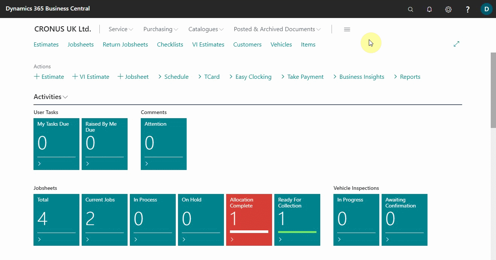
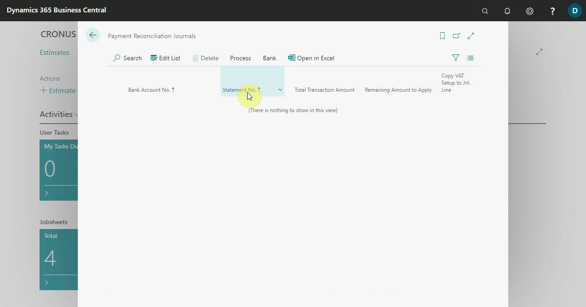
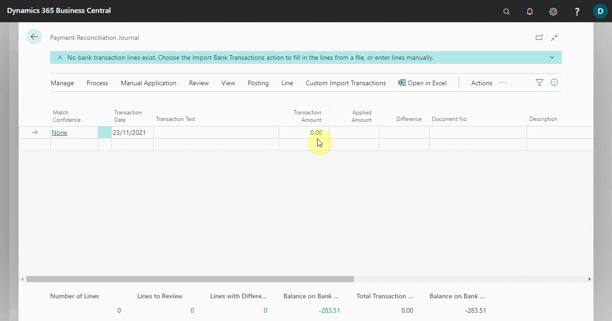
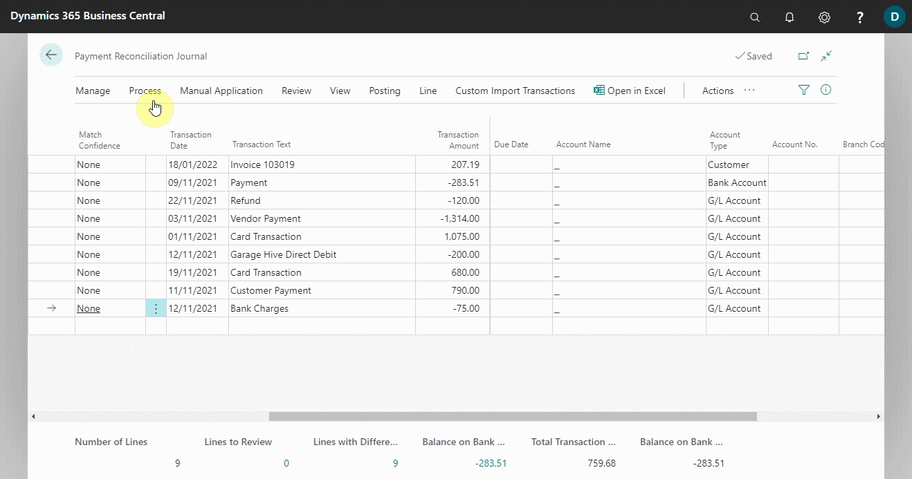
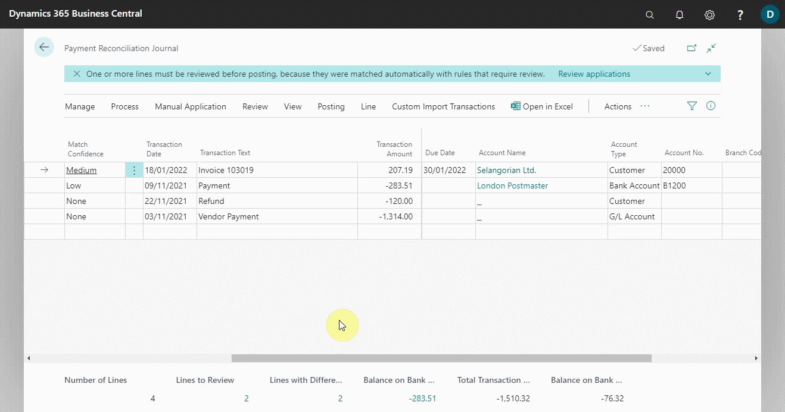
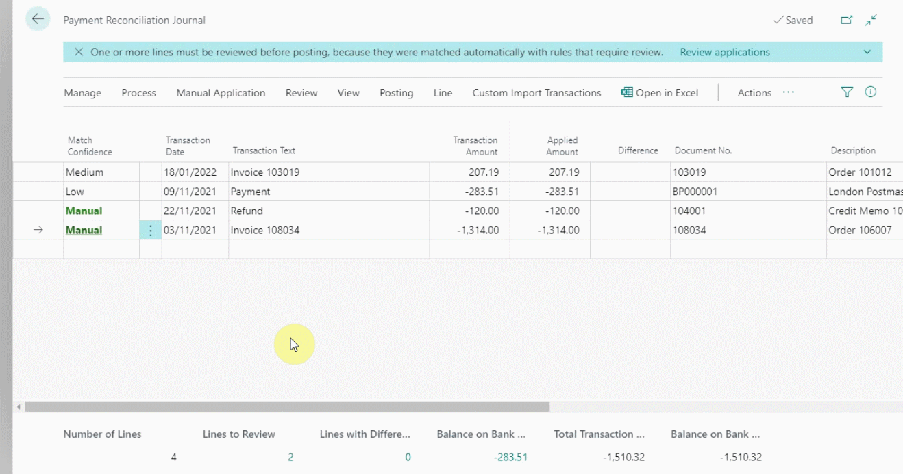
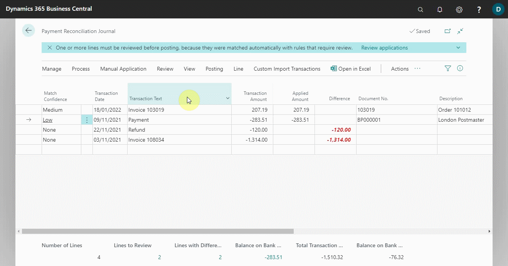
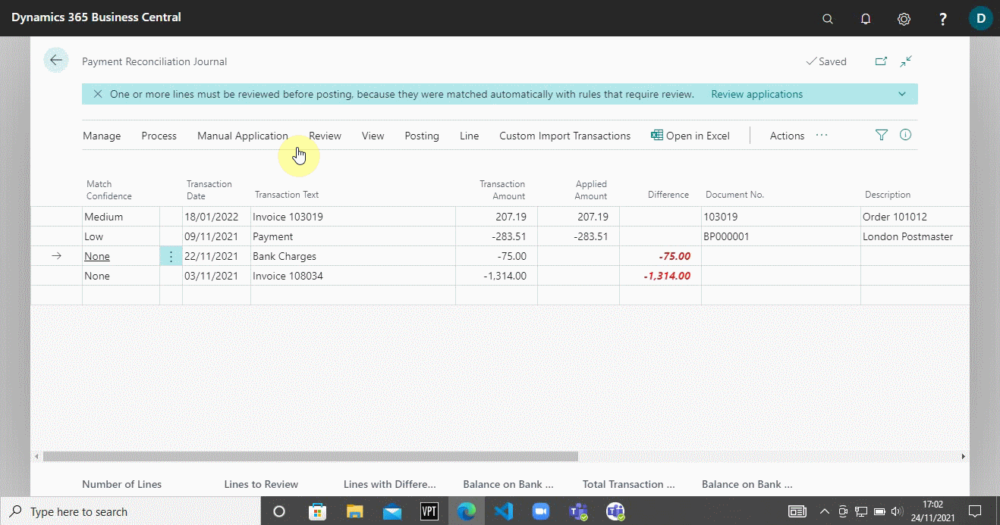
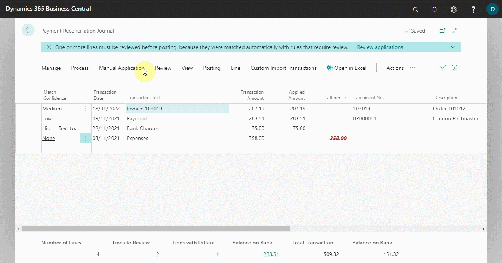

# Reconcile Payments Using the Automatic Application 
Lines in the **Payment Reconciliation Journal** can be filled in by importing a bank statement as a file or manually entering transactions made on your payment service. The following describes how to reconcile payments using the automatic application:
1. Choose the  icon, on the top-right corner, enter **Payment Reconciliation Journals**, and select the related link.

   

2. Select **Process** from the actions bar to start a new payment reconciliation journal, followed by the **New Journal** action.
3. On the **Payment Bank Account List** page, select the bank account you want to reconcile payments for, and then choose the **OK** button.

   

4. Select **Custom Import Transactions** from the actions bar, then the company's bank import format. In our example, we'll use the **NatWest Bankline** action to import the bank statement obtained from the bank.
5. Select the file containing the bank transactions for payments you want to reconcile on the **Select a file to import** page, and then click the **Open** button. The other option would be to manually enter the transactions into the journal.

   

6. The **Payment Reconciliation Journal** page is filled with lines for payments representing bank transactions from the imported bank statement or manually entered transactions.
7. To apply the reconciliation automatically select **Process** from the actions bar, and then **Apply Automatically**.
8. The **Match Confidence** field on lines for payments that have been automatically applied to their related open entries has a value of **Low**, **Medium** or **High** to indicate the quality of the data matching that the suggested payment application is based on. In addition, the **Account Name**, **Account Type**, and **Account No.** fields are filled with information about the customer or vendor to whom the payment is applied.

   

9. Choose the **Lines with Difference** action at the bottom to review, accept/remove, or manually change multiple payment applications that have a value in the **Difference** field.
10. The **Payment Application Review** page appears, with the first application to be reviewed displayed. As you process the previous application, the next one will be displayed on the page. All relevant information about the customer or vendor to whom the payment is applied, the matching details and actions to process the line, such as the **Accept Application** and **Apply Manually** actions, are displayed.

    

11. Choose the **Lines to Review** action at the bottom, and then choose the **Accept Application** action to accept the automatic application, or **Remove Application** to remove the automatic application in the **Payment Application Review** page for the selected journal line. The **Match Confidence** changes to **Accepted**.

    

12. To change an automatic application, select a journal line, and choose **Manual Application** from the actions bar and then choose the **Apply Manually** action. On the **Payment Application** page, you can reapply or manually apply the payment. See [Review or apply payments after automatic application](garagehive-review-or-apply-payments-after-automatic-application.html).

    

14. Select an unapplied journal line for a recurring cash receipt or expense, such as bank charges, and then choose **Manual Application** from the actions bar, followed by the **Map Text to Account** action. See [Map Text on Recurring Payments for automatic reconciliation](docs\garagehive-map-text-on-recurring-payments-to-accounts-for-automatic-reconciliation.html).
15. After you've finished mapping payment text to accounts, click on **Edit List** to save the changes, and then the **Close** button. From the dialogue box that appears, click **Yes**. When you set up a text-to-account mapping, the resulting automatic payment application will have **High - Text-to-Account Mapping** in the **Match Confidence** field.

    

16. For a journal line that has no suggested application because no ledger entry exists to which it can be applied, use the **Transfer Difference to Account** action, in **Manual Application** sub-menus from the actions bar, to create and post the missing general ledger entry required to apply the payment. The **Match Confidence** field for the journal line changes to **Manual**. See [Reconcile payments that cannot be applied automatically](garagehive-reconcile-payments-that-cannot-be-applied-automatically.html).

    

17. To review the result of posting before you post the journal lines, select **More Actions**, then **Actions** from the actions bar. In the **Actions** sub menus, select **Process**, **Post**, and then the **Test Report** action. The Bank Account Statement report opens and shows the same fields at the bottom of the Payment Reconciliation Journal page.

    

18. When no more lines need to be reviewed and the **Difference** field on all lines is blank, select **Posting** from the actions bar and then one of the following options:
- **Post Payments and Reconcile Bank Accounts** - To post the applied payments and close the related bank account ledger entries as reconciled.
- **Post Payments Only** - To only post the payments as applied but leave the related bank account ledger entries open. This action requires that you reconcile the bank account separately. For more information, see [Reconcile bank accounts](garagehive-reconcile-bank-accounts.html).

    

 

### **See Also**

[Video: How to perform a Payment Reconciliation Journal in Microsoft Dynamics Business Central](https://www.youtube.com/watch?v=WiAnm_VUQVQ){:target="_blank"} \
[Review or apply payments after automatic application](garagehive-review-or-apply-payments-after-automatic-application.html) \
[Reconcile payments that cannot be applied automatically](garagehive-reconcile-payments-that-cannot-be-applied-automatically.html) \
[Map text on recurring payments to accounts for automatic reconciliation](garagehive-map-text-on-recurring-payments-to-accounts-for-automatic-reconciliation.html) 