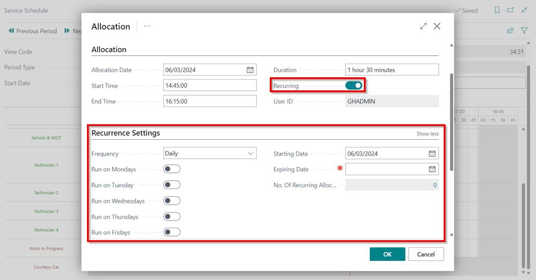
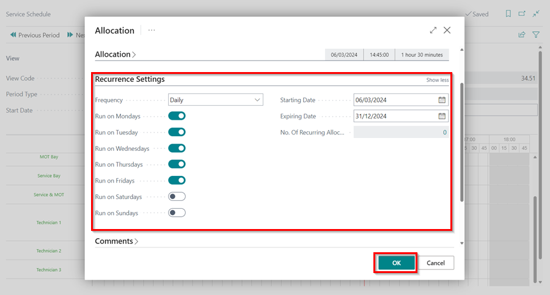
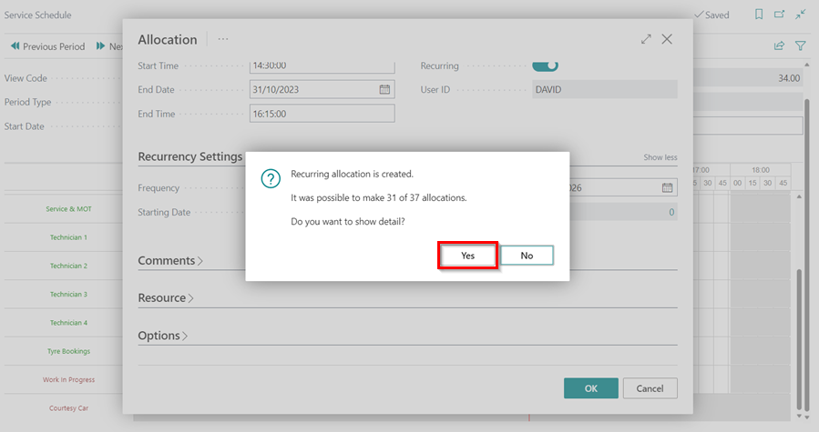

# We are still working on this article!
We are currently reviewing this article before it is published, check back later.

## How to Use Recurring Events in Garage Hive
In Garage Hive, recurring events are used for scheduling allocations that will happen again in the future, every time, or for an indefinite amount of time. They help with ensuring that the daily available time is accurate and that there is no need to continuously add allocations to the schedule. To add a recurring event in the schedule:

1. Open the schedule and add an **allocation** to a resource.
2. Select **Standard Event** as the **Allocation Type** and click **OK**.

   

3. Choose the **Service Standard Event** that you want to allocate. In this case, we'll select **Meeting**. Click **OK**.

   

4. Go to the **Allocation** FastTab on the **Allocation** page, and enable the **Recurring** slider. By doing so, the **Recurrence Settings** FastTab becomes visible.

   

5. In the **Recurrence Settings** FastTab, you can now set the **Frequency** of the allocation, the **Starting Date** and **Ending Date**, as well as the days on which the recurring allocation should run. Click **OK** when finished.

   

6. You will receive the following notification if the recurring allocation is assigned on a date that you have specified it shouldn't run. To view the dates that aren't assigned, click **Yes**.

   

7. To allocate the dates that aren't yet allocated, uncheck the **Unavailable Date** field and select **Allocate** from the menu bar. Click **Close**.

   

8. If you want to deallocate the recurring allocation, right click on the allocation and select **Deallocate**. When the next prompt appears, click **Yes**.

   

9. Select whether to **Deallocate current event** only, or **Deallocate current and following events**.

   

[Go back to top](#top)
