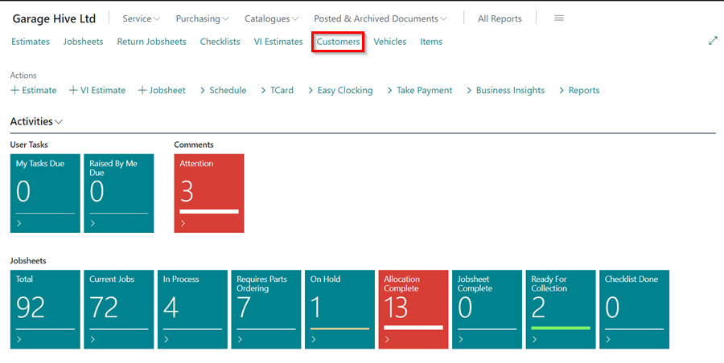
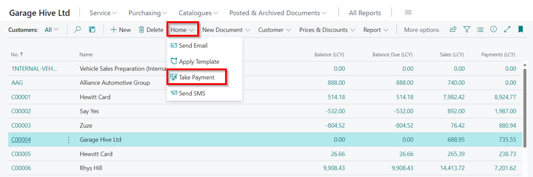
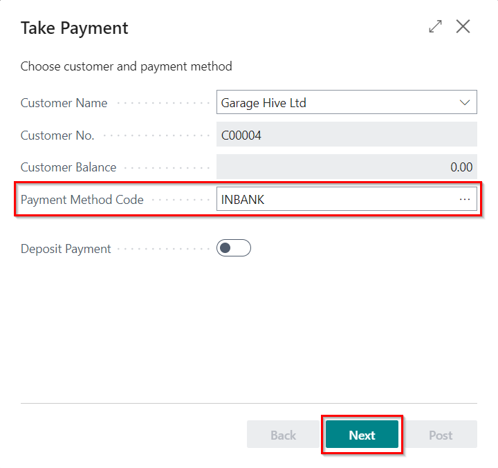
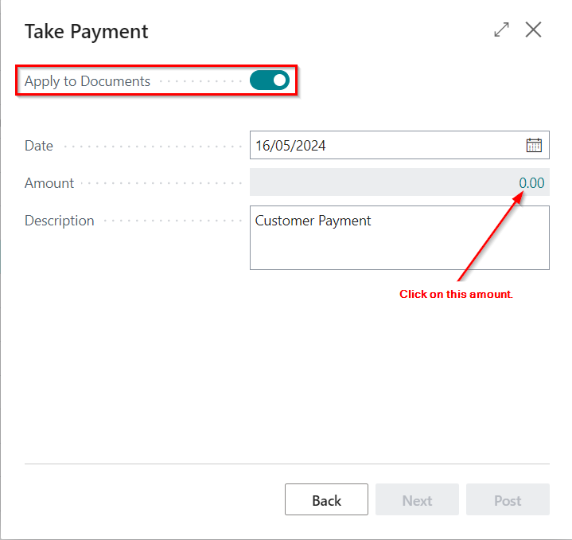
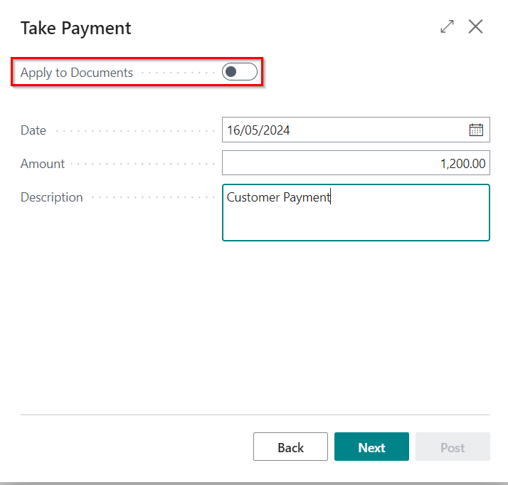
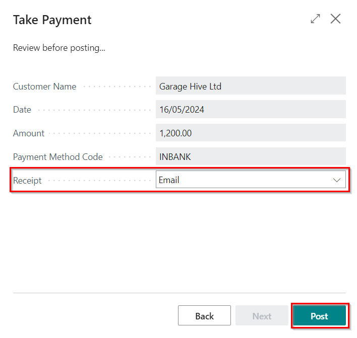

# Registering Customer Payments in Garage Hive
Other than using the **Cash Receipt Journal**, there is another method to receive payments in Garage Hive:
1. Select the customer's list from the Role Centre, and then select the customer you want to receive the payment from the **Customer List**.

   

2. Select **Home**, then **Take Payment**, from the menu bar.

   

3. Enter the **Payment Method Code** for the customer, and click **Next**.

   

4. If the **Apply to Documents** slider is enabled, select the document by clicking on the amount in the **Amount** field. 

   

5. If you disable the **Apply to Documents** slider, enter the amount in the **Amount** field and click **Next**.

   

6. Before posting, double-check the details, and either choose to **Print** or **Email** the receipt in the **Receipt** field.
7. Select **Post** to complete the payment if all details are correct.

   

 

### See Also
[Cash Receipt Journals](garagehive-finance-cash-receipt-journal.html){:target="_blank"}