

# We are still working on this article!
We are currently reviewing this article before it is published, check back later.

# Using the Reminded Not Booked Tiles
The primary goal of sending reminders to customers is to prompt them to book the service they were notified about. However, in some cases, the customer may not book as expected and require further follow-up. This is where the **Reminded Not Booked** feature is useful. It creates a list within the system to help you keep track of which customers need follow-up action regarding their booking.

## In this article
1. [Reminded Not Booked Set Up](#reminded-not-booked-set-up)
2. [Reviewing Reminded Not Booked Tiles](#reviewing-reminded-not-booked-tiles)

### Reminded Not Booked Set Up
This setup can be only be done by a **System Admin**. To Setup the **Reminded Not Booked** Setup:
1. In the top right corner, choose the  icon, enter **Reminded Not Booked Setup**, and select the related link.

   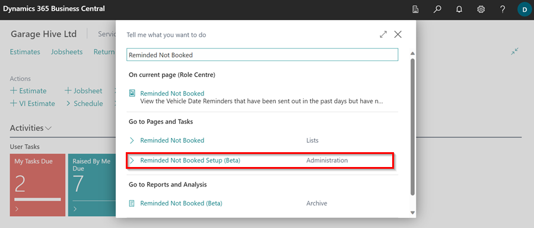

2. On the **Reminded Not Booked** setup page, you'll see various **Reminder Types** listed. These are available only if you have enabled notifications for **Vehicle Reminder Dates** in the system. To find out how to enable these reminders, [click here](/docs/garagehive-vehicle-date-reminders.html){:target="_blank"}.
3. By default, the system will set the **maximum number of days until the due date** to 30 days. You can change this duration if needed.

   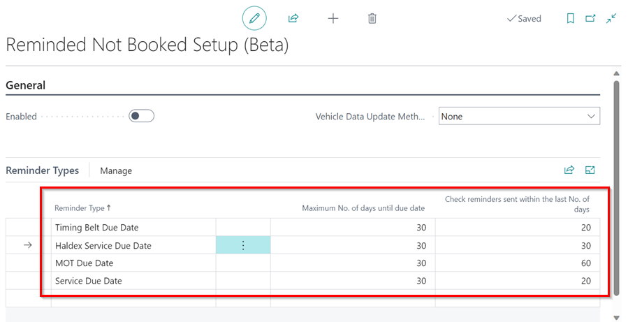

4. In the **General** FastTab, choose how you want the system to update vehicle data when the **Reminded Not Booked** notification is sent. You have three options:

    

   - **None**: No updates to vehicle data will be made.
   - **Update MOT**: Updates the MOT data for applicable vehicles. Standard charges apply.
   - **Update MOT & Vehicle Data by VIN**: Updates all vehicle data using the vehicle’s VIN, but only if it wasn’t looked up in the last 30 days; if however the reason for needing a lookup is because of an MOT an MOT lookup will be done instead of a VIN lookup. Standard charges apply.

      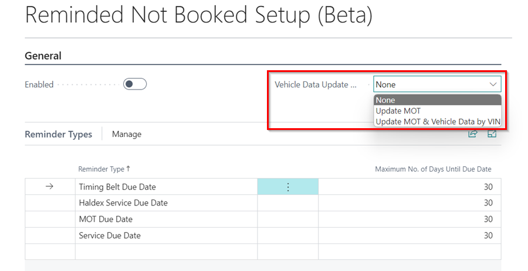

5. Once you've completed the setup, click the **Enabled** slider to enable the setup in the system.

   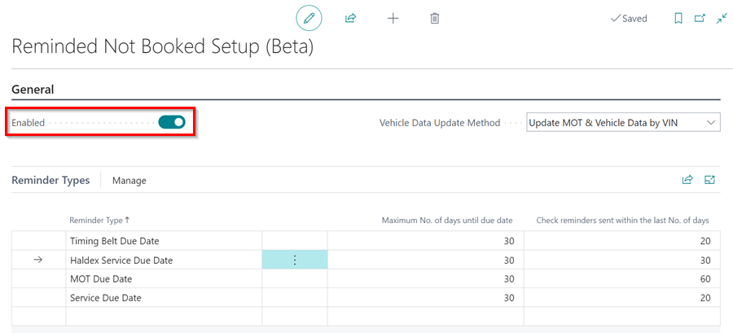

[Go back to top](#top)

### Reviewing Reminded Not Booked Tiles
1. Once the **Reminded Not Booked** Setup is enabled, you'll see the following tiles under the **Reminded Not Booked** heading in your Role Centre.

   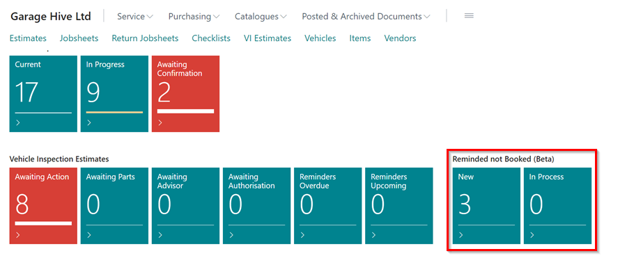

   

2. In the **New** tile, you'll find the list of vehicles which match the **Reminded Not Booked Setup**. This list will be regenerated once per day (overnight).
3. Click on the **New** tile to view the list.
4. In the menu bar, you can use the various actions available. Selecting **Suggest Lines** will refresh and regenerate the list.

   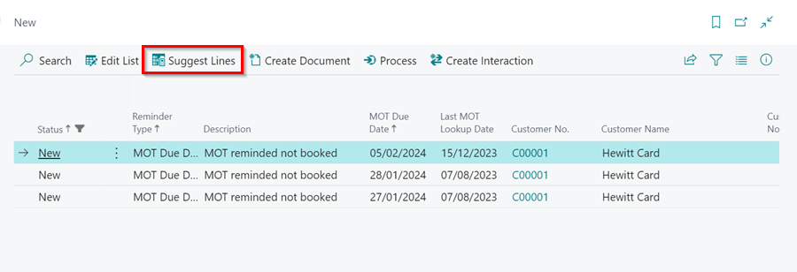

5. Use the **Create Document** action to make an **Estimate** or a **Jobsheet** for the customer.

   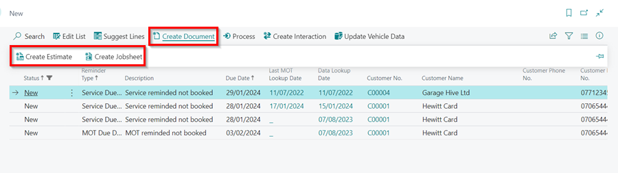

6. To move a line to the **In Process** tile or mark it as closed, click **Process** and choose either **Set In Process** or **Mark as Closed**.
7. If a reminder remains in the New state and passes its due date, it will automatically be set to Closed. 

   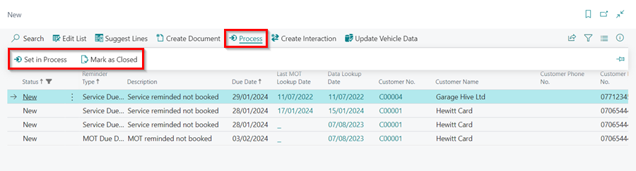

8. To send an Email or SMS to the customer, select **Create Interaction** and then choose **Send Email** or **Send SMS**. For detailed instructions on using the emailing feature, [click here](/docs/garagehive-using-emailing-feature.html#using-the-emailing-feature){:target="_blank"}.

   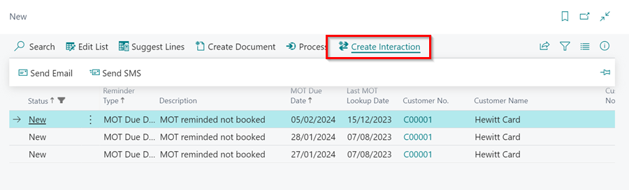

9. To update the vehicle data select **Update Vehicle Data** and use either **Update Vehicle Data by VIN** or **Update MOT Data by VRM**.

   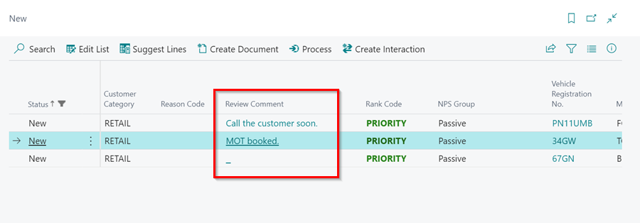

10. To add a specific **Reason Code** or a **Comment** to a reminder, click **Edit List**. Then select the appropriate reason in the **Reason Code** column and enter your comment in the **Review Comment** column. To learn more on how to set up the **Reason Codes**, [click here](garagehive-service-reason-codes.html){:target="_blank"}.

   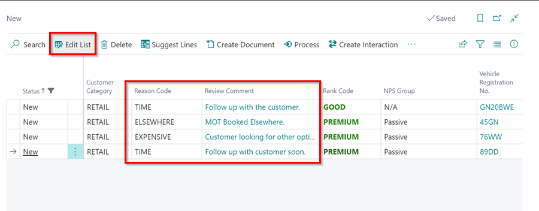

[Go back to top](#top)

